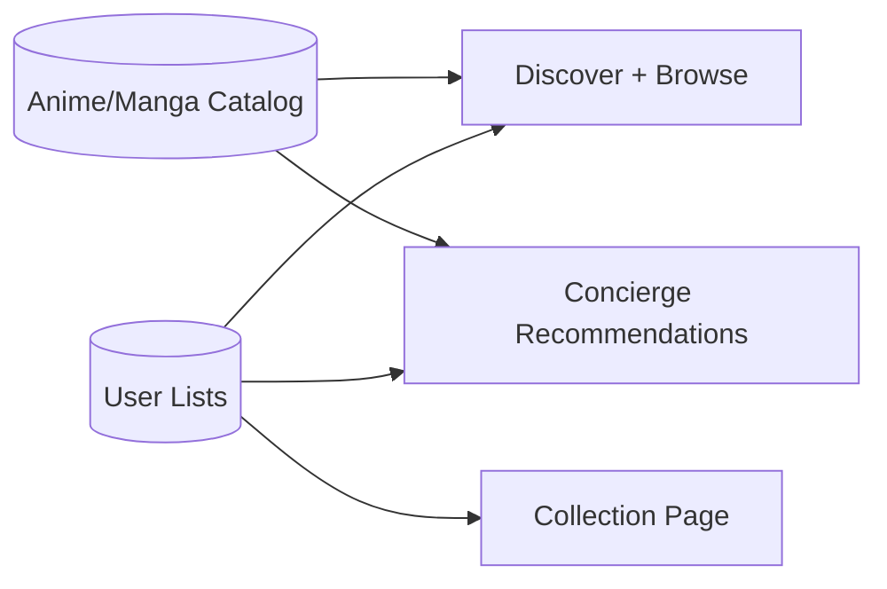
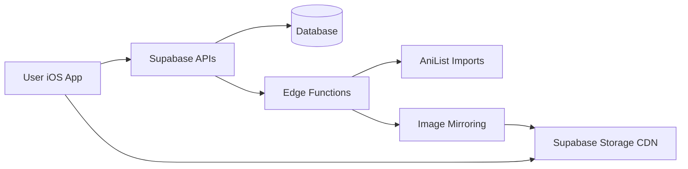
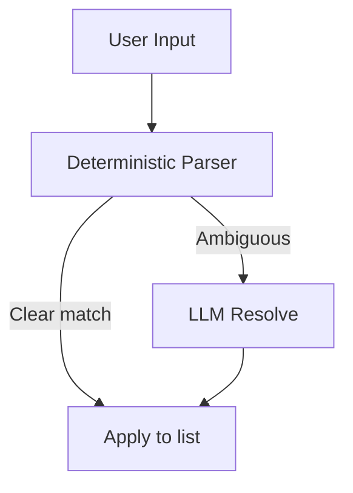

# Kuro — Current State (Plain English)

**Last updated:** 2026-02-05

This file explains the app in everyday language for non-technical readers. It is meant to be a complete, easy overview of how Kuro works today.

---

## 1) Rule: Always keep this file updated

Every time the app changes (design, features, backend, data, schedules, etc.), this file must be updated. Add a new line to the **Change Log** at the bottom with the date and a short summary.

---

## 2) What Kuro is (in one paragraph)

Kuro is a curated anime + manga app. It lets users browse premium picks, keep lists, and use a “Concierge” chat to import their watch list or get recommendations. The app is fast, clean, and focuses on high‑quality discovery.

**At a glance**
- Clean editorial design
- No adult content by default
- Concierge uses smart rules first, LLM only when needed
- Images are mirrored to a CDN for speed

---

## 3) How the app is organized (screens)

- **Concierge (left swipe)**: A chat-like page for importing lists and asking for recommendations.
- **Discover (main page)**: Curated sections like Essentials, Classics, Trending, etc.
- **Collection**: Your personal list of anime/manga.
- **Browse**: Explore the catalog with filters.
- **Search**: Find specific titles.

Profile is a small menu in the top-right corner.

**Header today:**
- Left: KURO wordmark
- Center: current page name
- Right: profile menu
- When on Concierge, a small chat icon appears next to the title.

---

## 3.1) Design style (today)

- Minimal, editorial look
- Glass‑like UI surfaces
- Serif titles, light typography
- Focus on premium / classic content

---

## 4) Concierge (the assistant)

The Concierge is designed to:
- **Import** lists quickly (e.g. “AoT completed, JJK ep 12”) and apply them to your list.
- **Recommend** new anime or manga based on your mood.

It works in two layers:
1. **Smart rules first** (fast, cheap, predictable).
2. **LLM fallback** only when needed (to resolve ambiguous titles or narrate recommendations).

There are built-in usage limits so it can’t be abused.

**On the Concierge page (today):**
- A short intro card explains what it does.
- Three quick start buttons:
  - Paste from clipboard
  - Try an example import
  - Give me a vibe

**Adult content:** filtered out by default.

---

## 5) Where the data comes from

Kuro’s anime and manga catalog is mostly imported from **AniList**. This includes:
- anime / manga titles
- episodes / chapters
- staff / characters
- tags / genres

This data is stored in Supabase (the backend database).

There are two main ways the database is populated:
1. **Bulk AniList imports** (scripts or edge functions)
2. **Image mirroring** (moves posters to Supabase Storage)

---

## 6) How images work (CDN + caching)

- The app **mirrors** images into Supabase Storage.
- Those images are then served from a CDN-like public storage URL.
- The app also caches images locally for speed.

This means posters are fast, stable, and don’t rely on AniList’s servers at runtime.

---

## 7) Scheduled jobs (automated maintenance)

Right now, the only built-in scheduled job is:
- **Concierge housekeeping**: runs daily to delete old logs/metrics.

Other imports (like image mirroring or AniList ingestion) are currently run manually or by external scripts.

---

## 8) The backend (Supabase) in plain terms

Supabase stores:
- the full catalog
- user lists and profiles
- concierge sessions + logs
- metrics and rate limits

Supabase also runs the Concierge server logic and provides secure APIs.

**Usage limits (plain English):**
- Per‑user and global daily budgets are enforced for AI usage.
- This prevents expensive overuse.

---

## 8.1) Simplified data model

---

## 9) Simple system diagram

---

## 10) Concierge flow (simple view)

---

## 11) Change Log (append-only)

- 2026-02-05: Added/expanded this plain-English snapshot for non-technical readers.
- 2026-02-05: Concierge moved to left swipe page. Profile is a top-right menu. Cards now show YEAR · EPS. Concierge intro + quick-start pills added.
