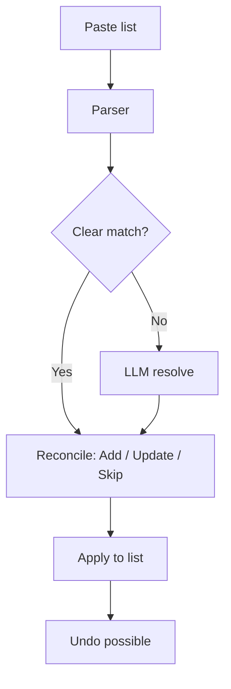
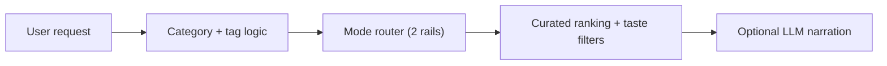
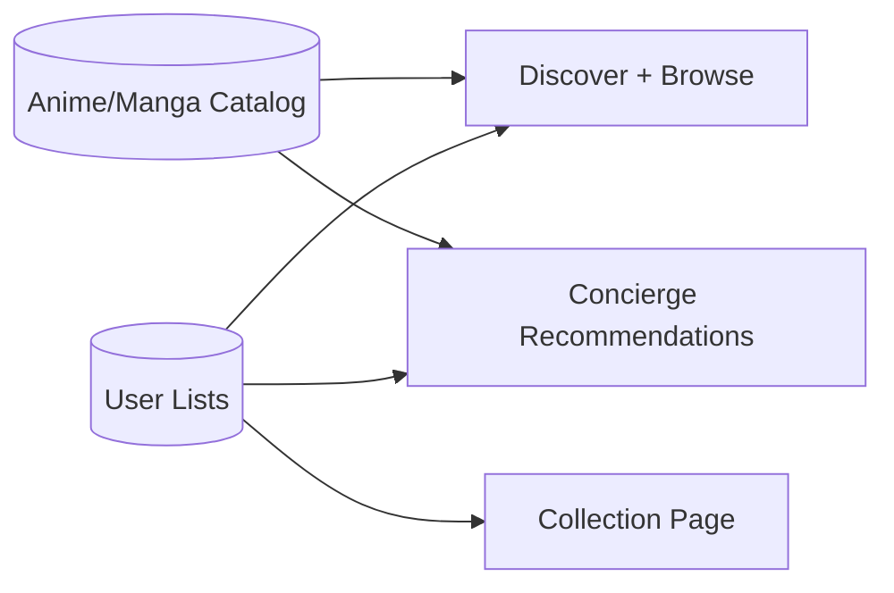
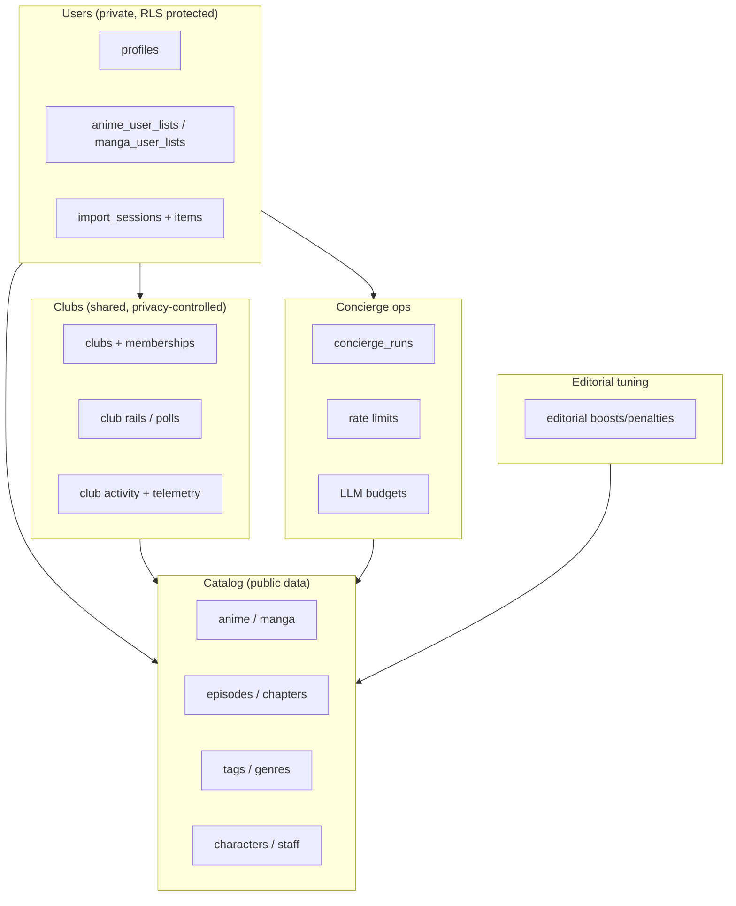
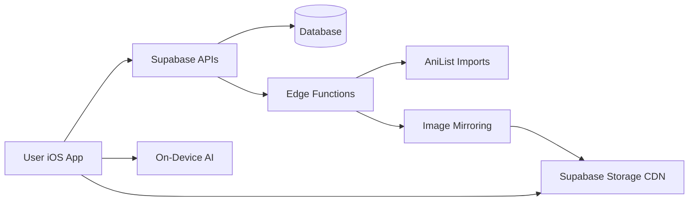
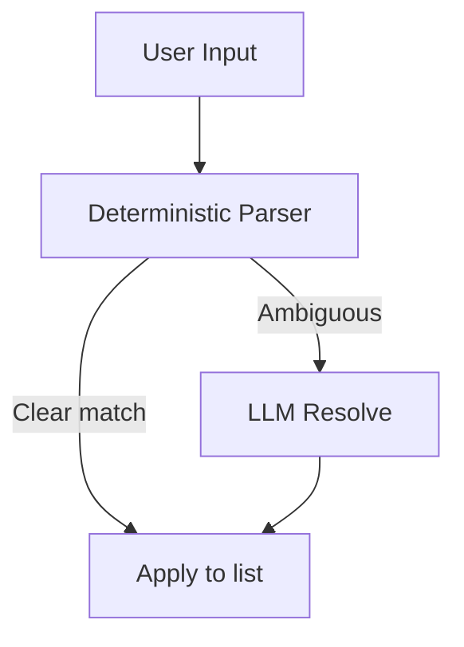

# Kuro — Current State (Plain English)

**Last updated:** 2026-02-16

This file explains the app in everyday language for non-technical readers. It is meant to be a complete, easy overview of how Kuro works today.

---

## 1) Rule: Always keep this file updated

Every time the app changes (design, features, backend, data, schedules, etc.), this file must be updated. Add a new line to the **Change Log** at the bottom with the date and a short summary.

For the technical “source of truth” and auto-generated inventories, see `CURRENT_APP_STATE.md`.

If you need the *literal code* in one place for another model to read, see:
- `CURRENT_APP_STATE_CODEBASE.md` (auto-generated; very large)

---

## 2) What Kuro is (in one paragraph)

Kuro is a curated anime + manga app. It lets users browse premium picks, keep lists, create private clubs with friends, and use a "Concierge" chat to import their watch list or get recommendations. The app is fast, clean, and focuses on high‑quality discovery.

**At a glance**
- Clean editorial design
- No adult content by default
- Private clubs for watching together with friends
- Concierge uses deterministic routing first, with optional AI for ambiguity and narration
- On-device AI for smart search, description condensing, and disambiguation support
- Images are mirrored to a CDN for speed
- Works offline (shows a banner when you lose internet)

---

## 3) How the app is organized (screens)

The app has 5 swipeable pages that follow a natural discovery flow:

1. **Concierge** (swipe left from Discover): An inline concierge page for importing from your library/clipboard and asking for recommendations.
2. **Discover** (main page, opens by default): Curated sections like Essentials, Classics, Trending, etc.
3. **Browse** (swipe right from Discover): Explore the full catalog with filters (genre, status, length, decade, format, sort).
4. **Collection** (swipe right from Browse): Your personal list of anime/manga.
5. **Clubs** (rightmost page): Private groups (2–20 members) for watching together. Create a club, invite friends with a code, share curated watchlists (rails), see weekly highlights, vote in polls, react to items (fire/heart/eyes/100), and chat (ephemeral 30-day messages). Club owners control privacy settings. The club list shows member counts, recent activity previews, and unread dots. When sharing is set to "progress", you'll see pace tracking ("3 ep behind the group"). Milestone cards celebrate when all members finish a title. Updates appear in real-time. Club activity also shows up on anime/manga detail pages. You can now add anime/manga directly to a club rail from the Rails tab — tap the "+" button on any rail, search by title, and tap to add.

**Search** is not a page — it opens as a sheet from the magnifying glass icon in the header, available from any page. It supports natural language queries like "show me action anime from 2020" using on-device AI.

Profile is a small menu in the top-right corner. Clubs is also accessible from the Profile sheet as a secondary shortcut.

**Header today:**
- Left: KURO wordmark
- Center: current page name in an animated window, with 5 dot indicators below
- Right: search icon + profile menu
- When on Concierge, a small chat icon appears next to the title.

### How to push a new TestFlight build

Run `fastlane beta` from the project root. This auto-increments the build number, archives the app, and uploads to TestFlight. No password or 2FA needed — it uses an API key stored at `~/.appstoreconnect/private_keys/AuthKey_7L84A7P9X7.p8`. The Fastlane config files are in `fastlane/Appfile` and `fastlane/Fastfile`.

---

## 3.1) Design style (today)

- Minimal, editorial look
- Glass‑like UI surfaces
- Serif titles, light typography
- Focus on premium / classic content

---

## 3.2) On-Device AI (Apple Foundation Models)

Kuro now uses Apple's built-in AI that runs directly on your device (no internet needed for these features). This means faster responses and better privacy since your data never leaves your phone for these tasks.

The concierge stack handles four things:

1. **Deterministic routing + heuristics first** for fast and stable recommendations.
2. **Disambiguation support** when multiple titles collide (for example, “Hunter x Hunter 1999” vs “Hunter x Hunter 2011”).
3. **Synopsis condensing**: Long plot descriptions get automatically shortened into 2-sentence hooks that are spoiler-free and easy to scan.
4. **Smart search**: You can search your collection using everyday language instead of picking filters manually.

---

## 3.3) New features added in this session

### Smart Descriptions
Long plot summaries from AniList are often several paragraphs. The app now automatically condenses them into short, spoiler-free 2-sentence hooks using on-device AI. This makes browsing feel faster and cleaner.

### Smart Search
Instead of tapping through genre filters and dropdowns, you can now type things like "show me action anime from 2020" or "short comedy manga" and the app understands what you mean. This uses the on-device AI to interpret your query.

### What to Watch/Read Next
When you open an anime or manga detail page, there is now a personalized "Next Up" section. It looks at your progress and suggests what episode or chapter to continue with, so you spend less time figuring out where you left off.

---

## 3.4) Offline detection

The app now notices when you lose your internet connection and shows a small "OFFLINE" banner at the top of the screen. When your connection comes back, the banner disappears automatically. This way you always know whether the app can reach the server.

---

## 3.5) App lifecycle handling

The app now properly handles being sent to the background (when you switch to another app) and coming back to the foreground. Previously, data could become stale or connections could break if you left the app for a while. Now it refreshes gracefully when you return.

---

## 4) Concierge (the assistant)

The Concierge is designed to:
- **Import** lists quickly (e.g. “AoT completed, JJK ep 12”) and apply them to your list.
- **Recommend** new anime or manga based on your mood.

It works in two layers:
1. **Smart rules first** (fast, cheap, predictable).
2. **LLM fallback** only when needed (to resolve ambiguous titles or narrate recommendations).

There are built-in usage limits so it can’t be abused.

**On the Concierge page (today):**
- A short intro card explains what it does.
- Four quick actions:
  - From your library
  - From clipboard
  - Try an example import
  - Describe a vibe
- The Concierge no longer takes over the full screen. Everything stays inline in the chat conversation, which makes it feel faster and more natural:
  - Import results appear as inline confirm bubbles (with cover art)
  - Recommendation results appear as scrollable editorial-style horizontal rails
  - Confirmations are inline buttons (not separate screens)
  - Success shows as a brief toast with undo
  - Internal mode names are hidden; users see curated titles and subtitles.

**Adult content:** filtered out by default.

---

## 4.1) How an import works (simple steps)

1. You import from your library or paste a list.
2. The concierge parser tries to match titles.
3. Each matched item is classified as one of three actions:
   - **Add** — brand new to your collection.
   - **Update** — already in your collection but with newer progress (e.g. more episodes watched).
   - **Skip** — already in your collection with the same or better progress (duplicate).
4. If something is unclear, it shows an inline clarify flow (status/title/intent) in the same message.
5. After confirmation, your list updates in place. A toast confirms success and supports Undo.
6. High-confidence imports (score >= 0.85) can auto-apply immediately with an undo toast.

---

## 4.2) How recommendations are chosen

- The system prefers **classics** and **premium picks** (internally `premium_picks`, surfaced in UI as **The Cut**).
- It avoids adult content by default.
- If you say "like X", it finds similar titles first.
- The LLM only adds wording or resolves ambiguity.
- Your prompt is routed into **up to 2 curated rails**:
  - Rail A: the best-fit vibe set for your request
  - Rail B: an expanded classics set (when available)
- The server selects from **23 configured modes** (v8), including:
  - Mecha, Mystery/Detective, Music & Performance, Historical, School/Coming-of-Age, Shoujo/Josei, plus core modes.
- The concierge now shows curated copy (for example, "The Cut", "Soft Evenings", "Dark, Not Empty") and suppresses raw internal taxonomy names.
- Roughly **50 curated rails** across anime/manga are active after dedupe/quality pruning.
- Negative genre filtering supported: "action but no romance", "fantasy without harem". Excluded genres now also suppress conflicting modes in routing (not just item filtering).
- 30+ abbreviations in the parser (up from 10): OP, DB/DBZ/DBS, SAO, NGE/Eva, LOTGH, etc.
- **German-first support**: inflection handling, intent keywords, and curated EN/DE recommendation copy.
- The modes are configurable in the database (`public.concierge_config.config.modes`) so we can tune them without redeploying the app.

---

## 4.3) Cost + abuse protection (so the Concierge cannot be exploited)

Kuro is built so it won't "accidentally bankrupt you" if someone spams the chat:
- **Deterministic-first**: most requests are handled by rules + database queries (no LLM call).
- **Rate limits**: frequent callers get temporarily blocked.
- **Daily token budgets** (per day):
  - **Per user**: 50,000 tokens/day
  - **Global**: 1,000,000 tokens/day

If budgets are exceeded, the app should keep working but the LLM-heavy behaviors get reduced (for example: less narration / fewer disambiguation calls).

---

## 5) Where the data comes from

Kuro’s anime and manga catalog is mostly imported from **AniList**. This includes:
- anime / manga titles
- episodes / chapters
- staff / characters
- tags / genres

This data is stored in Supabase (the backend database).

There are two main ways the database is populated:
1. **Bulk AniList imports** (scripts or edge functions)
2. **Image mirroring** (moves posters to Supabase Storage)

---

## 6) How images work (CDN + caching)

- The app **mirrors** images into Supabase Storage.
- Those images are then served from a CDN-like public storage URL.
- The app also caches images locally for speed.

This means posters are fast, stable, and don’t rely on AniList’s servers at runtime.

---

## 7) Scheduled jobs (automated maintenance)

Right now, the only built-in scheduled job is:
- **Concierge housekeeping**: runs daily to delete old logs/metrics.

Other imports (like image mirroring or AniList ingestion) are currently run manually or by external scripts.

---

## 8) The backend (Supabase) in plain terms

Supabase stores:
- the full catalog
- user lists and profiles
- concierge sessions + logs
- metrics and rate limits

Supabase also runs the Concierge server logic and provides secure APIs.

**Usage limits (plain English):**
- Per‑user and global daily budgets are enforced for AI usage.
- This prevents expensive overuse.

---

## 8.2) What data is stored about a user

- A **profile** row (your account basics)
- Your **anime/manga list** entries (status, progress, rating)
- Concierge **import sessions** (so you can undo)
- Concierge **logs** (for improving the parser and debugging)
- **Club memberships** and your activity within clubs

No one else can read your private list data because of row‑level security. Club data is shared only with club members, and the club owner controls exactly what is visible.

---

## 8.3) What to update when things change

Whenever you change the app or backend, update these two files:
- `CURRENT_APP_STATE.md` (technical)
- `CURRENT_APP_STATE_PLAIN.md` (plain English)

Then add a line to the Change Log at the bottom.

---

## 8.1) Simplified data model

---

## 8.4) Database (high-level view)

This is a simplified map (not every table/column, just the big groups):

If you need the full table/column-level definition, use:
- `CURRENT_APP_STATE.md` (schema + object maps)
- `CURRENT_APP_STATE_CODEBASE.md` (all migrations included)

---

## 9) Simple system diagram

---

## 10) Concierge flow (simple view)

---

## 11) Where to find things (non-technical)

- **App UI code:** `Kuro/Views/`
- **Main navigation:** `Kuro/ContentView.swift`
- **Data + API calls:** `Kuro/Services/SupabaseService.swift`
- **Backend SQL changes:** `supabase/migrations/`
- **Legacy DB fixes:** `supabase/migrations/20260206143000_fix_legacy_tags_and_comments.sql`
- **Foundation schema:** `supabase/migrations/20250109_remote_applied_placeholder.sql` (baseline core tables; already in prod migration history)                                                                                        
- **Legacy SQL originals:** `legacy_sql/` (archived; no longer used directly)
- **Backend functions (Concierge, imports):** `supabase/functions/`

---

## 12) Operator checklist (plain English)

- If images look slow: run image mirroring. Note that only ~2.7% of images are currently mirrored — this is a known backlog.
- If Concierge seems broken: check its usage limits and logs.
- If recommendations look bad: verify the recommendation tables and see if imports are stale.
- If imports stop: check the import cursor and re-run import scripts.
- If bulk imports fail with "unauthorized": make sure the correct secret key is being sent in the request header.
- If on-device AI features are not working: they require an Apple device with Foundation Models support (recent hardware). Older devices will fall back to non-AI behavior.
- **Dashboard actions still needed**: Postgres upgrade, OTP expiry reduction, and leaked password protection must be done manually in the Supabase dashboard (see section 17).

---

## 13) Glossary (plain English)

- **RPC:** A database function that the app can call like an API.
- **Edge Function:** A small backend function that runs on Supabase.
- **RLS:** Row Level Security; ensures users can only see their own data.
- **CDN:** Fast image delivery system.
- **Club:** A private group of friends who share watchlists and vote on what to watch next.
- **Rail:** A horizontal scrollable row of anime/manga picks (used on Discover, in Clubs, and in Concierge recommendations).
- **Quality gate:** An automated check that runs before code is saved, catching mistakes early.
- **On-device AI:** AI that runs directly on your iPhone using Apple's built-in models, so it works without internet and your data stays private.
- **Prompt injection:** A type of attack where someone types specially crafted text to trick an AI into doing something unintended. Kuro sanitizes user input to prevent this.
- **Synopsis condensing:** Automatically shortening a long plot description into a brief, spoiler-free hook.

---

## 14) Quality gates (automated checks)

Before code changes are committed, automated checks run to catch common problems early:
- **Secret scanning**: Makes sure no passwords, API keys, or tokens are accidentally included in the code.
- **Migration validation**: Checks that database migration files are well-formed and won't break the database.
- **Code quality**: Catches common code issues (unused variables, formatting problems, etc.).

These run automatically so that problems are caught before they reach users.

---

## 15) Security hardening (production-readiness session)

A thorough security review was done to make the app safer before it ships:

- **Import endpoints locked down**: The bulk import functions (used to load anime/manga data into the database) now require a secret key. Previously anyone who knew the URL could trigger an import.
- **Image uploads restricted**: The storage bucket that holds cover images now only accepts image files (jpeg, png, webp, avif, gif) up to 5MB. This prevents someone from uploading scripts or huge files.
- **Storage permissions tightened**: Proper read/write rules are in place so only the right people can upload or delete images.
- **AI prompt protection**: When user text is sent to AI services (like the Concierge LLM), it is now sanitized first. This prevents "prompt injection" attacks where someone types specially crafted text to trick the AI.
- **Database hardening**: Foreign keys, indexes, and row-level security policies were reviewed and tightened up.
- **Debug logging removed**: Verbose debug output that could reveal internal details has been stripped from production builds.
- **All edge functions redeployed**: Every backend function was redeployed with the latest security and performance fixes.

---

## 16) Performance improvements (production-readiness session)

- **Image mirroring no longer stalls**: The pipeline that copies cover images to our CDN used to get stuck waiting for database locks. A fix reduced the "skip" rate from 58% down to roughly 0%.
- **Automatic retries on flaky connections**: Network calls from the app now automatically retry 2-3 times when they hit temporary connection problems (timeouts, brief outages).
- **Gentler mirror batches**: The image mirroring job now processes 200 images at a time with 15 minutes between batches, which is more stable and less likely to overwhelm the server.

---

## 17) Known remaining items

These items were identified during the production-readiness review but require manual action in the Supabase dashboard (they cannot be done through code):

- **Postgres upgrade**: The database version should be upgraded to the latest available version via the Supabase dashboard.
- **OTP expiry reduction**: One-time password (email login codes) should have their expiry time reduced in the dashboard auth settings.
- **Leaked password protection**: Enable the "leaked password protection" setting in the dashboard so users cannot sign up with passwords known to be compromised.
- **Image mirroring backlog**: Only about 2.7% of catalog images have been mirrored to our CDN so far. This is a long-running data task that will take time to fully catch up.

---

## 18) Change Log (append-only)

- 2026-02-16: **Add to rail from clubs + adaptive card sizing**: You can now add anime or manga directly to a club rail without leaving the club. Each rail has a "+" button that opens a search sheet — type a title, tap to add. Locked rails only show the button for admins/owners. Error messages are clear (e.g. "This title is already in this rail"). Member labels in club activity now use a stable short ID instead of "Member 1, Member 2". Card sizes across Discover, Genre Hub, and detail pages now adapt to your screen width instead of being hardcoded.
- 2026-02-16: **Clubs Enhancement — reactions, chat, pace sync, realtime, notifications**: Clubs got a major upgrade across 6 phases. The club list now shows member counts, what's happening ("Added: Frieren"), and a dot when there's new activity you haven't seen. Inside a club, you can react to items with emoji (fire, heart, eyes, 100) — counts are anonymous. A new Chat tab lets members send short messages (280 chars, auto-deleted after 30 days) — like group iMessage, not a forum. When everyone's sharing progress, you'll see pace tracking ("3 ep behind the group" or "In sync") and milestone celebrations when all members finish a title. Updates now appear live without pull-to-refresh (Supabase Realtime). A badge dot on the Clubs indicator in the header tells you when there's new activity. All new features are behind feature flags for staged rollout. Privacy maintained: reaction counts are anonymous, chat is member-only with 30-day auto-prune, pace uses median (not individual progress).
- 2026-02-15: **5-page swipe navigation restored**: The app now has 5 swipeable pages instead of 3: Concierge ← Discover → Browse → Collection → Clubs. Browse was promoted from a popup to its own page. Clubs was elevated from being hidden inside Profile to its own rightmost page. Search stays as a popup from the header icon. Page transitions are snappier and the app runs at 120fps on ProMotion displays. Distant pages are automatically unloaded to save memory. Fastlane/TestFlight deployment instructions added to documentation.
- 2026-02-15: **43 UX improvements shipped + first TestFlight build**: A 16-agent team shipped 43 improvements across the entire app (discover, collection, browse, search, detail pages, concierge, settings). Senior code review caught and fixed a German spelling error, a security nonce cleanup, and a color palette violation. Fastlane was set up for automated TestFlight builds (run `fastlane beta` to push a new build). Build 2 (version 1.0) is now live on TestFlight. The on-device AI features (Smart Descriptions, Smart Search, Next Up) are compiled in and will activate on supported devices — no special Apple entitlement is needed for Foundation Models, just the standard framework import. A placeholder app icon (white K on black) was added. Bundle ID is `com.Kuro.app`.
- 2026-02-14: **Concierge and Clubs UX polish documented and completed**: Added "From your library" import action, curated concierge labels and 1–2 line curator notes, status clarifications in import flow, club member status/progress rendering on activity screens, and docs alignment for changed Concierge behavior.
- 2026-02-09: **Production-readiness session**: Added on-device AI (Apple Foundation Models) for mode routing, disambiguation, synopsis condensing, and smart search. Three new user-facing features: Smart Descriptions (2-sentence hooks), Smart Search (natural language collection queries), and What to Watch/Read Next (personalized "Next Up" on detail pages). Offline detection with banner. App lifecycle handling (background/foreground). Security hardening: bulk import auth, storage restrictions (images only, 5MB), prompt injection protection, DB hardening, debug logging removed. Performance: image mirroring lock fix (58% skip → ~0%), automatic network retries, gentler mirror batches. All edge functions redeployed. Added sections 3.2–3.5, 15–17.
- 2026-02-09: **Plain-English doc refresh**: Updated sections 2–4.2 to cover Clubs (private groups with shared watchlists, polls, privacy controls), import reconciliation (Add/Update/Skip detection with undo), Concierge inline redesign (no more full-screen takeovers), German language support, 23 recommendation modes (6 new), and quality gate automation. Added new section 14 for quality gates.
- 2026-02-09: **Clubs feature launched**: Private groups (2-20 members) with curated rails, polls, and privacy levels. New page in the app (6th swipe page). Create/join clubs via invite codes. Import reconciliation detects existing collection entries and proposes Add/Update/Skip actions instead of blind imports. Quality gate scripts added for CI. Club telemetry with 90-day retention. Haptics and empty states polished across all new views.
- 2026-02-09: **Concierge images wired**: `search_titles()` RPC now returns `cover_image_medium` (new migration). Import preview cards and recommendation cards now show actual cover art via `KuroCachedAsyncImage` instead of gradient placeholders. Gradient remains as fallback for missing images.
- 2026-02-09: **P0 fix — progress data forwarding**: `confirmImport()` now sends parsed progress fields (episodes, chapters, volumes, season, caughtUp, etc.) to the apply endpoint. Previously all imports landed with progress=0.
- 2026-02-09: **Performance parallelization**: All 3 concierge edge functions (parse, apply, recommend) now process items and DB queries in parallel via `Promise.all` instead of sequential loops. Expected 2-5x latency improvement. iOS post-apply fetches also parallelized with `async let`.
- 2026-02-08: **Adaptation disambiguation**: Parser extracts year mentions from input ("HxH 2011" → year=2011), boosts matching candidates, strips years from search queries. Resolver shows year/format tags to Groq LLM. iOS blocks auto-apply when top candidates are different adaptations of the same series (e.g. HxH 1999 vs 2011), unless the user's year mention resolves it.
- 2026-02-08: **Negative genre mode suppression**: "action but no romance" now correctly routes to `premium_action` (The UI copy is “Comedy/Action taste” class) instead of Romcom. Excluded genres suppress conflicting modes in both `mapStrongGenreToModeId` and `scoreMode`. Router eval script hardened with exponential backoff for 429/5xx.
- 2026-02-08: **Major curated content overhaul**: cleaned up all existing rails (removed sequels, misclassified items, cross-rail duplicates; slimmed from 120-210 items to 30-80 per rail; fixed classics definition). Added 3 new vibe modes (Sports, Sci-Fi, Horror & Supernatural) + demographic rails (Seinen, Shoujo, Josei). Parser now has 30 abbreviations and supports negative filtering ("no romance"). Total: 17 modes, 38 rails, 63 migrations. Enhanced audit script with overlap/franchise/year/size checks.
- 2026-02-08: Removed genre labels (Action, Adventure) from all card types — only year + episode count shown. Tightened card text spacing.
- 2026-02-08: "Recommend something" is now pinned to `premium_picks`, surfaced as **The Cut**, so vague prompts return consistently great results.
- 2026-02-08: Fixed some “off vibe” picks in pinned rails. Short & Complete is now truly short (<= 13 episodes) and Fantasy (no isekai) no longer includes ongoing or huge long-runners. Migration: `supabase/migrations/20260208090000_refine_short_and_fantasy_rails.sql`.
- 2026-02-07: More "vibe" recommendations are now pinned/curated (legacy internal modes like `premium_action`, `premium_comedy_grownup`, `cozy_comfort`, `dark_serious`, `hidden_gems`) and converted to curated copy before display.
- 2026-02-06: Security hardening: RLS enabled on 5 unprotected tables + 5 views fixed. Deleted 2 legacy edge functions (duplicates). Concierge UI polished: signal badges now visible on recommendation cards, serif fonts for editorial feel, larger tap targets, rail header dividers.
- 2026-02-06: Curated rail expansion: +366 editorial picks across 4 rails (classics_anime +90, classics_manga +97, gateway_anime +75, gateway_manga +104). All Ecchi/Hentai titles excluded, quality thresholds enforced (score >= 76 classics, >= 78 gateway). Total curated items: ~676.
- 2026-02-06: Schema drift fixed: baseline schema SQL captured in `supabase/migrations/20250109_remote_applied_placeholder.sql` (core catalog tables + import tracking + materialized views + matview refresh cron). Original root SQL files archived to `legacy_sql/`.
- 2026-02-06: Removed unused iOS code: ConciergeOverlay, KuroChanMascot, getByMood, dead SearchViewNew block (~500 lines).
- 2026-02-06: Concierge modes expanded from 8 to **14** and deployed: added Short & Complete, Movie Night, Romance (serious), Romcom, Fantasy (no isekai), Isekai. Enriched synonyms (incl. German) + new intent detectors.
- 2026-02-05: Concierge recommendations now return **two curated rails (modes)** and an **expanded Classics rail** (configurable via database).
- 2026-02-05: Added Concierge cost guardrails + a high-level database diagram; fixed formatting glitches.
- 2026-02-05: Added non-technical runbook and glossary sections.
- 2026-02-06: Added a production schema drift fix migration for `tags.kitsu_id` and `comments.user_id` types: `supabase/migrations/20260206143000_fix_legacy_tags_and_comments.sql`.
- 2026-02-05: Expanded this plain-English snapshot with deeper flows and diagrams.
- 2026-02-05: Added/expanded this plain-English snapshot for non-technical readers.
- 2026-02-05: Concierge moved to left swipe page. Profile is a top-right menu. Cards now show YEAR · EPS. Concierge intro + quick-start pills added.
