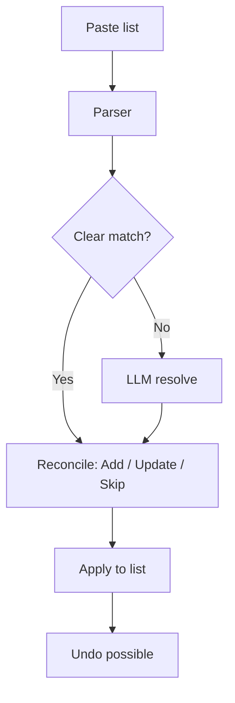
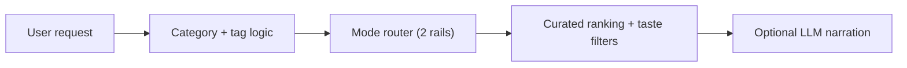
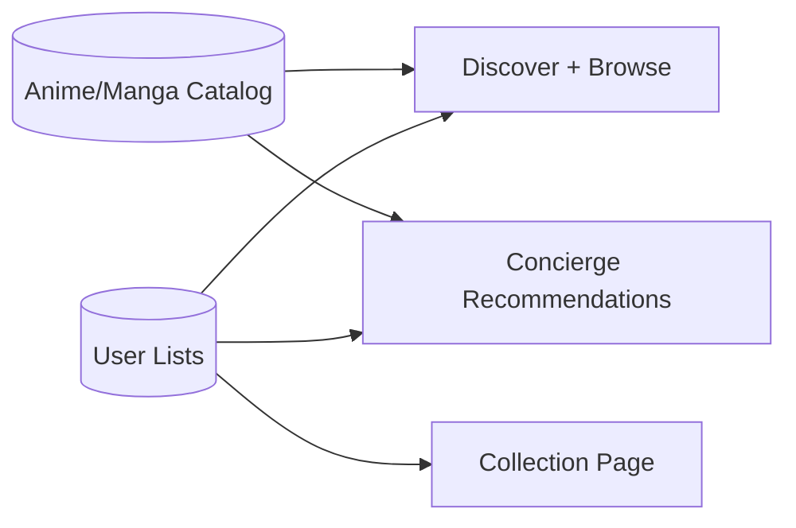
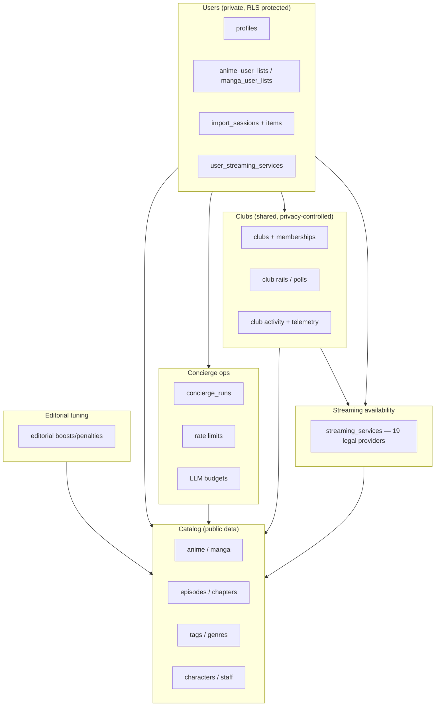
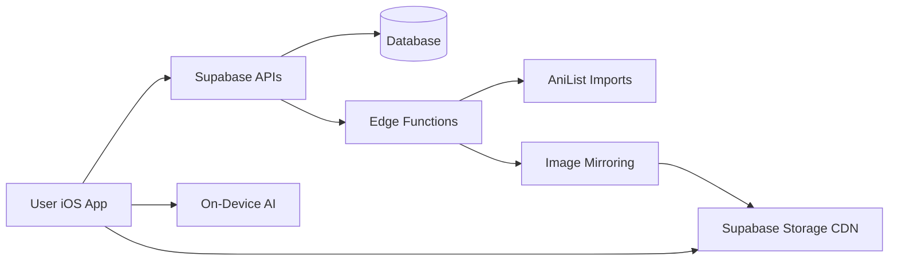
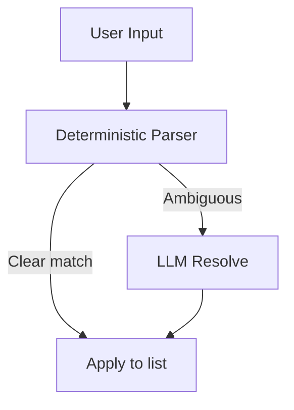

# Kuro — Current State (Plain English)

**Last updated:** 2026-07-31

This file explains the app in everyday language for non-technical readers. It is meant to be a complete, easy overview of how Kuro works today.

**Current inventory:** 93 app Swift files and 222 SQL migrations are in the repo today.
**Current rollout note:** streaming/provider availability remains staged behind `streaming_availability_v1` at 0%; the live watch/read path still uses `external_links`.
Historical notes below describe what changed at the time; they are not current inventory counts.

---

## 1) Rule: Always keep this file updated

Every time the app changes (design, features, backend, data, schedules, etc.), this file must be updated. Add a new line to the **Change Log** at the bottom with the date and a short summary.

For the technical “source of truth” and auto-generated inventories, see `CURRENT_APP_STATE.md`.

If you need the *literal code* in one place for another model to read, see:
- `archive/CURRENT_APP_STATE_CODEBASE.md` (auto-generated; very large)

---

## 2) What Kuro is (in one paragraph)

Kuro is a curated anime + manga app. It lets users browse premium picks, keep lists, create private clubs with friends, teach Kuro their taste through a simple card ritual, and use a "Concierge" chat to import their watch list or get recommendations. The app is fast, clean, and focuses on high‑quality discovery.

**At a glance**
- Clean editorial design
- No adult content by default
- Taste Deck: a calm one-card-at-a-time ritual teaches Kuro what you love, know, and don't want — your picks already shape which cards you get dealt next, and a fully personalized New to You rail is staged behind a flag
- Private clubs for watching together with friends
- Concierge uses deterministic routing first, with optional AI for ambiguity and narration
- On-device AI for smart search, description condensing, and disambiguation support
- Local Mac synopsis worker continuously improves weak descriptions and writes enhanced copy back to the backend (without overwriting raw source text)
- Separate local Mac catalog-safety worker scans catalog records for pornographic signals and writes safety states/open-gap reports (independent from synopsis pipeline)
- Images are mirrored to a CDN for speed
- Works offline (shows a banner when you lose internet)

---

## 3) How the app is organized (screens)

The app has 5 swipeable pages that follow a natural discovery flow:

1. **Taste** (swipe left from Discover): the Taste Deck — a calm, full-screen ritual that shows one title at a time. You tap NOT FOR ME, I KNOW THIS, or CALLS TO ME (long-press for a synopsis, undo if you change your mind). After 12 cards, a quiet "Kuro is listening." summary confirms your signals were heard, and a "Your leanings" sheet shows what Kuro has learned so far. Since the taste-math upgrade (July 31, 2026, evening), these signals build a real taste profile on the server — a weighted sketch of the genres, themes, and tones you lean toward and the ones you avoid, where your distinctive tastes count for more than generic ones, recent signals count for more than old ones, and no single title or franchise can dominate. The deck already uses it: each session deliberately mixes safe ground with new territory (well-known canon, acclaimed picks, and hidden gems across different genre families), explores a little on purpose, and never re-deals anything you've listed, judged, or passed. A fully personalized `New to You` rail on Discover is built and verified, but still staged behind a flag. The Concierge used to live here; it moved (see below).
2. **Discover** (main page, opens by default): Shows 6 curated sections on first load (your personalized picks, what's airing today, essentials, trending, and manga counterparts). A "Show More" button reveals 7 additional sections (classics, current season, top rated, just added, etc.). Once you expand, it stays expanded across launches. The `New to You` rail now rotates per user on the server, so it stops repeating the same titles all the time; a fully taste-personalized version of this rail — matching candidates against your taste sketch while the editors' picks always keep most of the vote — is built, verified against live data, and staged behind a feature flag (`personalized_new_to_you_v1`, currently off). By default, ancillary anime entries like specials, music videos, and TV shorts are hidden from normal discovery.
3. **Browse** (swipe right from Discover): Explore the full catalog with filters (genre, status, length, decade, format, sort).
4. **Collection** (swipe right from Browse): Your personal list of anime/manga. The live app uses status filters, type filters, search, and sorting — including natural language search of *your own collection* ("show me action anime from 2020") via on-device AI. The newer provider/language availability filtering work remains staged behind `streaming_availability_v1` at 0% and is not part of the default-on production path.
5. **Clubs** (rightmost page): Private groups (2–20 members) for watching together. Create a club, invite friends with a code or a `kuro://join/...` link (opens the join sheet pre-filled), share curated watchlists (rails), see weekly highlights, vote in polls, and react to items (fire/heart/eyes/100). Club owners control privacy settings, and friend-activity visibility now strictly follows those settings on the server (a privacy gap was closed in July 2026). The club list shows member counts, recent activity previews, and unread dots. When sharing is set to "progress", you'll see pace tracking ("3 ep behind the group") once a club has at least 3 members — duo clubs see an honest "Activity unlocks at 3 members" note. Milestone cards celebrate when all members finish a title. Club activity also shows up on anime/manga detail pages. You can add anime/manga directly to a club rail from the Rails tab or via the "Add to Club..." context menu on any card. **Social activity**: when you open an anime or manga detail page, you can now see which of your club friends are also tracking that title, read their comments, and react with thumbs up/down. This replaces the old club chat tab with more relevant, title-level conversations. **Shared streaming** (staged): a "SHARED" toggle on club rails that shows titles available on services all members share is built but remains behind the `streaming_availability_v1` flag at 0%.

**Concierge** is no longer a pager page. It lives in two places now: a Concierge row in the Profile sheet, and the `kuro://concierge` link — both open it as a sheet, and a pre-filled prompt still works. Everything it did before (list imports, mood recommendations, undo) is unchanged.

**Search** is not a page — it opens as a sheet from the magnifying glass icon in the header, available from any page. It is a structured catalog search (title/keyword with filters); natural-language understanding ("show me action anime from 2020") applies to searching *your Collection*, not the global search sheet. Default anime search now also hides ancillary formats like specials, music videos, and TV shorts so the mainline results come first.

Profile is a small menu in the top-right corner with Concierge and Clubs shortcuts. (Setting your streaming subscriptions — Crunchyroll, Netflix, Funimation, HIDIVE, etc. — is built but still staged behind the `streaming_availability_v1` flag at 0%, so it is not visible in the live app yet.)

**Onboarding** (first launch): a short intro ends with a "Teach Kuro your taste" card that drops new users straight into the Taste Deck, so the app starts learning from the very first session.

**Header today:**
- Left: KURO wordmark
- Center: current page name in an animated window, with 5 dot indicators below
- Right: search icon + profile menu
- When on Concierge (legacy layout), a small chat icon appears next to the title.

### How to push a new TestFlight build

Run `fastlane beta` from the project root. This auto-increments the build number, archives the app, and uploads to TestFlight. No password or 2FA needed — it uses an API key stored at `~/.appstoreconnect/private_keys/AuthKey_7L84A7P9X7.p8`. The Fastlane config files are in `fastlane/Appfile` and `fastlane/Fastfile`.

---

## 3.1) Design style (today)

- Minimal, editorial look
- Glass‑like UI surfaces
- Serif titles, light typography
- Focus on premium / classic content

---

## 3.2) On-Device AI (Apple Foundation Models)

Kuro now uses Apple's built-in AI that runs directly on your device (no internet needed for these features). This means faster responses and better privacy since your data never leaves your phone for these tasks.

The concierge stack handles four things:

1. **Deterministic routing + heuristics first** for fast and stable recommendations.
2. **Disambiguation support** when multiple titles collide (for example, “Hunter x Hunter 1999” vs “Hunter x Hunter 2011”).
3. **Synopsis condensing**: Long plot descriptions get automatically shortened into 2-sentence hooks that are spoiler-free and easy to scan.
4. **Smart search**: You can search your collection using everyday language instead of picking filters manually.

---

## 3.3) New features added in this session

### Smart Descriptions
Long plot summaries from AniList are often several paragraphs. The app now automatically condenses them into short, spoiler-free 2-sentence hooks using on-device AI. This makes browsing feel faster and cleaner.

### Smart Search
Instead of tapping through genre filters and dropdowns, you can now type things like "show me action anime from 2020" or "short comedy manga" when searching *your own collection*, and the app understands what you mean. This uses the on-device AI to interpret your query. (The global search sheet from the header uses structured catalog search, not natural language.)

### What to Watch/Read Next
When you open an anime or manga detail page, there is now a personalized "Next Up" section. It looks at your progress and suggests what episode or chapter to continue with, so you spend less time figuring out where you left off.

---

## 3.4) Offline detection

The app now notices when you lose your internet connection and shows a small "OFFLINE" banner at the top of the screen. When your connection comes back, the banner disappears automatically. This way you always know whether the app can reach the server.

---

## 3.5) App lifecycle handling

The app now properly handles being sent to the background (when you switch to another app) and coming back to the foreground. Previously, data could become stale or connections could break if you left the app for a while. Now it refreshes gracefully when you return.

---

## 4) Concierge (the assistant)

The Concierge is designed to:
- **Import** lists quickly (e.g. “AoT completed, JJK ep 12”) and apply them to your list.
- **Recommend** new anime or manga based on your mood.

It works in two layers:
1. **Smart rules first** (fast, cheap, predictable).
2. **LLM fallback** only when needed (to resolve ambiguous titles or narrate recommendations).

There are built-in usage limits so it can’t be abused.

**On the Concierge page (today):**
- A short intro card explains what it does.
- Four quick actions:
  - From your library
  - From clipboard
  - Try an example import
  - Describe a vibe
- The Concierge no longer takes over the full screen. Everything stays inline in the chat conversation, which makes it feel faster and more natural:
  - Import results appear as inline confirm bubbles (with cover art)
  - Recommendation results appear as scrollable editorial-style horizontal rails
  - Confirmations are inline buttons (not separate screens)
  - Success shows as a brief toast with undo
  - Internal mode names are hidden; users see curated titles and subtitles.

**Adult content:** filtered out by default.

---

## 4.1) How an import works (simple steps)

1. You import from your library or paste a list.
2. The concierge parser tries to match titles.
3. Each matched item is classified as one of three actions:
   - **Add** — brand new to your collection.
   - **Update** — already in your collection but with newer progress (e.g. more episodes watched).
   - **Skip** — already in your collection with the same or better progress (duplicate).
4. If something is unclear, it shows an inline clarify flow (status/title/intent) in the same message.
5. After confirmation, your list updates in place. A toast confirms success and supports Undo.
6. High-confidence imports (score >= 0.85) can auto-apply immediately with an undo toast.

---

## 4.2) How recommendations are chosen

- The system prefers **classics** and **premium picks** (internally `premium_picks`, surfaced in UI as **The Cut**).
- It avoids adult content by default.
- If you say "like X", it finds similar titles first.
- The LLM only adds wording or resolves ambiguity.
- Your prompt is routed into **up to 2 curated rails**:
  - Rail A: the best-fit vibe set for your request
  - Rail B: an expanded classics set (when available)
- The server selects from **23 configured modes** (v8), including:
  - Mecha, Mystery/Detective, Music & Performance, Historical, School/Coming-of-Age, Shoujo/Josei, plus core modes.
- The concierge now shows curated copy (for example, "The Cut", "Soft Evenings", "Dark, Not Empty") and suppresses raw internal taxonomy names.
- Roughly **50 curated rails** across anime/manga are active after dedupe/quality pruning.
- Negative genre filtering supported: "action but no romance", "fantasy without harem". Excluded genres now also suppress conflicting modes in routing (not just item filtering).
- 30+ abbreviations in the parser (up from 10): OP, DB/DBZ/DBS, SAO, NGE/Eva, LOTGH, etc.
- **German-first support**: inflection handling, intent keywords, and curated EN/DE recommendation copy.
- The modes are configurable in the database (`public.concierge_config.config.modes`) so we can tune them without redeploying the app.

---

## 4.3) Cost + abuse protection (so the Concierge cannot be exploited)

Kuro is built so it won't "accidentally bankrupt you" if someone spams the chat:
- **Deterministic-first**: most requests are handled by rules + database queries (no LLM call).
- **Rate limits**: frequent callers get temporarily blocked.
- **Daily token budgets** (per day):
  - **Per user**: 50,000 tokens/day
  - **Global**: 1,000,000 tokens/day

If budgets are exceeded, the app should keep working but the LLM-heavy behaviors get reduced (for example: less narration / fewer disambiguation calls).

---

## 5) Where the data comes from

Kuro’s anime and manga catalog is mostly imported from **AniList**. This includes:
- anime / manga titles
- episodes / chapters
- staff / characters
- tags / genres

This data is stored in Supabase (the backend database).

There are two main ways the database is populated:
1. **Bulk AniList imports** (scripts or edge functions)
2. **Image mirroring** (moves posters to Supabase Storage)

---

## 6) How images work (CDN + caching)

- The app **mirrors** images into Supabase Storage.
- Those images are then served from a CDN-like public storage URL.
- The app also caches images locally for speed.

This means posters are fast, stable, and don’t rely on AniList’s servers at runtime.

**Mirroring backlog unblocked (2026-07-31):** coverage was stuck at fixed ceilings (anime 2.8%, manga 1.4%, characters 0.2%, staff 0.5% — measured July 31). Three fixes landed: the mirror jobs now only queue images that are actually still remote (instead of re-scanning the same fixed windows), a database safeguard prevents imports from ever replacing a mirrored image with a remote URL again, and viewing a title can bump its images to the front of the queue. Coverage should now climb steadily on its own.

---

## 7) Scheduled jobs (automated maintenance)

Automated jobs that run on a schedule:
- **Concierge housekeeping**: daily, deletes old logs/metrics (90-day retention for club telemetry).
- **Image mirroring**: 5 jobs spaced 15 minutes apart every night (anime/manga in three windows, then characters, then staff) — copies remote images into our CDN.
- **Taste profile drain**: every 15 minutes, recomputes queued users' taste profiles from their latest signals (small batches, errors captured per user).
- **Outbound link ledger cleanup**: daily, deletes click-ledger rows older than 90 days.
- **Bulk AniList imports**: scheduled catalog refreshes (run with a secret key for safety).

Manual runs are still possible for image mirroring and imports when needed.

---

## 8) The backend (Supabase) in plain terms

Supabase stores:
- the full catalog
- user lists and profiles
- concierge sessions + logs
- metrics and rate limits

Supabase also runs the Concierge server logic and provides secure APIs.

**Usage limits (plain English):**
- Per‑user and global daily budgets are enforced for AI usage.
- This prevents expensive overuse.

---

## 8.2) What data is stored about a user

- A **profile** row (your account basics)
- Your **anime/manga list** entries (status, progress, rating)
- Your **taste signals and taste profile** (deck choices and list activity, condensed into weighted likes/dislikes; only you can read your profile)
- Your **streaming subscriptions** (which services you use — Crunchyroll, Netflix, etc.; staged feature, not yet visible in the app)
- Concierge **import sessions** (so you can undo)
- Concierge **logs** (for improving the parser and debugging)
- **Club memberships** and your activity within clubs
- **Outbound link taps** (which watch/read/provider links you tap, kept 90 days — this is the click ledger that may later power affiliate links; no ads, ever)

No one else can read your private list data because of row‑level security. Club data is shared only with club members, and the club owner controls exactly what is visible — and the server now strictly enforces those sharing settings for friend activity (fixed July 2026). Your streaming subscription data is deleted when you delete your account (GDPR compliant).

---

## 8.3) What to update when things change

Whenever you change the app or backend, update these two files:
- `CURRENT_APP_STATE.md` (technical)
- `CURRENT_APP_STATE_PLAIN.md` (plain English)

Then add a line to the Change Log at the bottom.

---

## 8.1) Simplified data model

---

## 8.4) Database (high-level view)

This is a simplified map (not every table/column, just the big groups):

If you need the full table/column-level definition, use:
- `CURRENT_APP_STATE.md` (schema + object maps)
- `archive/CURRENT_APP_STATE_CODEBASE.md` (all migrations included)

---

## 9) Simple system diagram

---

## 10) Concierge flow (simple view)

---

## 11) Where to find things (non-technical)

- **App UI code:** `Kuro/Views/`
- **Main navigation:** `Kuro/ContentView.swift`
- **Data + API calls:** `Kuro/Services/SupabaseService.swift`
- **Backend SQL changes:** `supabase/migrations/`
- **Legacy DB fixes:** `supabase/migrations/20260206143000_fix_legacy_tags_and_comments.sql`
- **Foundation schema:** `supabase/migrations/20250109_remote_applied_placeholder.sql` (baseline core tables; already in prod migration history)                                                                                        
- **Legacy SQL originals:** `legacy_sql/` (archived; no longer used directly)
- **Backend functions (Concierge, imports):** `supabase/functions/`

---

## 12) Operator checklist (plain English)

- If images look slow: run image mirroring. Coverage was measured at 2.8% (anime) / 1.4% (manga) / 0.2% (characters) / 0.5% (staff) on 2026-07-31 — the pipeline was unblocked that day (remote-only queuing + anti-overwrite safeguard + priority queue), so coverage should climb on its own; check the trend, not just the snapshot.
- If Concierge seems broken: check its usage limits and logs.
- If recommendations look bad: verify the recommendation tables and see if imports are stale.
- If imports stop: check the import cursor and re-run import scripts.
- If bulk imports fail with "unauthorized": make sure the correct secret key is being sent in the request header.
- If on-device AI features are not working: they require an Apple device with Foundation Models support (recent hardware). Older devices will fall back to non-AI behavior.
- **Dashboard action still needed**: 1 auth setup step must be done manually in the Supabase dashboard (see section 17).

---

## 13) Glossary (plain English)

- **RPC:** A database function that the app can call like an API.
- **Edge Function:** A small backend function that runs on Supabase.
- **RLS:** Row Level Security; ensures users can only see their own data.
- **CDN:** Fast image delivery system.
- **Club:** A private group of friends who share watchlists and vote on what to watch next.
- **Rail:** A horizontal scrollable row of anime/manga picks (used on Discover, in Clubs, and in Concierge recommendations).
- **Quality gate:** An automated check that runs before code is saved, catching mistakes early.
- **On-device AI:** AI that runs directly on your iPhone using Apple's built-in models, so it works without internet and your data stays private.
- **Prompt injection:** A type of attack where someone types specially crafted text to trick an AI into doing something unintended. Kuro sanitizes user input to prevent this.
- **Synopsis condensing:** Automatically shortening a long plot description into a brief, spoiler-free hook.

---

## 14) Quality gates (automated checks)

Before code changes are committed, automated checks run to catch common problems early:
- **Secret scanning**: Makes sure no passwords, API keys, or tokens are accidentally included in the code.
- **Migration validation**: Checks that database migration files are well-formed and won't break the database.
- **Code quality**: Catches common code issues (unused variables, formatting problems, etc.).

These run automatically so that problems are caught before they reach users.

---

## 15) Security hardening (production-readiness session)

A thorough security review was done to make the app safer before it ships:

- **Import endpoints locked down**: The bulk import functions (used to load anime/manga data into the database) now require a secret key. Previously anyone who knew the URL could trigger an import.
- **Image uploads restricted**: The storage bucket that holds cover images now only accepts image files (jpeg, png, webp, avif, gif) up to 5MB. This prevents someone from uploading scripts or huge files.
- **Storage permissions tightened**: Proper read/write rules are in place so only the right people can upload or delete images.
- **AI prompt protection**: When user text is sent to AI services (like the Concierge LLM), it is now sanitized first. This prevents "prompt injection" attacks where someone types specially crafted text to trick the AI.
- **Database hardening**: Foreign keys, indexes, and row-level security policies were reviewed and tightened up.
- **Debug logging removed**: Verbose debug output that could reveal internal details has been stripped from production builds.
- **All edge functions redeployed**: Every backend function was redeployed with the latest security and performance fixes.

---

## 16) Performance improvements (production-readiness session)

- **Image mirroring no longer stalls**: The pipeline that copies cover images to our CDN used to get stuck waiting for database locks. A fix reduced the "skip" rate from 58% down to roughly 0%.
- **Automatic retries on flaky connections**: Network calls from the app now automatically retry 2-3 times when they hit temporary connection problems (timeouts, brief outages).
- **Gentler mirror batches**: The image mirroring job now processes 200 images at a time with 15 minutes between batches, which is more stable and less likely to overwhelm the server.

---

## 17) Known remaining items

These items were identified during the production-readiness review but require manual action in the Supabase dashboard (they cannot be done through code):

- **Disable email confirmations** (1 step — required so new sign-ups are authenticated immediately):
  1. Auth → Email → turn OFF "Confirm email" (email verification is no longer required for sign-up)
- **Image mirroring backlog**: Only a small fraction of catalog images have been mirrored to our CDN so far (anime 2.8%, manga 1.4%, characters 0.2%, staff 0.5% as of 2026-07-31). The pipeline was unblocked on 2026-07-31 (see section 6), so this is now a matter of letting the nightly jobs catch up over time.

---

## 17.1) P2 production improvements (completed 2026-02-16)

A batch of lower-priority production improvements was completed across the backend, iOS app, and accessibility:

### Backend hardening
- **Database cleanup**: All 8 core catalog tables (anime, manga, episodes, chapters, volumes, characters, studios, staff) now require a `created_at` timestamp -- previously some rows had NULL values which could cause sorting/filtering issues.
- **Index cleanup**: 12 unused database indexes were removed. These were leftovers from earlier search approaches that have since been replaced by the title_search materialized view.
- **Duplicate policy fix**: Two overlapping security policies on the club_members table were merged into one cleaner policy.
- **Mirror health check**: A new `check_mirror_health()` database function lets operators quickly check if the image mirroring pipeline is healthy (shows run stats, failure counts, and an alert flag).
- **Image mirroring improvements**: The mirroring pipeline now supports AVIF images (a modern, efficient image format). Mirrored images are now cached for 1 year with an "immutable" flag, meaning browsers and CDNs won't re-fetch them unnecessarily.

### iOS bug fixes
- **Vote errors now handled gracefully**: If voting in a club poll fails (network issue, etc.), the app now shows a clear error toast instead of silently failing.
- **Background tasks properly cancelled**: The Concierge page had several background tasks (warmup, prefetch, refresh) that could leak if you navigated away quickly. These are now tracked and cancelled when you leave the page.
- **Discover page error recovery**: If the Discover page fails to load on first attempt, it now shows a clear error message with a retry button instead of a blank screen.

### Accessibility improvements
- Screen readers (VoiceOver) now work better across multiple screens:
  - **Club detail**: Section headers are properly marked as headings.
  - **Club list**: The empty state and club cards have descriptive labels (club name + member count).
  - **Collection**: Section headers are properly marked as headings.
  - **Discover**: Section titles and error states have proper labels.
  - **Concierge**: Chat messages say "You said: ..." and "Concierge: ..." for clarity. Recommendation rail titles are marked as headings. Clarification cards have combined labels for easier reading.

### Deep linking (new feature)
- The app now supports deep links via the `kuro://` URL scheme. This means other apps or websites can link directly into Kuro:
  - `kuro://anime/12345` — opens a specific anime
  - `kuro://manga/67890` — opens a specific manga
  - `kuro://club/abc123` — opens a specific club
  - `kuro://discover` — goes to the Discover page
  - `kuro://collection` — goes to your Collection
  - `kuro://concierge?prompt=action` — opens the Concierge with a pre-filled prompt
  - `kuro://auth/callback?access_token=...&refresh_token=...` — handles email verification callback (signs user in immediately)
- The app's entitlements file was updated with an Associated Domains placeholder for future Universal Links support (`kuro.app`).

### Branded email templates + auth callback (new feature)
- 5 custom email templates replace the default Supabase emails: signup verification, password reset, magic link, email change, and invitation.
- Designed in the Kuro editorial style: monochrome, serif "K" wordmark, warm gray (#f5f5f0) background, black call-to-action buttons, minimal copy.
- **Sign-up flow** (how it works today):
  1. A user enters their email. The form validates the format in real time and checks uniqueness with a 500ms debounce (sign-up only). A subtle checkmark appears when the email is valid and available.
  2. The user enters a password. A "8 characters minimum" hint shows until the password meets the requirement, then a checkmark appears.
  3. The submit button stays disabled until both fields pass validation.
  4. On sign-up, the user is immediately authenticated — no email verification step, no "check your email" message. They go straight into the app.
- **Password reset and other email flows** still use branded email templates (reset link, magic link, email change, invitation). These redirect into the app via `kuro://auth/callback`. If the direct redirect doesn't work (e.g., on a desktop browser), a fallback page appears: a dark-themed page with an animated K logo and an "Open Kuro" button.
- **5 branded email templates** in the `emails/` folder: signup verification, password reset, magic link (passwordless login), email change confirmation, and invitation. They match Kuro's editorial style: warm gray background, serif K wordmark, black call-to-action buttons, minimal copy.
- **Custom SMTP required for production**: Supabase's built-in email service is severely limited — only ~2 emails per hour and only to team member addresses. For a real user base, you need a third-party email provider like Resend (3,000 emails/month free), AWS SES, Postmark, or Brevo. Resend is already configured as an MCP server in `.mcp.json`.
- **Pending manual step** (must be done in the Supabase Dashboard):
  1. **Auth → Email → Enable email confirmations**: Turn OFF "Confirm email" so that new sign-ups are authenticated immediately without email verification

---

## 18) Change Log (append-only)

- 2026-08-02: **Realm descriptors without burning agent quota** — Kuro can now write short editorial descriptions (what a title is / who it's for) for the visible catalog using the same Groq stack as Concierge narration, instead of expensive agent swarms. Already-generated swarm leftovers were salvaged first; a background worker is filling the rest. Taste "craft indicators" (great animation / weak story) stay for a later project.
- 2026-08-02 (cont.): The fill-in worker is deliberately slow (one title at a time with long pauses) so it doesn’t trip Groq rate limits or edge-function timeouts. About 1.6k titles done, ~5.5k still queued — multi-day unless we raise the Groq plan.
- 2026-08-02 (later): **Groq is out for realm descriptors.** You asked the agent to write them instead — Groq drain stopped; new rows come from agent batches via the fetch/submit scripts (Kimi master plan §6).
- 2026-08-02 (Stage 2 close): Descriptors finished for the visible pool. Low-confidence salvage rows were rewritten. The app can now nudge each title’s realm weights by up to ±0.2 from those descriptors (with reasons logged). Spirited Away’s similar titles still lead with Ghibli/folklore peers.
- 2026-08-02 (A+B+C): Spirited Away gate tightened so Re:ZERO/JJK no longer leak. AniList “also liked” edges stayed **advisory** after a first gold-set score (don’t fold them into ranking yet). Discover gained The Shelf + Hidden Gem behind a 0% flag.
- 2026-08-02 (curation research → ingest): After a real EN+JP pass of industry/niche lists, Kuro imported more peer awards (日本漫画家協会賞), more Annecy prizes, Manga Taishō runners-up, and Kono Manga #2/#3. Opaque “Critic Consensus” was split into Paste / Time Out / A.V. Club. Seasonal desks (Filmarks, 次にくるマンガ大賞, EN yearlists) now feed Hidden Gem without becoming forever-canon. Owner still needs to hand-judge the recommendation gold set.

- 2026-03-13: **Safety pagination limits on club bundle**: Added safety limits to the database function that loads all club data (members, rails, polls) in one call. Members capped at 50 rows (club max is 20, so this is just a safety net), rail items capped at 50 per rail, polls capped at 20. Rails and poll options are left unbounded since clubs rarely have more than 10 rails and polls typically have 2-6 options. No visible behavior change — these limits only kick in if the data is somehow corrupted or abused beyond normal use.
- 2026-02-28: **FM-Powered Intent Classification**: The Concierge now uses Apple's on-device Foundation Models as its primary intent classifier on supported devices (iOS 26+). When you type something like "Watched jujutsu kaisen halfway through", the FM model understands the intent (import) from context instead of relying on keyword matching. This handles nuances that keywords can't — for example, "I watched something great, recommend me more" correctly routes to recommendations even though it contains the word "watched". The FM classifies into 6 intents (import, recommend by vibe, recommend by seed title, library query, club action, unknown) with a confidence score. If the model is unsure (below 65% confidence), unavailable, or times out, it falls back to the existing keyword matching — so there's zero regression risk. On older devices without FM, keyword routing works exactly as before. Analytics now track whether each routing decision came from FM or keywords so we can compare accuracy. The keyword matching logic (`looksLikeImport`) was also extracted from ConciergeView into `TextNormalization` so it can be unit-tested — 14 unit tests now cover keyword detection for status words, past tense, German, progress patterns, and more. A UI test verifies that typing "Watched Jujutsu Kaisen halfway through" in Concierge routes to the import flow (not recommendations). The KuroTests unit test target was also wired into the Xcode scheme so `xcodebuild test` actually runs it.
- 2026-02-28: **Concierge Import UX Improvements**: Redesigned the import cards and confirmation flow in the Concierge. Import cards are now larger (80x114pt posters with sharp editorial edges), show the media type (ANIME/MANGA badge), display what was parsed from your text (e.g., "WATCHING · Ep 12 of 24"), and you can tap the poster or title to preview the full detail page. The redundant "N% match" text was removed (the ring indicator is enough). Low-confidence matches (below 80%) now auto-expand the "Other possibilities" list. The CONFIRM button now shows a loading spinner while items are being applied, and after success, the bubble permanently shows a summary (e.g., "2 added, 1 updated") with UNDO and VIEW COLLECTION buttons right there in the chat — so you don't have to rely on catching the 4-second toast anymore.
- 2026-02-28: **Fix Concierge Import False Success Toast**: Fixed a bug where using the Concierge to import anime/manga (e.g., "I watched Jujutsu Kaisen halfway") would show a "added to collection" success toast even when the server-side save actually failed. Both the auto-apply path (high-confidence matches) and the manual confirm path now properly check the server's response before showing the toast. If the save fails, users now see an error toast with the actual reason instead of a false success. Investigation confirmed the database column types are correct (TEXT, not the legacy INTEGER from original SQL) — the fix is purely on the iOS side where the response wasn't being checked.
- 2026-02-27: **UX Density + Clarity Improvements**: Four changes to reduce information overload and help first-time users. (1) **Discover page**: reduced from 13 sections on first load to 6 primary sections (your picks, airing today, essentials, trending, manga counterparts), with a "Show More" button to reveal 7 more (classics, current season, top rated, etc.). Once expanded, stays expanded. Data loading unchanged. (2) **Concierge first-time hint**: new users now see a clear two-row explanation of what Concierge does (import lists + get mood-based recommendations with a concrete example). After first use, it collapses to a slim one-liner. (3) **Club reactions**: items with no reactions now show a compact smiley icon instead of 4 empty emoji buttons; tap to expand. Items with existing reactions show the full row. (4) **Error dedup in Concierge**: rate-limit errors now show inline only, network errors show as toast only — no more seeing the same error in two places.
- 2026-02-24: **Social Activity Layer + Add to Club Context Menu**: Replaced the club chat tab with a more useful social activity layer. Now when you open any anime or manga detail page, you can see how many of your club friends are tracking that title, read their short comments, and react with thumbs up or thumbs down. "Friends" means anyone who shares a club with you. Cards throughout the app (Discover, Browse, Collection) now show a small indicator when friends are tracking that title, and long-pressing any card gives you an "Add to Club..." option to quickly add it to one of your club rails. The old club chat tab has been removed from clubs (clubs now have 3 tabs: Rails, This Week, Polls). The feature was staged behind `social_activity_v1` at 0% and rolled out to 100% on 2026-03-13. Backend: 2 new database tables, 5 new RPCs, rate limits on comments (10/5min) and reactions (30/min). iOS: 1 new view file, 12 modified files, ~600 lines added, ~316 lines removed.
- 2026-02-24: **Catalog safety uncertain flood reduced**: We found why the safety runner looked “stuck” with too many uncertain items. Most uncertain rows were `model_uncertain + no_strong_signal` (so not actually porn evidence, just conservative model output). We updated the worker to default to **safe** when there is no meaningful porn signal (low rule score + no rule hits), added a new metric `safe_fallback_no_signal`, and updated the safety dashboard to show it. A forced validation run confirmed improvement: `processed=240`, `safe=235`, `uncertain=0`, `blocked=5`.
- 2026-02-24: **Audit follow-up fixes completed**: The catalog safety worker no longer silently hides open-gap fetch failures. If `get_catalog_safety_open_gaps` fails, the run now records a failure metric (`open_gaps_fetch_failed`), logs a warning, keeps the previous `uncertain-latest.md` report instead of accidentally showing a misleading empty state, and writes the failure metric into each run summary line for easier terminal debugging. We also refreshed the technical inventory snapshot in `CURRENT_APP_STATE.md`, updated stale function-version notes in `CLAUDE.md` to match live deployments, and added backlog progress visualization to the safety dashboard (`http://127.0.0.1:8788`) so you can see how far the safety queue has moved (baseline vs remaining + completion %).
- 2026-02-24: **Separate catalog-safety runner added (synopsis runner unchanged)**: Added a fully separate local worker for catalog safety (`scripts/catalog_safety_worker.swift`) so safety scanning runs independently from synopsis enrichment. It has its own launchd label (`com.kuro.catalog-safety`), its own lock file, its own report directory (`/Applications/Kuro/reports/catalog-safety/`), and its own dashboard on `http://127.0.0.1:8788`. It does not reuse synopsis runner files. New backend RPC support was added in migration `20260224101000_catalog_safety_runner_v1.sql` (`get_catalog_safety_candidates`, `upsert_catalog_safety_result`, `mark_catalog_safety_failed`, `get_catalog_safety_open_gaps`). You can now track unresolved safety items in `/Applications/Kuro/reports/catalog-safety/uncertain-latest.md` while continuing to use synopsis weak-source tracking at `/Applications/Kuro/reports/synopsis-enrichment/weak-sources-latest.md`.
- 2026-02-23: **Synopsis enrichment pipeline stabilized and instrumented**: The local synopsis worker now resumes safely (retry/backoff migration applied remotely: `20260223002000`), tracks backlog before/after each run, and records extra quality metrics (`tone_polish_used`, `fallback_used`, `autodeduped_sentences`). The run scripts were hardened to avoid overlaps with a lock file, and launchd install now preserves existing env settings and validates required Supabase secrets before writing the plist. Lock handling now auto-recovers stale lock folders (PID + TTL guard) so the worker can resume without manual cleanup after crashes. The local dashboard now shows cumulative totals + 24h rollups and includes a generated-samples panel so you can inspect actual generated synopsis text from recent runs.
- 2026-02-23: **Dashboard timestamp fix**: The local synopsis dashboard no longer shows `updated_at: null`. `/api/status` now auto-fills `updated_at` from the latest run log timestamp (or file metadata fallback), so you always see a real last-run time.
- 2026-02-20: **Import cursor rewind bug fixed**: `scripts/run_full_import.js` was unintentionally resetting import cursors (`last_page=0`) each time it started. We changed it to “seed only if missing” behavior, so existing cursor progress is now preserved across runs.
- 2026-02-20: **Full import script now self-recovers from timeouts**: `scripts/run_full_import.js` now detects import timeout failures (like 504/524), automatically runs a smaller schedule-safe fallback batch, and then continues instead of stopping the whole import. This reduces manual babysitting during long imports. Live smoke test confirmed: after an anime timeout, fallback succeeded and cursor advanced.
- 2026-02-20: **Manga collision matching improved and data started flowing**: We loosened the collision tie-break rules so the matcher no longer stalls as easily when multiple MangaDex records share the same external ID. We also added an English-title preference layer (while still penalizing edition variants like “webtoon version” when possible). We fixed a backend insert bug where chapter upserts were failing due conflict-target mismatch, and switched to a safe dedupe-then-insert path. After deploying the function, the known problematic manga (**Tales of Demons and Gods / Yao Shen Ji**, AniList 86707) now maps correctly and imports chapter data: 321 chapter rows inserted, highest imported chapter 468, status now shows ready.
- 2026-02-20: **Parity deployment completed**: We ran the full sequence in order: pushed pending migrations, deployed `manga-chapter-enrich`, then deployed `manga-source-review-action`. Remote now includes both pending migrations (`20260221150000`, `20260221162000`). Function versions are now `manga-chapter-enrich` v4 and `manga-source-review-action` v2. Follow-up checks still pass: DB lint is warnings-only, DB health metrics look stable, and iOS build is still `BUILD SUCCEEDED`.
- 2026-02-20: **Backend sanity check re-run from Supabase CLI + docs synced**: Re-validated the live backend with `supabase functions list`, `supabase migration list --linked`, `supabase db lint --linked`, and `supabase inspect db db-stats`. iOS build also re-ran and passed (`BUILD SUCCEEDED`). The backend is healthy (no lock/blocking issues, good cache hit rates), but deployment parity is still not complete: local migrations `20260221150000` and `20260221162000` are not applied remotely yet, and chapter-enrichment functions are still on older deployed versions (`manga-chapter-enrich` v3, `manga-source-review-action` v1). This pass updated `CURRENT_APP_STATE.md`, `CURRENT_APP_STATE_PLAIN.md`, and `CLAUDE.md` to reflect that exact state.
- 2026-02-20: **Manga matching upgraded to fuzzy v2 with safety guardrails**: The chapter enrichment function now keeps exact AniList/MAL ID matches first, then uses a weighted fuzzy score for title matching (similarity + token overlap + exact alias) only when confidence and ambiguity checks pass. Mappings are now remembered and periodically re-verified (`next_verify_at`) so we don’t redo matching from scratch every run. If a mapping starts failing verification repeatedly, it is automatically deactivated and safely rematched. New run metrics were added for fuzzy attempts, skips, verification mismatches, and wrong-map proxy counts. A new quality RPC (`get_manga_match_quality_metrics`) powers operational scorecards. Daily housekeeping now auto-expires stale pending review rows older than 30 days. `check_cron_health.js` now prints auto-resolve rate, wrong-map proxy rate, unresolved trend, and current matcher mode/degraded status.
- 2026-02-20: **Senior full-stack stability audit published**: Added four evidence-backed audit documents in `/Applications/Kuro/docs/` (manifest, findings, remediation plan, release gate). Current release decision is **NO-GO** because one P0 (plaintext import secret exposure in migration SQL) and one P1 (deployed backend artifacts not yet tracked in git) are still open. Also re-verified that the prior add-to-rail P3 issue is fixed through structured PostgREST error mapping.
- 2026-02-19: **Manga chapter enrichment v1 scaffolded**: Added a new backend pipeline to fill missing manga chapter rows without touching the existing AniList import path. New migration creates `manga_source_links` (strict provider mapping), `manga_source_link_review` (manual review queue), candidate/metrics RPCs, and a 15-minute cron job (`manga-chapter-enrich-15m`). New edge function `manga-chapter-enrich` is secret-gated, lock-protected, logs to `import_runs` as `chapter_enrich`, maps MangaDex links in strict order (AniList ID, MAL ID, strict title), skips fractional chapter numbers, and upserts integer chapters safely. iOS now uses a legal-provider allowlist for manga read links: chapter taps no longer use generic `siteUrl`, and users see explicit copy when no legal link is available. `check_cron_health.js` now includes enrichment metrics + smoke test. Follow-up migration `20260219234000_fix_manga_chapter_enrich_cron_secret.sql` ensures the cron job always includes `x-import-secret`. Added one-tap review queue endpoint (`manga-source-review-action`) to approve/reject unresolved mappings and trigger immediate enrichment for the approved manga.

### 2026-02-18: Database Health Audit Fixes
- Dropped 2 duplicate indexes saving ~19 MB
- Removed dead rag_cache_cleanup() function
- Filled in 3 migration files that were previously remote-only
- 93 total migrations now (91 local + 2 remote)
- 67 public functions (removed 1 dead one)
- Postgres confirmed at version 17.6
- Pending Dashboard items down from 6 to 3

- 2026-02-18: **Audit follow-up — error handling, dead code, backend hardening**: A 4-agent team fixed 21 remaining findings from the pre-ship audit. Auth errors now surface to users (login failures, club errors, rate limits). Deleted ~2,100 lines of dead code (4 unused files + 2 dead structs in ContentView). Fixed force-unwraps in manga detail and import cards. Added debug logging to 4 empty catch blocks in Apple FM service. Backend: storage uploads now restricted to user's own folder, club descriptions validated (500 char max), chat message RPCs captured in migrations, unused `validate_club_invite` function dropped, concierge input limited to 5000 chars. Feature flag docs corrected: chat/reactions/realtime all at 100%. Added 3 more manual Dashboard items to pending list (OTP expiry, leaked password protection, Postgres upgrade). 60 Swift files (down from 64), 93 total migrations.
- 2026-02-18: **Pre-ship quality audit fixes**: A 7-agent audit found and fixed several issues: auth error messages now show to users instead of failing silently, a rare crash in Apple Sign In nonce generation was fixed, the Browse page no longer re-renders all cards when loading more results, 1,417 external links with Korean/Chinese/Japanese characters now work correctly, a Privacy Manifest was added (required by Apple for App Store), and joining archived clubs is now blocked. 93 migrations total.
- 2026-02-18: **Direct app redirect + Resend SMTP**: Email verification now redirects directly into the Kuro app via `kuro://auth/callback` deep link — no intermediate webpage. URL scheme registered in `Info.plist` at project root. Resend MCP server configured for production email delivery.
- 2026-02-17: **Branded email templates + auth callback deep linking**: 5 branded email templates (confirm, reset, magic-link, change-email, invite) with monochrome Kuro editorial styling. Auth-callback edge function deployed as fallback. iOS handles auth callbacks at app level (before auth gate) with `handleAuthCallback()` using `setSession()`. `signUpWithEmail` and `resetPassword` now pass `redirectTo` pointing to `kuro://auth/callback`. Files: `emails/*`, `supabase/functions/auth-callback/index.ts`, `DeepLinkRouter.swift`, `SupabaseService.swift`, `KuroApp.swift`, `ContentView.swift`.
- 2026-02-17: **Detail page error feedback fix**: When marking an episode as watched or a chapter as read fails (e.g. network error), the app now shows a visible error toast instead of silently failing. This applies to both the inline preview and the full episode/chapter list sheets. Also fixed the chapter row accessibility hint from "Opens on AniList" to the generic "Opens external link" since the link can go to any source.
- 2026-02-16: **P2 production blockers completed**: Backend hardening (NOT NULL on catalog created_at, 12 unused indexes dropped, duplicate club_members policy merged, mirror health check function, mirror AVIF support + 1-year cache). iOS bug fixes (vote error toast in clubs, Task.detached cancellation in concierge, discover error state with retry). Accessibility pass across 6 views (VoiceOver headings, labels, combined descriptions). Deep linking infrastructure (kuro:// scheme with anime/manga/club/page routes, Associated Domains placeholder). Added section 17.1.
- 2026-02-16: **Add to rail from clubs + adaptive card sizing**: You can now add anime or manga directly to a club rail without leaving the club. Each rail has a "+" button that opens a search sheet — type a title, tap to add. Locked rails only show the button for admins/owners. Error messages are clear (e.g. "This title is already in this rail"). Member labels in club activity now use a stable short ID instead of "Member 1, Member 2". Card sizes across Discover, Genre Hub, and detail pages now adapt to your screen width instead of being hardcoded.
- 2026-02-16: **Clubs Enhancement — reactions, chat, pace sync, realtime, notifications**: Clubs got a major upgrade across 6 phases. The club list now shows member counts, what's happening ("Added: Frieren"), and a dot when there's new activity you haven't seen. Inside a club, you can react to items with emoji (fire, heart, eyes, 100) — counts are anonymous. A new Chat tab lets members send short messages (280 chars, auto-deleted after 30 days) — like group iMessage, not a forum. When everyone's sharing progress, you'll see pace tracking ("3 ep behind the group" or "In sync") and milestone celebrations when all members finish a title. Updates now appear live without pull-to-refresh (Supabase Realtime). A badge dot on the Clubs indicator in the header tells you when there's new activity. All new features are behind feature flags for staged rollout. Privacy maintained: reaction counts are anonymous, chat is member-only with 30-day auto-prune, pace uses median (not individual progress).
- 2026-02-15: **5-page swipe navigation restored**: The app now has 5 swipeable pages instead of 3: Concierge ← Discover → Browse → Collection → Clubs. Browse was promoted from a popup to its own page. Clubs was elevated from being hidden inside Profile to its own rightmost page. Search stays as a popup from the header icon. Page transitions are snappier and the app runs at 120fps on ProMotion displays. Distant pages are automatically unloaded to save memory. Fastlane/TestFlight deployment instructions added to documentation.
- 2026-02-15: **43 UX improvements shipped + first TestFlight build**: A 16-agent team shipped 43 improvements across the entire app (discover, collection, browse, search, detail pages, concierge, settings). Senior code review caught and fixed a German spelling error, a security nonce cleanup, and a color palette violation. Fastlane was set up for automated TestFlight builds (run `fastlane beta` to push a new build). Build 2 (version 1.0) is now live on TestFlight. The on-device AI features (Smart Descriptions, Smart Search, Next Up) are compiled in and will activate on supported devices — no special Apple entitlement is needed for Foundation Models, just the standard framework import. A placeholder app icon (white K on black) was added. Bundle ID is `com.Kuro.app`.
- 2026-02-14: **Concierge and Clubs UX polish documented and completed**: Added "From your library" import action, curated concierge labels and 1–2 line curator notes, status clarifications in import flow, club member status/progress rendering on activity screens, and docs alignment for changed Concierge behavior.
- 2026-02-09: **Production-readiness session**: Added on-device AI (Apple Foundation Models) for mode routing, disambiguation, synopsis condensing, and smart search. Three new user-facing features: Smart Descriptions (2-sentence hooks), Smart Search (natural language collection queries), and What to Watch/Read Next (personalized "Next Up" on detail pages). Offline detection with banner. App lifecycle handling (background/foreground). Security hardening: bulk import auth, storage restrictions (images only, 5MB), prompt injection protection, DB hardening, debug logging removed. Performance: image mirroring lock fix (58% skip → ~0%), automatic network retries, gentler mirror batches. All edge functions redeployed. Added sections 3.2–3.5, 15–17.
- 2026-02-09: **Plain-English doc refresh**: Updated sections 2–4.2 to cover Clubs (private groups with shared watchlists, polls, privacy controls), import reconciliation (Add/Update/Skip detection with undo), Concierge inline redesign (no more full-screen takeovers), German language support, 23 recommendation modes (6 new), and quality gate automation. Added new section 14 for quality gates.
- 2026-02-09: **Clubs feature launched**: Private groups (2-20 members) with curated rails, polls, and privacy levels. New page in the app (6th swipe page). Create/join clubs via invite codes. Import reconciliation detects existing collection entries and proposes Add/Update/Skip actions instead of blind imports. Quality gate scripts added for CI. Club telemetry with 90-day retention. Haptics and empty states polished across all new views.
- 2026-02-09: **Concierge images wired**: `search_titles()` RPC now returns `cover_image_medium` (new migration). Import preview cards and recommendation cards now show actual cover art via `KuroCachedAsyncImage` instead of gradient placeholders. Gradient remains as fallback for missing images.
- 2026-02-09: **P0 fix — progress data forwarding**: `confirmImport()` now sends parsed progress fields (episodes, chapters, volumes, season, caughtUp, etc.) to the apply endpoint. Previously all imports landed with progress=0.
- 2026-02-09: **Performance parallelization**: All 3 concierge edge functions (parse, apply, recommend) now process items and DB queries in parallel via `Promise.all` instead of sequential loops. Expected 2-5x latency improvement. iOS post-apply fetches also parallelized with `async let`.
- 2026-02-08: **Adaptation disambiguation**: Parser extracts year mentions from input ("HxH 2011" → year=2011), boosts matching candidates, strips years from search queries. Resolver shows year/format tags to Groq LLM. iOS blocks auto-apply when top candidates are different adaptations of the same series (e.g. HxH 1999 vs 2011), unless the user's year mention resolves it.
- 2026-02-08: **Negative genre mode suppression**: "action but no romance" now correctly routes to `premium_action` (The UI copy is “Comedy/Action taste” class) instead of Romcom. Excluded genres suppress conflicting modes in both `mapStrongGenreToModeId` and `scoreMode`. Router eval script hardened with exponential backoff for 429/5xx.
- 2026-02-08: **Major curated content overhaul**: cleaned up all existing rails (removed sequels, misclassified items, cross-rail duplicates; slimmed from 120-210 items to 30-80 per rail; fixed classics definition). Added 3 new vibe modes (Sports, Sci-Fi, Horror & Supernatural) + demographic rails (Seinen, Shoujo, Josei). Parser now has 30 abbreviations and supports negative filtering ("no romance"). Total: 17 modes, 38 rails, 63 migrations. Enhanced audit script with overlap/franchise/year/size checks.
- 2026-02-08: Removed genre labels (Action, Adventure) from all card types — only year + episode count shown. Tightened card text spacing.
- 2026-02-08: "Recommend something" is now pinned to `premium_picks`, surfaced as **The Cut**, so vague prompts return consistently great results.
- 2026-02-08: Fixed some “off vibe” picks in pinned rails. Short & Complete is now truly short (<= 13 episodes) and Fantasy (no isekai) no longer includes ongoing or huge long-runners. Migration: `supabase/migrations/20260208090000_refine_short_and_fantasy_rails.sql`.
- 2026-02-07: More "vibe" recommendations are now pinned/curated (legacy internal modes like `premium_action`, `premium_comedy_grownup`, `cozy_comfort`, `dark_serious`, `hidden_gems`) and converted to curated copy before display.
- 2026-02-06: Security hardening: RLS enabled on 5 unprotected tables + 5 views fixed. Deleted 2 legacy edge functions (duplicates). Concierge UI polished: signal badges now visible on recommendation cards, serif fonts for editorial feel, larger tap targets, rail header dividers.
- 2026-02-06: Curated rail expansion: +366 editorial picks across 4 rails (classics_anime +90, classics_manga +97, gateway_anime +75, gateway_manga +104). All Ecchi/Hentai titles excluded, quality thresholds enforced (score >= 76 classics, >= 78 gateway). Total curated items: ~676.
- 2026-02-06: Schema drift fixed: baseline schema SQL captured in `supabase/migrations/20250109_remote_applied_placeholder.sql` (core catalog tables + import tracking + materialized views + matview refresh cron). Original root SQL files archived to `legacy_sql/`.
- 2026-02-06: Removed unused iOS code: ConciergeOverlay, KuroChanMascot, getByMood, dead SearchViewNew block (~500 lines).
- 2026-02-06: Concierge modes expanded from 8 to **14** and deployed: added Short & Complete, Movie Night, Romance (serious), Romcom, Fantasy (no isekai), Isekai. Enriched synonyms (incl. German) + new intent detectors.
- 2026-02-05: Concierge recommendations now return **two curated rails (modes)** and an **expanded Classics rail** (configurable via database).
- 2026-02-05: Added Concierge cost guardrails + a high-level database diagram; fixed formatting glitches.
- 2026-02-05: Added non-technical runbook and glossary sections.
- 2026-02-06: Added a production schema drift fix migration for `tags.kitsu_id` and `comments.user_id` types: `supabase/migrations/20260206143000_fix_legacy_tags_and_comments.sql`.
- 2026-02-05: Expanded this plain-English snapshot with deeper flows and diagrams.
- 2026-02-05: Added/expanded this plain-English snapshot for non-technical readers.
- 2026-02-05: Concierge moved to left swipe page. Profile is a top-right menu. Cards now show YEAR · EPS. Concierge intro + quick-start pills added.

### February 19, 2026 — Backend Security & Quality Remediation

Completed a comprehensive 5-phase backend quality remediation based on a 7-agent audit:

**Security fixes:**
- Removed 5 dangerous database functions (2 contained hardcoded admin credentials that could be called by anyone)
- Locked down 4 admin-only database functions so they can't be called by regular users or anonymous visitors
- Added authentication to the image mirroring service (was previously open to anyone)
- Fixed an analytics table that was silently rejecting all data

**Bug fixes:**
- Fixed anime/manga data model mismatches — two ID columns were mapped to wrong database names, one had the wrong data type, and two properties referenced columns that don't exist
- Added the user's anime and manga lists to real-time updates (subscriptions were silently failing)
- Made the "is adult content" flag required instead of optional on anime and manga

**Hardening:**
- Added rate limiting to club reactions (30/minute) and club creation (5/hour, max 20 clubs per user)
- Restricted club emoji reactions to only the 4 approved emojis
- Tightened 5 database access policies from "anyone" to "logged-in users only"
- Fixed a storage policy that didn't verify file ownership on updates
- Added 2 missing database indexes for better query performance
- Removed 2 ambiguous function duplicates that could cause routing issues

**Operations:**
- Added automatic cleanup of cron job history (keeps 14 days)
- Removed a duplicate weekly cleanup job
- Fixed a scheduling conflict where 3 jobs ran at the same time
- Updated all image mirroring schedules with proper authentication

**Numbers:** 12 new database migrations, functions reduced from 67 to 58, edge functions increased from 13 to 14

### February 19, 2026 — P0 Pre-Ship Audit Remediation

Fixed the highest-priority issues identified during the pre-ship audit:

**Database integrity:**
- Fixed 13 potential crash points where the database allowed empty values in columns that the app expected to always have data. Added strict "must have a value" constraints on 17 database columns total.

**Concierge import fixes:**
- Fixed a bug where user ratings (like "Naruto 8/10") were correctly understood by the AI parser but silently lost when building the import payload. Ratings now carry through the entire import flow from parse to apply.
- Fixed a build error in the import card mock data that was caused by adding the new rating fields.

**Club live updates:**
- Fixed club real-time subscriptions: new polls and chat messages from other members now trigger instant refresh. These two tables were missing from the real-time subscription list.

**Error handling improvements:**
- Progress updates and rating changes now show error messages to the user instead of failing quietly.
- Club chat loading failures now show an error message with a retry option instead of a blank screen.
- Club reaction toggle failures now show a toast notification instead of silently failing.

**Deep linking:**
- Opening `kuro://concierge?prompt=recommend something` now actually pre-fills the prompt in the Concierge input field. Previously the prompt parameter was parsed but never applied.

### 2026-02-24 — Detail page scrolling fixes
- **Bottom dead zone gone**: The anime and manga detail pages had a ~59pt dead zone at the very bottom where touches didn't register. The hero banner was being visually shifted up but its invisible layout frame still took the original space. Fixed by shrinking the layout to match.
- **Horizontal rails scroll again**: The "More Like This" section on detail pages couldn't be swiped horizontally because three competing touch recognizers were fighting. Removed the one that only matters on the main pager pages (not inside sheet presentations).

### 2026-02-25 — Sign-up flow streamlined with inline validation
- **Inline field validation**: The sign-up/login screen now validates email format in real time as you type. During sign-up, it also checks if the email is already taken (with a 500ms debounce so it doesn't fire on every keystroke). Password shows a "8 characters minimum" hint until valid. Both fields show subtle checkmarks when they pass validation. The submit button stays disabled until everything checks out.
- **No more email verification on sign-up**: New users are authenticated immediately after signing up — no "check your email" step. This removes friction from onboarding.
- **New database function**: `check_email_exists` powers the real-time email uniqueness check from the sign-up form.
- **Pending Dashboard steps reduced**: The 3 manual Supabase Dashboard steps (redirect URLs, email templates, SMTP) have been replaced by just 1: disable email confirmations in the Dashboard so sign-ups go through instantly.

### 2026-02-26 — Gesture regressions fixed (TestFlight build 9)
- **3 gesture regressions fixed**: Vertical scrolling was stuck, horizontal rails were hard to swipe, and most cards could not be tapped. All three issues traced to a single root cause.
- **Root cause**: The `KuroDeliberateTap` modifier used a custom drag gesture with overly strict thresholds (6pt movement limit, 80ms dwell time, 220ms cooldown after rail scrolls) that blocked normal interactions instead of just guarding against accidental taps during page swipes.
- **Fix**: Replaced the custom drag gesture with SwiftUI's built-in `.onTapGesture`, which natively handles tap-vs-scroll disambiguation without interfering with scrolling or swiping. The only guard kept is `suppressCardTaps`, which prevents card taps while the user is actively swiping between pages.
- **TestFlight build 9** shipped with this fix.

### 2026-02-28 — Fix: Concierge import detection
- Fixed a bug where phrases like "Watched jujutsu kaisen halfway through" were incorrectly treated as recommendation requests instead of imports. The app now recognizes standalone past-tense verbs ("watched", "saw", "seen") and partial-progress markers ("halfway", "midway") as import signals, matching what the server parser already supports. Also added German past-tense detection ("geschaut", "gesehen", "gelesen").

### 2026-03-01 — FM intent classification post-review cleanup
- **Documentation fix**: The technical snapshot had a stale 260-line code dump of the old `send()` function that didn't reflect the new FM-powered intent routing. Replaced with a concise summary pointing to the real source code.
- **Flag rollout documented**: The `fm_assist_v1` feature flag (which enables on-device AI intent classification) is now documented as 0% staged rollout with a planned ramp: 0% → 10% canary → 50% → 100%. It stays dormant until on-device testing validates accuracy.
- **8 more tests added**: Edge cases for empty/whitespace input, case-insensitive matching (e.g., "WATCHED"), German vibe-guard override when staffel/folge is present, and regex boundary conditions (e.g., "s1e1", "1x50"). Test suite now has 22 tests total, all passing.
- **2 clarifying comments added**: One explains why the "is this input garbage?" check runs before the AI classifier (to save inference cost), another explains why `ConciergeInputField` has its own list-detection function separate from the main import detector.
- No behavior changes, no new files.

### 2026-03-01 — Offline mode hardening
- **Detail pages now fall back to cached data** instead of showing an error when the network is unavailable. If the app has previously loaded an anime or manga, it will show the cached version when offline.
- **Browse shows an offline error screen** with a retry button instead of looking like "no results found".
- **Collection shows a network-aware error** ("You're Offline" vs "Couldn't Load Collection") with a retry button. When offline but cached data exists, it shows a subtle "Showing Cached Data" label.
- **Discover shows a "Showing Cached Data" label** when offline but content is still visible.
- **Detail sheets have a retry button** so users can re-attempt loading without dismissing and reopening.
- **Write actions are disabled when offline**: Concierge send button, Add to List save/remove actions, and club create rail/poll buttons are all disabled with appropriate hints.
- **Pages auto-refresh when you come back online**: Discover reloads its bundle, Collection reloads your lists, Clubs checks for new notifications.
- No new files, no backend changes. 10 existing files updated.

### 2026-03-01 — Streaming Availability v1 (Where to Watch/Read)
- **Set your streaming subscriptions in Profile**: You can now tell Kuro which streaming services you use (Crunchyroll, Netflix, Funimation, HIDIVE, and 15 more legal providers — 19 total). This is saved to your account and used to personalize what you see across the app.
- **Collection gets streaming + language filters**: New filter pills on the Collection page let you narrow your list by streaming service (e.g., "only show titles on Crunchyroll") or by language (EN, DE, JA). Card grids now show the best available streaming provider name below each title.
- **Clubs get a "SHARED" toggle**: On club rails, a new SHARED toggle highlights titles that are available on services all club members share. Coverage text explains how many members have set up their services (e.g., "3 of 5 members have set up streaming").
- **New database tables**: `streaming_services` (19 pre-populated legal streaming providers) and `user_streaming_services` (tracks which services each user subscribes to). Both have proper row-level security.
- **GDPR compliant**: User streaming data is deleted when the user deletes their account.
- **Behind feature flag**: All streaming features are behind `streaming_availability_v1` at 0% rollout. Test with the launch argument `--ff-on=streaming_availability_v1`.
- 1 new migration file, 7 modified Swift files, 0 new Swift files.

### 2026-03-02 — Streaming rollout deferred (kept behind flag)
- **Decision**: We are pausing the streaming availability rollout for now. It stays behind `streaming_availability_v1` at 0%, so nothing new is forced on users.
- **What remains in code (not default-on)**:
  - Pre-production schema/RPC scaffold in `20260301153000_streaming_availability_country_lang_v1.sql`
  - Local provider-availability worker + launchd installer + localhost dashboard (`:8789`)
- **Operational stance**: Keep existing legal watch/read links as the active path until provider API strategy (coverage/cost) is finalized.

### 2026-03-03 — UX Wave 1: P0 Quick Wins (6 improvements)
- **Discover gets a hero card**: The Discover homepage now opens with a large featured title card at the very top, giving it a proper editorial "moment" instead of jumping straight into grids.
- **Browse shows active filters on empty results**: When you search Browse and get no results, the app now tells you how many filters are active, lists them, and offers a "CLEAR FILTERS" button to reset everything at once.
- **Collection gets a "Dropped" filter**: The Collection filter bar now includes a DROPPED option so you can see titles you've dropped. Previously these were hidden.
- **Collection gets an Anime/Manga toggle**: A new type filter pill on the Collection page lets you show only anime, only manga, or both.
- **Import CONFIRM 0 now explains itself**: When importing titles and the CONFIRM button shows 0, the app now explains why — either everything's already in your library, you excluded all items, or you need to select matches above.
- **Detail pages stop using deprecated API**: The "More Like This" section on anime and manga detail pages no longer uses the deprecated `UIScreen.main` API. Width is now passed from the parent layout.
- **Bug fix**: Detail pages were making streaming availability API calls even though the streaming feature is turned off. These calls are now properly gated behind the feature flag, matching how the rest of the app handles it.

### 2026-03-03 — UX Wave 2: Medium-Effort P0s (3 improvements)
- **Concierge now shows starter actions on first use**: When you open the Concierge with no messages, you now see 4 quick-action pills — "From your library," "From clipboard," "Curate for me," and "Show examples." Previously this was a blank screen with just a mood subtitle.
- **Discover gets an Anime/Manga toggle**: A new filter pill on the Discover page lets you show only anime sections, only manga sections, or both. All 14 editorial sections respect this filter.
- **Concierge is session-local**: The app no longer tries to restore old Concierge chats after you leave and come back. This avoids bringing back misleading text-only transcripts without the import cards or recommendation state that made them useful.

### 2026-03-03 — Post-review security + bug fixes
- **Historical note**: The old text-only Concierge cache was previously scoped per-user to prevent cross-account leaks. That cache has since been removed entirely because Concierge is now session-local again.
- **Browse error state fixed**: The Browse page could get stuck showing an error screen after reconnecting to the internet if the search had no results. Now it correctly distinguishes between "offline error" and "no results found."

### 2026-03-03 — UX Wave 3: P1 Quick Wins (13 improvements)
- **Collection: live search as you type**: Typing in the Collection search bar now filters results instantly with a 300ms debounce — no need to press Enter. The Enter key still triggers the FM-powered smart search.
- **Collection: sort by your rating**: A new "MY RATING" sort option in the Collection lets you see your highest-rated titles first.
- **Collection: empty state now has CTAs**: When your Collection is empty, you now see buttons to "EXPLORE DISCOVER" and "TRY THE CONCIERGE" instead of just a generic message.
- **Collection: status summary row**: A compact row above the filters shows how many titles you have in each status (e.g., "12 WATCHING · 8 COMPLETED · 3 PLANNED").
- **Collection: batch remove confirmation**: Removing multiple items from your collection now asks for confirmation first instead of deleting immediately.
- **Score: tap to clear + bug fix + descriptive labels**: Tapping the same score you already selected now clears your rating. Also fixed a bug where scores were being saved at 1/10th their value. The score picker shows a giant 44pt serif number with a curator label (SKIP, WEAK, FLAT, MEH, DECENT, GOOD, STANDOUT, MUST-SEE, BRILLIANT, or CANON) and dot indicators instead of stars. When no score is selected it shows "TAP TO RATE". The old score guide reference table has been removed since the inline label replaces it.
- **Progress: tap to type for long series**: For manga with 300+ chapters, you can now tap the large centered progress number to type it directly instead of using ± buttons hundreds of times.
- **Discover: context menus on all grid cards**: All 2-column grid sections on Discover now have long-press context menus (Quick Add, Edit List, Add to Club) — previously only some card types had them.
- **Browse: result count**: Browse now shows "N RESULTS" above the content grid so you know how many titles matched your filters.
- **Clubs: "THIS WEEK" tab renamed to "ACTIVE"**: Better reflects the actual content (recently active items, not just this week's).
- **Friends: delete your own comment**: You can now delete your own comments on titles via a trash icon with confirmation dialog.
- **Detail pages: empty synopsis hidden**: Titles with no synopsis no longer show a blank "SYNOPSIS" header.
- **Detail pages: share button**: Anime and manga detail pages now have a "SHARE" button that shares the `kuro://` deep link so friends with the app can open it directly.

### 2026-03-03 — Post-Wave 3 review fixes
- **Batch remove now waits for each deletion**: Previously the "remove selected items" action in Collection fired off all deletions without waiting, then immediately showed "Removed N items" even if some failed silently. Now it waits for each removal and tells you if any failed.
- **Favorite toggle fixed**: Marking an anime as a favorite was writing the wrong value to the database (10 instead of 100 on a 10-100 scale), so the favorite status wouldn't stick after reopening.
- **Delete comment now shows errors**: Deleting your own comment on a title silently swallowed errors. Now it shows "Could not delete comment" if the server request fails.

### 2026-03-03 — Pre-release hardening
- **Batch remove is faster**: Removing multiple items from your collection now does one refresh at the end instead of a full refresh after each item. If you removed 10 items, it used to do 30 network calls — now it does 12.
- **Empty synopsis fully hidden**: Titles with a blank or placeholder description no longer show a "SYNOPSIS" section at all. Previously some edge cases (empty string in database) could still show a blank section.

### 2026-03-04 — Production audit fixes
- **Browse page cleans up on leave**: The Browse page now cancels any in-progress reload when you navigate away. Previously a reload could finish after you signed out and briefly show stale data.
- **Double-tap protection on add/remove**: Rapidly tapping the add-to-collection or favorite button no longer fires multiple network requests. The second tap is ignored while the first is still in progress.

### 2026-03-04 — Characters, Staff, Studios & Authors on Detail Pages
- **Anime detail pages now show CAST and PRODUCTION**: After genres/tags, you'll see a horizontal scrollable cast rail with circular character portraits, followed by a single compact PRODUCTION section. Studios appear as an inline text line (e.g., "MADHOUSE · ANIPLEX · DENTSU") and credits appear as editorial bylines (e.g., "Directed by HIROSHI KOUJINA") showing the top 2 roles, with an ALL CREDITS button for the full list. This merged layout saves about 250 pixels of vertical space compared to the original separate Studios and Credits sections.
- **Manga detail pages now show CAST and CREATED BY**: The same cast portrait rail as anime, plus author name(s) with role (Story, Art, Story & Art) displayed as tappable links.
- **Tapping any person/studio opens a detail sheet**: Each sheet shows a hero section (portrait + name + metadata) and a sortable works rail (by RATING or YEAR). Staff/author sheets show the role per work. All works are adult-content-filtered.
- **Feature flag**: `credits_cast_v1` at 100% — can be disabled via `--ff-off=credits_cast_v1` or by setting rollout to 0% in the database.
- **No new backend work needed**: All data already exists in the database (imported hourly from AniList). Only iOS models and UI were added.

### 2026-03-04 — Credits/Cast audit fixes
- **Migration now applied remotely**: The feature flag was only in local migration files. Now pushed to production database.
- **Flag refresh race fixed**: If you opened a detail page before the app finished loading feature flags from the server, credits/cast sections would be skipped and never appear until you closed and reopened the page. Now they auto-load when the flag becomes available.
- **Adult content filtering strengthened**: Previously adult titles were only filtered out on the device after downloading. Now the server also filters them out before sending, reducing bandwidth and adding a safety layer.
- **Migration conflict strategy hardened**: If the feature flag row somehow pre-existed with different values, the migration now overwrites them instead of silently keeping the old values.

### 2026-03-06 — Free streaming metadata research spike
- **New local research tool only**: Added a standalone spike under `research/streaming_availability/` that tests whether free GitHub sources are good enough for `platform + country + EN/DE audio/subtitle note`.
- **What it does**: Runs a fixed 50-title benchmark from Kuro's own catalog (`25 anime`, `25 manga`), normalizes results, and writes local reports only. It does not touch production tables or user-facing UI.
- **What we learned**: The free JustWatch GraphQL wrapper is somewhat useful for anime, but weak overall. It found deterministic matches for `13/50` benchmark titles and title-level locale data for `12/50`. On manga, it failed completely (`0/25` matches).
- **Important limit**: `anime-streaming` is only used as a service/region hint list, not as title-level truth. The Selenium JustWatch scraper is not usable on this machine because its Python/browser dependencies are missing.
- **Decision stays the same**: keep the real streaming availability rollout deferred. This spike is evidence gathering, not a production rollout path.

### 2026-03-06 — Concierge + Add to List stabilization
- **Concierge no longer pretends to persist**: The partial chat restore path was removed. Leaving and reopening Concierge now starts fresh instead of showing a stripped-down transcript that lost the important cards and actions.
- **Add to List is consistently online-only**: The sheet already blocked save when offline. It now blocks remove too, and both actions share one clear offline message: `You're offline. Reconnect to update your list.`

### 2026-03-06 — Credits/cast drilldowns + filter wiring audit
- **Creator and studio sheets are more useful now**: Tapping a studio, staff member, author, or character on a detail page still opens their works sheet, but those sheets now do more than just sort by rating or year. Character sheets can split between anime and manga appearances, staff sheets can filter by craft (director, writer, music, design), author sheets can filter by story vs art, and all of them now support an `ERA` mode to group works more editorially.
- **Search filters are now actually wired**: The Search sheet now exposes backend-supported refinement chips like `TRENDING`, `CLASSICS`, `HIDDEN GEMS`, and `AIRING`/`NEW SEASON` where appropriate. These are real server-backed filters, not just UI decoration.
- **Discover rail chips are now labeled honestly**: Some chips on Discover only refine a single already-fetched rail rather than querying the whole catalog. They are now labeled `REFINE THIS RAIL`, and the expanded rail sheets are labeled `EDITORIAL RAIL` so they do not look like full-catalog search tools.
- **There is now a written audit matrix**: `docs/filter-wiring-audit.md` records which filters are true backend filters, which are intentional local refinements, and which areas needed clarification.

### 2026-03-06 — Detail page link copy cleanup
- **More honest link messaging**: Detail pages no longer show vague `Availability unknown` copy. If Kuro has a legal link but no verified region metadata, anime now says availability/audio/subtitles may vary by region, and manga says reading availability may vary by region and publisher.
- **Cleaner no-link fallback**: If no legal watch/read link exists yet, both anime and manga now simply say `Link coming soon.` This same wording is also used in the manga chapter surfaces so the message is consistent.

### 2026-03-07 — Adaptation Path (live)
- **Detail pages can now show an editorial franchise ladder**: Anime and manga detail pages now have code for an `ADAPTATION PATH` section that can show things like `READ THE SOURCE`, `WATCH THE ADAPTATION`, `START WITH`, and `CONTINUE TO`.
- **This is built on real relation data, not guessed titles**: A new `media_relations` table and `get_media_ladder(...)` RPC were added locally so Kuro can store explicit links between anime and manga instead of guessing from matching names.
- **Importers were extended too**: The AniList anime and manga import functions now fetch relation edges and write them into the new table when the related title already exists in Kuro.
- **The ladder stays compact and editorial**: It does not dump every franchise edge. It picks the strongest path first — source material, adaptations, then chronology.
- **Safety rules still apply**: adult titles and hentai/ecchi-only branches are filtered out before the ladder reaches the app.
- **Important current status**: the migration is live, the anime/manga import functions were redeployed, and a controlled backfill seeded the first live relation graph rows in production. The ladder is now structurally live and will expand as more titles refresh through the normal import pipeline.

### 2026-03-07 — Adaptation Path v2
- **The ladder now explains why a title matters**: Instead of only returning raw relation buckets, Kuro now returns editorial picks like a best entry point, the next step, the main source work, and the most relevant adaptation. The app can show a more decisive path instead of a plain list.
- **Coverage quality is explicit**: Ladder responses now carry `strong`, `partial`, or `minimal` coverage so the app can be honest about how complete the franchise path really is.
- **Refreshes now happen where they matter**: If you open a title with weak ladder coverage, or if a title shows up in Discover’s main rails or Concierge recommendations, Kuro queues a strict AniList-only relation refresh for that title.
- **There is now a dedicated relation worker**: A new local worker and launchd agent process the ladder refresh queue, run top-catalog backfills, and write coverage reports under `reports/media-relations/`.
- **Backfill strategy is focused, not global**: Instead of trying to map the whole catalog at once, Kuro now targets the top catalog first (top anime + manga by popularity), then lets normal imports and queued refreshes fill in the rest.

### 2026-03-07 — Unified local dashboard
- **There is now one page for all local background systems**: A new localhost dashboard combines the status of catalog safety, synopsis enrichment, provider availability, media relations, and local CI/CD into one page instead of making you open several separate dashboards or logs.
- **It uses the real local status files**: The page reads the same JSON reports, log files, launchd state, and running-process state that the scripts already produce. It does not invent a second layer of status tracking.
- **It now has direct drilldowns**: Each panel exposes the underlying status JSON, run JSON, and live log tail directly from the unified page, so you can inspect the real underlying worker output without leaving localhost.
- **Ladder coverage gets its own panel**: The dashboard now highlights Adaptation Ladder coverage specifically — relation rows, covered titles, strong vs partial ladders, backfill progress, and the top missing high-popularity titles.
- **It stays available on this machine**: A new launchd installer keeps the unified dashboard running locally at `http://127.0.0.1:8791`.

### 2026-03-06 — Streaming note hardening
- **Dub vs audio vs subtitles is now explicit**: Kuro no longer turns every language hint into `EN dub` / `DE dub`. It now distinguishes between dub, plain audio, subtitle-only evidence, and generic availability.
- **No more overclaiming when source data is thin**: If Kuro does not know the original language well enough, it now says `EN audio` instead of guessing `EN dub`.
- **Subtitle-only cases are preserved**: If a provider only proves subtitles, the note now says `EN subtitles` / `DE subtitles` instead of pretending there is audio.
- **Manga stays conservative**: Manga detail pages still use the neutral legal-link disclaimer copy because the current backend does not have strong per-title locale metadata for manga reading sources.
- **Backend contract updated**: The provider-availability RPC was extended and the follow-up migration was pushed, so iOS and Supabase now agree on the note fields (`audio_languages`, `subtitle_languages`, `countries_by_sub_lang`).
- **Regression coverage added**: Tests now cover EN/DE dub/audio/subtitle note formatting and mixed anime/manga card identity so same-number IDs do not collide in character sheets.

### 2026-03-07 — Search chips + script config cleanup + truthful docs
- **Search chips now work without typed text**: If you tap refinements like `TRENDING`, `CLASSICS`, or `HIDDEN GEMS`, Kuro now runs the real backend search even when the search box is empty. It only stays idle when both the query and chips are empty.
- **Scripts no longer read app source for project config**: Public-read scripts now load the Supabase URL + anon key from `scripts/project_public.env` (or real env vars) instead of scraping `SupabaseService.swift`. Private credentials still stay env-only.
- **Current-state docs are now anchored to the real repo**: The technical and plain-English state docs now state the actual live inventory (`68` app Swift files, `153` SQL migrations), clearly mark historical notes as historical, and say explicitly that provider availability is still staged behind `streaming_availability_v1` while live watch/read links come from `external_links`.
- **There is now a docs consistency gate**: `scripts/quality-gates/check_docs_current_state.py` fails if the current-state docs drift away from the real Swift/migration counts or keep overclaiming stale status.

### 2026-03-09 — Release-build warning cleanup
- **The release build is cleaner now**: The remaining Kuro-side archive warnings were removed from auth, realtime subscriptions, Genre Hub sizing, horizontal rail sizing, and the provider-availability/adaptation-ladder test suites.
- **What still warns is Xcode, not Kuro**: The only warning left during build/test is Xcode's App Intents metadata tool saying the app does not depend on `AppIntents.framework`.
- **TestFlight build 12 uploaded cleanly**: `fastlane beta` archived and uploaded build `12`, and the earlier Kuro code warnings no longer appeared in the archive log.

### 2026-03-10 — Runtime cleanup outside release builds
- **More UI timing code now uses cancellable tasks instead of delayed main-queue callbacks**: Launch dismissal, Concierge deep-link prompt clearing, header title cleanup, quick-action card resets, and Concierge intent-indicator animations now use `Task.sleep(...)`-based cleanup instead of fire-and-forget `DispatchQueue.main.asyncAfter`.
- **This reduces stale state updates after views disappear**: The affected views now cancel their pending resets on disappear instead of letting delayed closures fire against old UI state.
- **Build and tests still pass**: The app still builds and the unit tests still pass; the only remaining warning is the same Xcode App Intents tool note.

### 2026-03-10 — Documentation cleanup
- **17 stale root-level docs archived** into `archive/` — root now has exactly 7 MD files.
- **Inventory counts fixed**: CLAUDE.md, auto-inventory, and KNOWLEDGE/PART-00 now all agree on 68 Swift files and 153 migrations.
- **Cross-references updated**: all paths to archived files now point to `archive/`; quality gate script updated.
- **The doc hierarchy is now explicit**: `docs/documentation-surface-map.md` now says which docs are current authority, which are reference-only, and which are historical; `archive/README.md` explains that archived docs are for context, not current truth.

### 2026-03-10 — Detail page redesign HTML mockup
- **A browser mockup exists for detail page layout exploration**: `mockups/detail-page-redesign.html` shows two screens in iPhone frames — an anime detail page and an earlier AddToList concept. The mockup was used as a design reference; the implemented changes differ slightly from it (see "Detail Page Declutter" below). A separate side-by-side mockup of all three AddToList design concepts lives at `mockups/addtolist-concepts.html`.

### 2026-03-10 — Detail Page Declutter
- Merged Studios + Credits into single compact PRODUCTION section on detail pages
- Studios now show as inline text with dots between names instead of big rows
- Credits show as editorial bylines (e.g., "Directed by...") — top 2 visible, tap ALL CREDITS for more
- Cast circles now appear before the production section
- Score picker in Add to List now shows a giant serif number with curator label (SKIP through CANON) and dot indicators instead of stars
- Score guide table removed — the inline label replaces it
- (The Add to List sheet received a full editorial redesign shortly after — see March 11 entry below)

### 2026-03-10 — Club detail page redesign mockup v2
- Rewrote the club page mockup with a much more editorial, magazine-like detail page
- Club list page stays the same (it was already good)
- Detail page now has: cinematic hero banner with blurred poster collage and overlaid club name, larger poster cards in watchlists with serif italic titles and episode progress, activity entries with poster thumbnails, glass-morphism pace banner with catch-up button, dramatic milestone cards with confetti dots, polls with large serif questions and full-width option cards showing voter avatars, and a fixed bottom action bar replacing the old floating button
- No code changes — mockup only (HTML file)

### 2026-03-11 — AddToList Sheet — Editorial Redesign
- The "add to list" sheet got a complete visual overhaul. Instead of the old form-like layout (small poster preview, 2-column status grid with icons, stepper for progress, star rating, plain text area), it now looks like a magazine spread:
- **Big cinematic poster** fills the top of the sheet with the title overlaid in white
- **Capsule pills** for status selection instead of icon grid cards
- **Giant score number** (44pt serif) with curator label (SKIP through CANON) and dot indicators instead of stars
- **Large centered progress number** with a thin bar and +/- buttons instead of a stepper
- **Pull-quote style notes** with a left accent bar and the prompt "What would you tell a friend?" — because club members can see your comments
- **Pinned save button** that stays at the bottom as you scroll
- All the behind-the-scenes logic (saving, score scale conversion, offline handling, pre-filling existing entries) stayed exactly the same.
- A side-by-side HTML mockup with all 3 design concepts was also created at `mockups/addtolist-concepts.html`.

### 2026-03-11 — Club detail page: 3 stylistic variations (mockups)
- Created 3 different design directions for the club detail page, all staying within Kuro's editorial language but exploring different layout philosophies:
  - **Option A: "The Gallery"** (`mockups/club-redesign-gallery.html`) — Think fashion lookbook. One huge poster per title in a vertical scroll. Tons of white space. The activity section is barely there (just 4 lines). A single floating "+" button is the only UI chrome.
  - **Option B: "The Broadsheet"** (`mockups/club-redesign-broadsheet.html`) — Think newspaper arts section. No hero image at all — just the club name in big serif type with a dateline. Titles in a dense 2-column grid. Activity as a compact newsroom feed. Polls as ballot-style tables with radio circles. A thin text-only toolbar at the bottom.
  - **Option C: "The Journal"** (`mockups/club-redesign-journal.html`) — Think shared Moleskine. The blurred mosaic hero returns with a subtle film grain texture. Rails have curator's notes in italic ("What we're watching right now"). Activity reads like a diary — full sentences, date headers, personal language. Polls are framed as conversations ("S asked:"). Glass bottom bar adds a WRITE button.
- All 3 share the same clubs list page and are fully interactive (tab switching, navigation, press effects).
- No app or backend changes. Mockups only.

### 2026-03-11 — Club detail page: Journal editorial redesign (Swift)
- Option C ("The Journal") was selected as the best design and implemented in Swift, replacing the previous club detail page layout.
- **What changed visually**:
  - The old plain header (member count + sharing pill) is replaced by a **cinematic hero** — a blurred grid of poster images from the club's watchlist with the club name in elegant italic serif text, member avatars, and the privacy setting shown as a small pill.
  - The old segmented picker tabs are replaced by a **custom tab bar** with an animated sliding underline.
  - The **Rails tab** now has editorial curator's notes above each rail (italic text like "What we're watching right now"), bigger poster cards (120x170 instead of 110x157), and progress text like "EP 8 OF 24" plus who's watching.
  - The **Activity tab** is completely redesigned as a **journal/diary**. Instead of simple rows, it shows prose-style entries grouped by date ("Tuesday, March 11") with sentences like "Max reached episode 12 of Attack on Titan". Pace banners and milestone cards appear inline.
  - The **Polls tab** frames questions as conversations ("S ASKED:") with italic serif questions and fill-bar percentage indicators.
  - A **floating glass pill** at the bottom replaces the old toolbar — it has ADD, INVITE, and POLL buttons. Regular members only see INVITE.
  - The navigation bar is hidden, replaced by custom back/settings buttons that transition from white (over the dark hero) to black (when scrolled past the hero).
- **What stayed the same**: All the behind-the-scenes logic — data loading, voting, reactions, real-time updates, all the popup sheets (settings, create rail, create poll, add item), feature flag gates, offline handling. Zero backend changes.

### 2026-03-11 — Adaptation Path: Editorial Footnote redesign
- The "Adaptation Path" section on anime and manga detail pages was completely redesigned from a card-based layout to an editorial footnote style.
- **New migration**: A new migration (`20260311100000_ladder_source_author.sql`) updated the `get_media_ladder` RPC so it can now return the source author's name (resolved from the manga authors table, prioritizing story roles), the total number of titles in the franchise, and a text summary of alternate adaptations.
- **What it looks like now**: Instead of showing compact poster cards for related titles, it now shows a big serif statement like "Based on the manga by Hiromu Arakawa" (tappable to open that source), a small metadata line underneath (title, year, format, rating), a thin rule, and then a prose footnote sentence like "Also adapted as a 2003 television series. The franchise includes 8 titles — see the full path." The underlined words are tappable links.
- **For manga pages**: The statement reads "Adapted as {Anime Title} ({year})" instead.
- **Full franchise sheet**: Tapping "see the full path" opens a sheet showing every title in the franchise grouped by category (Source, Adaptations, Sequels, Side Stories, Spin-Offs). Each row is tappable.
- **When it's hidden**: If an anime has no source material (it's an original), the section doesn't appear at all.
- **Old card-based layout removed**: The previous poster card rows (AdaptationPathRowModel, EditorialLadderCard, AdaptationPathRow) are gone, replaced by the footnote design.
- No new Swift files. 1 new migration (154 total).

### 2026-03-12 — Bulk import speed improvement
- Both the anime and manga bulk import functions now process items in parallel batches of 5 instead of one at a time. Previously, each anime or manga item on a page was imported sequentially (check if exists, upsert, then import studios/tags/characters/staff/relations one by one), causing 100+ back-to-back database calls per page. Now 5 items are processed at the same time, cutting the number of sequential rounds from 25 to 5 per page. If one item fails, it doesn't affect the others in the batch. No changes to what gets imported or how errors are reported.

### 2026-03-13 — Feature flags refresh retry
- The feature flags refresh (which loads server-controlled flags like rollout percentages on app launch) now retries up to 3 times if the network request fails, waiting 10s, 30s, then 60s between attempts. Previously a single failure would silently fall back to whatever was cached. Non-network errors (like a server returning bad data) still fail immediately without retrying. If all retries fail, the app uses its local cache if one exists; if not, it logs a warning. No user-visible changes unless the network is flaky at launch.

### 2026-03-13 — CI/CD pipeline improvements
- Added a new quality gate that runs iOS unit tests (`test_ios_unit.sh`) as part of the quality gates suite. It can be skipped with `SKIP_IOS_TEST=1`.
- The quality gates orchestrator (`run_all.sh`) now runs 8 gates instead of 7.
- Fastlane's `beta` and `release` lanes now run all quality gates automatically before building the app. If any gate fails, the build stops.
- The local CI script now uses the quality gates orchestrator instead of running a standalone xcodebuild build.

### 2026-03-13 — Production hardening: graceful config error + memory pressure
- If the Supabase credentials are missing or misconfigured, the app now shows a "Configuration Error" screen instead of crashing. The error screen uses the same KURO wordmark styling as the loading spinner.
- When the device is low on memory, the app now automatically clears all non-essential caches (detail pages, discover bundles, concierge responses, entity data, image memory cache) while keeping the user's lists and authentication intact. The data reloads on demand when the user navigates back to it.
- All debug print statements across the codebase were verified to already be inside `#if DEBUG` guards.

### 2026-03-13 — Audit fix pass
- The club bundle safety limits were fixed so they actually work — the member cap (50) now applies before grouping results (it was accidentally applied after, making it useless). The rail item cap (50 per rail) now picks items in their correct sort order instead of arbitrary order.
- The config error crash protection was tightened — previously a misconfigured build could still crash if it received a deep link or came back from the background. Now those code paths are also blocked when config is invalid.
- The image loading concurrency cap (40 simultaneous requests) now applies to all image loads, not just prefetch batches.
- Unit test fixtures were updated to match current model shapes, and the test runner script was improved to use specific simulator versions.

### 2026-03-13 — Social activity rolled out to all users
- The social activity feature (`social_activity_v1`) was rolled from 0% to 100%. When you open an anime or manga detail page, you now see which club friends are tracking that title, their comments, and can react with thumbs up/down.
- Fixed a gap where browsing past the first page of results wouldn't show friend count indicators until you navigated away and back. Now friend counts load for every page of Browse results.

### 2026-03-14 — Production readiness (Build 16 shipped to TestFlight)
- **No more crash on bad config**: If the Supabase credentials are missing or wrong, the app now shows a styled error screen instead of crashing. All code paths that could reach the uninitialized client (deep links, background resume, auth callbacks) are also blocked.
- **Memory pressure handling**: When the device is low on memory, the app automatically clears all non-essential caches (detail pages, discover bundles, concierge data, image memory cache) while keeping user lists and login intact. Data reloads on demand.
- **127+ debug prints wrapped**: Every `print()` statement across all Swift files is now inside `#if DEBUG` guards so they don't appear in release builds.
- **Feature flag retry**: If loading feature flags fails at launch (e.g., flaky network), the app now retries up to 3 times (10s, 30s, 60s) before falling back to cached values.
- **Quality gates in CI**: A new iOS unit test gate was added (8 gates total). All quality gates now run automatically before every TestFlight build (Fastlane) and local CI run. If any gate fails, the build stops.
- **Club data safety limits**: The database function that loads club data now caps members at 50, rail items at 50, and polls at 20 — these only matter if data is somehow corrupted beyond normal use.
- **Social activity live for everyone**: The social activity feature (friend tracking indicators, title comments, reactions) is now at 100% rollout. Browse pagination now correctly shows friend counts on every page.
- **Config moved out of code**: Supabase credentials are no longer hardcoded in the app. Info.plist now reads them from build configuration files (xcconfig), which are wired into the Xcode project. This is the proper way to manage environment-specific values.
- **Build 16** uploaded to TestFlight with all 8 quality gates passing.

### 2026-03-16 — UX Smoothness + Club Data Fix (Build 17)
- **Loading skeletons on detail pages**: When you open an anime or manga, the Cast, Production, and Adaptation Path sections now show subtle shimmer placeholders while loading instead of nothing.
- **Instant collection toggles**: Tapping the bookmark/add button on any card now flips instantly (optimistic UI) instead of waiting for the server. If the server fails, it silently rolls back.
- **Browse pagination skeletons**: Scrolling to load more results in Browse now shows ghost card placeholders instead of a tiny spinner.
- **Collection load-more prefetch**: When loading more items in your Collection, images and friend counts are now prefetched so cards appear fully loaded.
- **Club data fix**: Fixed a bug where loading club data could fail for clubs with items. The database function referenced wrong column names (`episode_count` instead of `episodes`, `chapter_count` instead of `chapters`) and was missing reaction data. Also added diagnostic logging for club data loading errors.
- **Build 17** uploaded to TestFlight with all 8 quality gates passing.

### 2026-03-16 — Clubs list page editorial redesign
- The clubs list page now matches the Journal aesthetic used on the club detail page. Club entries use serif typography and thin editorial rule lines instead of glass card wrappers. The empty state is a centered magazine-page opener with decorative rules and a serif tagline. Loading shows shimmer ghost cards. No new files — all changes in ClubsView.swift.

### 2026-03-16 — Foundation refactor wave
- The big service and screen files are now split into safer slices: Browse data loading moved into `SupabaseService+Browse.swift`, while the club detail, collection, and browse screens each moved their heavy helper views into dedicated companion files.
- The collection screen was also restructured internally so its main body is smaller and easier to compile and maintain. Its image/friend-count/provider prefetch now runs through one shared helper instead of being duplicated in three places.
- Validation after the split stayed green: the app still builds, the `KuroTests` suite still passes, and Supabase schema lint still passes.
- Current repo inventory after this refactor wave is 74 Swift files and 157 SQL migrations.

### 2026-03-16 — Foundation pass
- Runtime source no longer lives at the repo root: `PosterView.swift` moved into `Kuro/Views/`, legacy importer drafts moved under `scripts/legacy/`, and manual verification scripts were renamed under `scripts/manual/`.
- The similar-title path was cleaned up structurally and operationally: recommendation code moved into `SupabaseService+Recommendations.swift`, and detail hydration now batches IDs instead of fanning out one request per title.
- Added two working audit/remediation docs: `docs/foundation-audit-2026-03-16.md` and `docs/foundation-remediation-plan-2026-03-16.md`.
- Current repo inventory is now 70 Swift files and 157 SQL migrations.

### 2026-03-16 — Design-token cleanup on extracted component files
- The extracted Collection and Browse component files no longer depend on raw `.black`, `.white`, or ad hoc `.font(.system(...))` calls. They now use the central Kuro design tokens and typography helpers only.
- The design system gained one generic custom-font helper plus the missing opacity tokens needed to preserve the current look without leaving hard-coded values scattered in the views.
- The club detail companion file also got a focused cleanup on the most active surfaces — rails, polls, reactions, add-item search, and settings/member badges now rely on the same token layer instead of one-off styling.
- No file-count or migration-count changes in this pass. Inventory remains 74 Swift files and 157 SQL migrations.

### 2026-03-16 — Concierge/shell cleanup + warning removal
- The Concierge component file no longer carries static raw `.black`, `.white`, or `.font(.system(...))` styling. It now uses the same token layer as the rest of the refactor wave, so that surface is easier to maintain without changing its look.
- The app shell in `ContentView.swift` was cleaned up too: launch/header colors and typography now use Kuro tokens, and the repeated header icon chrome was reduced to one small helper.
- The Adaptation Path footnote no longer uses the deprecated `Text + Text` composition style on iOS 26. The copy and behavior stay the same, but the warning is gone.
- `FeatureFlags.swift` dropped an unused retry variable (`lastError`) with no behavior change.
- Validation stayed green: the app build passed and all 8 quality gates passed again. Inventory remains 74 Swift files and 157 SQL migrations.

### 2026-03-16 — Clubs list page mosaic card redesign
- The clubs list page cards now show a 2x2 image mosaic (up to 4 cover images from the club's rail items) above the club name, member avatars, and last-activity time. This matches the HTML mockup design that was approved earlier.
- A new database migration enriches the clubs list query to return cover image URLs and member display names, so the app doesn't need extra network calls to show the mosaic and avatar stack.
- The loading skeleton was updated to match the new card shape (mosaic placeholder + text bars inside a bordered card). Card spacing is now 16pt between cards instead of editorial divider lines.
- Unread activity is shown as a small 8pt dot overlay on the card corner.
- 68 Swift files (unchanged), 158 SQL migrations (+1).

### 2026-03-17 — Lean hot-path wave
- The club detail backend fetch got tighter without changing the app contract. A new migration makes ordering deterministic for rails, items, member-status lists, and polls, and poll option vote counts are now aggregated more efficiently instead of being counted one option at a time.
- The main Concierge screen shell was cleaned up to match the rest of the tokenized UI work. The AniList import flow, timeline shell, and tutorial overlay no longer depend on raw black/white styling or ad hoc system-font calls.
- We explicitly skipped the extra Club Detail UI follow-up in this wave because the backend contract stayed stable; there was nothing real to adapt on the Swift side.
- Validation stayed green on the integrated result: iOS build passed, Supabase schema lint passed, and the repo now contains 74 Swift files and 160 SQL migrations.

### 2026-03-17 — Follow-up hardening
- The streaming/provider availability code was split out of the main Supabase service into a dedicated companion file, `SupabaseService+Streaming.swift`. The logic did not change, but the main service file is easier to navigate and the provider-specific code is now isolated.
- The last raw red error text in the Concierge screen was replaced with a proper design-system token (`Color.kuroError`), so that view no longer hard-codes its error color inline.
- The three pending migrations from the recent clubs/club-bundle work were tracked in git, which removes the last reason the default migration hygiene gate needed an override.
- After this follow-up, the repo contains 75 Swift files and 160 SQL migrations.

### 2026-03-18 — Remediation wave: service + view decomposition
- The main Supabase service file was split into 6 companion files so each domain (clubs, collection, user lists, social, concierge, club realtime) lives in its own file. The main file still owns state and caches; the companions just extend it with methods. This makes the codebase much easier to navigate without changing any behavior.
- The club detail page was similarly split: the hero/status bar/tab bar/bottom bar shell components, the tab content (rails, activity, polls), and the sheets (settings, add-item, search) each got their own file.
- The Concierge's AniList import flow was extracted into its own file pair (view + coordinator) to reduce the size of the main ConciergeView.
- Two new backend migrations add import tracking/worker state tables and lightweight club loading RPCs (`fetch_my_clubs_loading`, `fetch_club_bundle_loading`) that return just enough data for initial loading states.
- After this wave, the repo contains 86 Swift files and 162 SQL migrations.

### 2026-03-18 — Wire club loading RPCs
- The clubs list now uses the new lightweight loading RPC for faster initial display, with automatic fallback to the enriched RPC.
- When opening a club detail page, the app now requests a lightweight loading snapshot in parallel with the full bundle, so the initial loading state shows real club info (name, members, rail/poll counts) instead of generic skeleton placeholders.
- 86 Swift files (unchanged), 162 SQL migrations (unchanged).

### 2026-03-25 — Clearer sign-in network errors (Build 19)
- When sign-in fails because the network is down or unstable, the app no longer dumps the vague system message. It now tells the user whether they are offline, timed out, or simply cannot reach the server.
- This applies consistently across email sign-in, sign-up, and Apple sign-in because the mapping now lives in one shared helper.
- Automated tests were added for the main error cases, and TestFlight build 19 was uploaded with the fix.

### 2026-03-26 — `New to You` rotation + ancillary anime hidden by default
- The home-page `New to You` rail now rotates per user on the server. Kuro remembers what each user has already been shown, prefers titles they have never seen in that rail, and only recycles older ones when needed.
- Inside that fresh pool, titles are still quality-ranked: popularity first, then score, then favourites.
- Default anime Search, Browse, and Discover now hide ancillary entries like specials, music videos, and TV shorts so the mainline results come first.
- Browse still lets a user intentionally filter into those formats if they really want them.
- Example result: `ONE PIECE FAN LETTER` no longer appears in default discovery/search, but still appears if the user explicitly browses `SPECIAL`.

### 2026-03-29 — Personalization execution contract added
- Kuro now has one strict planning document for future personalization work: `/Applications/Kuro/docs/personalization_execution_contract.md`.
- This is not feature code. It is the rulebook for how personalization must be built so it cannot be implemented loosely or sloppily.
- It defines what Kuro is allowed to personalize first (`New to You`), what must stay non-personalized in v1 (Search and Browse), which user signals count, how imports are discounted, and what counts as “done” for each sprint, plus ticket-style deliverables inside each sprint.
- It also includes rollback rules, review questions, fixture users, and validation checklists so the work stays curated and does not drift into noisy recommendation logic.

### 2026-07-30 — Personalization Sprint 01: taste signal capture
- Backend-only: list mutations now write durable taste events. No Discover/Search/Browse ranking yet.
- New tables: `taste_signal_events`, `taste_profile_recompute_queue`, `taste_import_context`.
- Triggers on `anime_user_lists` / `manga_user_lists` emit semantic events (planned, watching/reading, completed, dropped, rewatch/reread, meaningful progress, high/low rating, verdicts). No-op updates are suppressed.
- `user_id` stays TEXT on list tables; triggers cast safely to UUID and never break list writes on bad IDs.
- Live rating scale is **1–10** (DB check constraints). High `>= 8`, low `<= 4`. Older docs that said 10–100 for list ratings were wrong.
- Import-origin marking: `concierge-apply` sets a short-lived `taste_import_context` row (PostgREST-safe substitute for `SET LOCAL`); events get `is_import=true` + session id. No new list column.
- Migration: `20260730160000_taste_signal_events_v1.sql`. Next: Sprint 02 profile computation.

### 2026-07-31 — KIMI K3 overnight Agent Swarm prompt written
- Added a full overnight prompt/spec at `docs/superpowers/specs/2026-07-31-kimi-k3-agent-swarm-overnight-epic.md` for KIMI K3 to run unattended.
- It tells the swarm to audit the whole backend, fix image CDN mirroring so covers actually land in Storage over time, replace the left Concierge chat page with a Tinder-style yes/no taste deck, map swipe signals into real taste profiles/clusters, and audit/fix clubs invites + friend visibility — while leaving the in-progress Auth redesign UI alone.
- Spec/prompt only; no app behavior changed yet.

### 2026-07-31 — Overnight prompt deepened (taste + money)
- Same prompt now locks how taste should work: swipes/lists build a profile, that maps to a few named “neighborhoods,” and only certain lists change (especially `New to You`) while Browse/Search stay tools.
- It also adds an ad-free money plan: Kuro Plus subscription for software value, plus careful affiliate links for buying/reading/watching/merch — never ads, never paid ranking.
- Still prompt/spec only.

### 2026-07-31 — Overnight prompt made creativity-first
- Rewrote the KIMI prompt so the first job is a full check of the app (including design) and a real creative idea deck with competing options — not “build exactly this Tinder clone.”
- Your hunches are still in there as problems to solve; the swarm has to invent better answers, fight them, then ship the winners overnight.

### 2026-07-31 — Overnight swarm shipped: Taste Deck, taste profiles, image fixes, club fixes
- **Taste Deck (new first page)**: the leftmost page is now a calm one-card-at-a-time ritual — PASS, I KNOW THIS, or CALLS TO ME on 12 titles per session, with undo and long-press synopses. Your choices build a real taste profile on the server (weighted likes/dislikes with sensible caps so no single title or franchise dominates). The Concierge moved out of the pager into the Profile sheet and the `kuro://concierge` link — everything it did still works, including pre-filled prompts.
- **Onboarding**: the intro now ends with a "Teach Kuro your taste" card that drops new users into the deck.
- **Personalized New to You (staged)**: a version of the Discover `New to You` rail that blends your taste profile with the editorial picks is built but stays off (0% flag) until we choose to ramp it; the editorial order always stays dominant.
- **Image mirroring unblocked**: coverage was stuck at fixed ceilings (anime 2.8%, manga 1.4%, characters 0.2%, staff 0.5%). Mirror jobs now only queue still-remote images, imports can no longer overwrite mirrored images, and viewing a title can prioritize its images — coverage should now climb on its own.
- **Club fixes**: emoji reactions on club items work again (the server was rejecting every reaction the app sent); friend activity on detail pages now strictly follows each club's privacy settings (a real privacy hole, closed); club invites now include a `kuro://join/<code>` link that opens a pre-filled join sheet; duo clubs honestly say "Activity unlocks at 3 members" instead of showing empty pace text; the "You were removed" message no longer appears for people who were never members.
- **Click ledger (monetization groundwork)**: taps on WATCH/READ buttons, provider picks, and external reference links are recorded (120/hour cap, 90-day retention, only you can read your rows). No ads, ever; affiliate decoration stays off pending a compliance review.
- Backend: 6 new migrations (all in production), 2 edge functions redeployed (image mirror + AniList import auth gate). iOS: 3 new files (Taste Deck screen + two service extensions), flag-aware pager, deep-link fixes, green build + unit tests (13 new).
- **Taste Deck v1.1 (2026-07-31, later)**: the deck's image now shows only a small modern strip — how many episodes, how many seasons (or FILM / VOL / CH for movies and manga), and DUB or SUB only when we actually know. Title, the quiet genre/year line, the three decisions and the "3 / 12" counter moved below the image. You can now also flick the picture: right = calls to me, left = pass, up = I know this (buttons stay). New database columns for episodes/seasons/dub/sub are in migration `20260731050000_taste_deck_meta_v1.sql` — not pushed to production yet.

### 2026-07-31 (evening) — Taste Math v2: Kuro's taste sketch became real math, verified with live users
- **What changed:** Kuro's taste profile is no longer a pile of scores — every title and every user now lives in the same "taste space," where each genre/theme/tone is a dimension and rare, distinctive tastes weigh more than common ones. Your profile is built from your signals with a half-life (recent months count more), grows more trustworthy as evidence accumulates (Kuro stays humble for your first ~dozen judgments — that's deliberate), and can't be hijacked by one title or franchise. A genre is only marked "avoided" if the overall pattern is truly negative, so one bad mood can't exile something you love.
- **The deck got smarter:** each 12-card session is now deliberately balanced — half anime, half manga, spread across six genre families and three fame levels (canon, acclaimed, hidden gems) — with a little purposeful exploration early on, variety guarantees (no cluster or franchise can fill a session), and no repeats of anything you've listed, judged, or passed. The left button is now honestly labeled **NOT FOR ME** (it always was a dislike; a separate neutral "just pass" exists on the server for future use).
- **Verified with real users, not just code review:** the team created throwaway accounts through the public API and checked everything end-to-end — signals recorded exactly, profiles computed exactly (including the avoidance rules), the personalized rail reproducible card-for-card, and the deck itself dealing fresh, varied, never-repeated cards with real cover art. Two live bugs were caught and fixed the same evening (the deck was briefly down for everyone; an internal maintenance function was accidentally callable by any signed-in user — both closed).
- **Still off:** the personalized `New to You` rail stays behind its flag (0%) until the team watches the pipeline for a bit; everything else is live. Open follow-ups include one unexplained impression-tracking anomaly (did not recur), zero unit-test coverage for deck actions, and continued watching of the "I know this" button for false-positive drift.
- 2026-07-31 (deck v2): **Taste Deck redesign: full-screen art, no more interruptions, one honest leanings** — the deck's cover art now fills the whole screen edge-to-edge, with a frosted monochrome glass card floating on top that holds the title, a one-line summary (genres, year, format) and the three choices (NOT FOR ME / I KNOW THIS / CALLS TO ME). The "Kuro is listening." pause every 12 swipes is gone — the deck simply keeps dealing new titles, with a quiet running count of how many you've judged sitting next to the LEANINGS button; you only see an end screen when you've genuinely judged everything Kuro has. "Your leanings" now always shows the same server-computed profile (with an "updated N min ago" stamp and a gentle note when your newest swipes are still being digested), so it no longer changes when you swipe away and come back. Every card is now clearly labeled ANIME or MANGA as the first chip, so you always know which medium you're judging.
- 2026-07-31 (discover P1): **Discover starts becoming a magazine, not a warehouse** — the old "FEATURED" box is replaced by **The One Thing**: one hand-picked title per day with a real sentence or two about why it deserves your attention, presented as a full-width cover with the title in elegant serif on frosted glass. The "New to You" row can now become **"Because You Loved …"** — recommendations built from what you actually loved, with the reason printed right under the heading in italic serif (it only appears once Kuro knows at least a couple of your favorites; otherwise you keep the old row). Posters in the horizontal rows grew about 20% so each title has more presence, and the little star-rating chips are now quiet monochrome glass instead of loud badges. The new server pieces are written and tested but not switched on yet — the app gracefully shows the old hero until they go live.

### 2026-08-04/05 (overnight) — The recommendation engine got its repair night
- **The "penalty" system works again.** For months a guard that quietly demotes harem/isekai filler had been broken twice over (first inverted into a bonus, then zeroed out). It's restored the way it was originally designed — junk stopped leaking into lists like Berserk's neighbors.
- **Gates became judgment calls.** Titles are no longer executed for missing an arbitrary cutoff by a hair: being in a related realm now just costs a little score instead of banishment. My Neighbor Totoro is back among Spirited Away's neighbors (#10) — it had been excluded partly because its database entry was missing ALL its credits (no Miyazaki, no Ghibli!). We fixed Totoro's and found 60 more famous titles with the same hole.
- **Recommendations are ~40x faster.** Similar-titles used to be computed from scratch on every request (2–4 seconds, often timing out). Kuro now precomputes everyone's 30 nearest neighbors overnight and serves them instantly (~40–100 milliseconds). A safety valve still computes live for obscure titles.
- **Honest incident report:** during the overnight build the database was accidentally overloaded once and was down for ~25 minutes (a memory setting multiplied badly on our small instance). Found, fixed, documented — and the same class of mistake is now guarded against.
- **Security cleanup:** a leftover internal function that could read a secret out of the job scheduler was removed, and three database views no longer bypass permission checks. The security scanner's error count went from 3 to 0. One item needs the owner: rotate the import secret and store it properly.
- **Critique-site scouting done (nothing ingested):** 12 dossiers on niche anime/manga critique sites (7 English, 5 Japanese) with honest notes on which ones even allow automated reading — several famous ones don't. The owner picks the 3–4 pilot sites; nothing was fetched or blessed.
- Nothing user-visible changed by itself: the realm rails and personalized rows stay switched off until the owner flips them.
