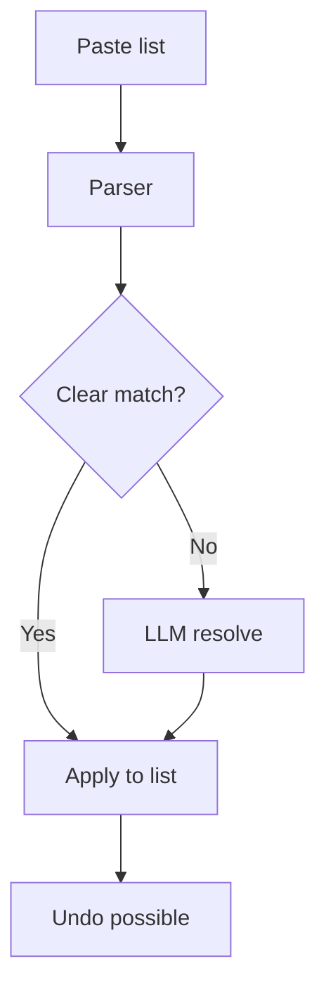
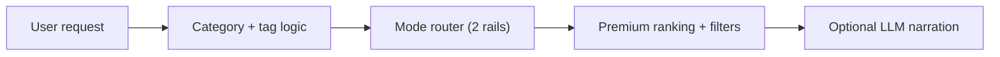
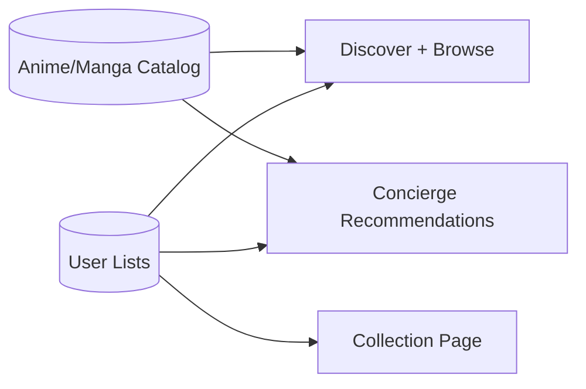
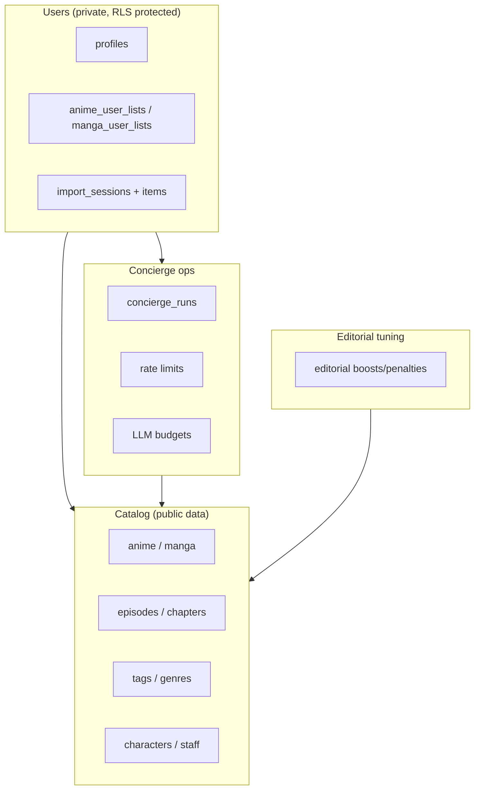
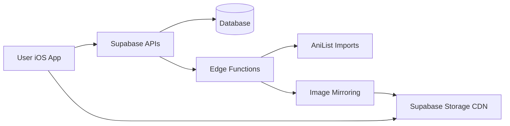
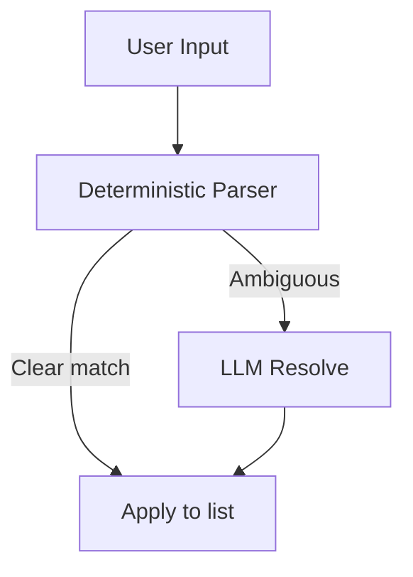

# Kuro — Current State (Plain English)

**Last updated:** 2026-02-06

This file explains the app in everyday language for non-technical readers. It is meant to be a complete, easy overview of how Kuro works today.

---

## 1) Rule: Always keep this file updated

Every time the app changes (design, features, backend, data, schedules, etc.), this file must be updated. Add a new line to the **Change Log** at the bottom with the date and a short summary.

For the technical “source of truth” and auto-generated inventories, see `CURRENT_APP_STATE.md`.

If you need the *literal code* in one place for another model to read, see:
- `CURRENT_APP_STATE_CODEBASE.md` (auto-generated; very large)

---

## 2) What Kuro is (in one paragraph)

Kuro is a curated anime + manga app. It lets users browse premium picks, keep lists, and use a “Concierge” chat to import their watch list or get recommendations. The app is fast, clean, and focuses on high‑quality discovery.

**At a glance**
- Clean editorial design
- No adult content by default
- Concierge uses smart rules first, LLM only when needed
- Images are mirrored to a CDN for speed

---

## 3) How the app is organized (screens)

- **Concierge (left swipe)**: A chat-like page for importing lists and asking for recommendations.
- **Discover (main page)**: Curated sections like Essentials, Classics, Trending, etc.
- **Collection**: Your personal list of anime/manga.
- **Browse**: Explore the catalog with filters.
- **Search**: Find specific titles.
- **Clubs**: Private groups for watching together. Create or join clubs, share curated rails, vote in polls.

Profile is a small menu in the top-right corner.

**Header today:**
- Left: KURO wordmark
- Center: current page name
- Right: profile menu
- When on Concierge, a small chat icon appears next to the title.

---

## 3.1) Design style (today)

- Minimal, editorial look
- Glass‑like UI surfaces
- Serif titles, light typography
- Focus on premium / classic content

---

## 4) Concierge (the assistant)

The Concierge is designed to:
- **Import** lists quickly (e.g. “AoT completed, JJK ep 12”) and apply them to your list.
- **Recommend** new anime or manga based on your mood.

It works in two layers:
1. **Smart rules first** (fast, cheap, predictable).
2. **LLM fallback** only when needed (to resolve ambiguous titles or narrate recommendations).

There are built-in usage limits so it can’t be abused.

**On the Concierge page (today):**
- A short intro card explains what it does.
- Three quick start buttons:
  - Paste from clipboard
  - Try an example import
  - Give me a vibe
- Everything stays inline in chat — no full-screen takeovers
- Import results appear as inline confirm bubbles
- Recommendation results appear as editorial-style horizontal rails
- Success shows as a toast with undo

**Adult content:** filtered out by default.

---

## 4.1) How an import works (simple steps)

1. You paste a list.
2. The system tries to match titles.
3. If something is unclear, it shows an inline picker in the chat.
4. After applying, a toast with undo appears (not a full-screen done view).
5. For high-confidence imports (score >= 0.85), items are auto-applied immediately with an undo toast.

---

## 4.2) How recommendations are chosen

- The system prefers **classics** and **premium picks**.
- It avoids adult content by default.
- If you say "like X", it finds similar titles first.
- The LLM only adds wording or resolves ambiguity.
- Your prompt is routed into **up to 2 curated rails ("modes")**:
  - Rail A: a best-fit "vibe mode" (e.g. Premium Action / Cozy / Movie Night / Romcom)
  - Rail B: **Classics (expanded)** (keeps your existing classics picks, but returns more)
- Production currently has **23 modes** (v8): Premium Picks, Start Here, Premium Action, Premium Comedy, Cozy/Comfort, Dark/Serious, Hidden Gems, Classics, Short & Complete, Movie Night, Romance (serious), Romcom, Fantasy (no isekai), Isekai, **Sports**, **Sci-Fi**, **Horror & Supernatural**, **Mecha**, **Mystery/Detective**, **Music/Performance**, **Historical**, **School/Coming-of-Age**, **Shoujo/Josei**.
- **50 curated rails** total (27 original + 23 new: sports, sci-fi, horror/supernatural, mecha, mystery, music, historical, school, shoujo/josei anime+manga, seinen, shoujo, josei).
- Negative genre filtering supported: "action but no romance", "fantasy without harem". Excluded genres now also suppress conflicting modes in routing (not just item filtering).
- 30 abbreviations in the parser (up from 10): OP, DB/DBZ/DBS, SAO, NGE/Eva, LOTGH, etc.
- **Full German language support**: vibe adjective inflection handling, German intent keywords, German synonyms on all modes.
- The modes are configurable in the database (`public.concierge_config.config.modes`) so we can tune them without redeploying the app.

---

## 4.3) Cost + abuse protection (so the Concierge cannot be exploited)

Kuro is built so it won't "accidentally bankrupt you" if someone spams the chat:
- **Deterministic-first**: most requests are handled by rules + database queries (no LLM call).
- **Rate limits**: frequent callers get temporarily blocked.
- **Daily token budgets** (per day):
  - **Per user**: 50,000 tokens/day
  - **Global**: 1,000,000 tokens/day

If budgets are exceeded, the app should keep working but the LLM-heavy behaviors get reduced (for example: less narration / fewer disambiguation calls).

---

## 5) Where the data comes from

Kuro’s anime and manga catalog is mostly imported from **AniList**. This includes:
- anime / manga titles
- episodes / chapters
- staff / characters
- tags / genres

This data is stored in Supabase (the backend database).

There are two main ways the database is populated:
1. **Bulk AniList imports** (scripts or edge functions)
2. **Image mirroring** (moves posters to Supabase Storage)

---

## 6) How images work (CDN + caching)

- The app **mirrors** images into Supabase Storage.
- Those images are then served from a CDN-like public storage URL.
- The app also caches images locally for speed.

This means posters are fast, stable, and don’t rely on AniList’s servers at runtime.

---

## 7) Scheduled jobs (automated maintenance)

Right now, the only built-in scheduled job is:
- **Concierge housekeeping**: runs daily to delete old logs/metrics.

Other imports (like image mirroring or AniList ingestion) are currently run manually or by external scripts.

---

## 8) The backend (Supabase) in plain terms

Supabase stores:
- the full catalog
- user lists and profiles
- concierge sessions + logs
- metrics and rate limits

Supabase also runs the Concierge server logic and provides secure APIs.

**Usage limits (plain English):**
- Per‑user and global daily budgets are enforced for AI usage.
- This prevents expensive overuse.

---

## 8.2) What data is stored about a user

- A **profile** row (your account basics)
- Your **anime/manga list** entries (status, progress, rating)
- Concierge **import sessions** (so you can undo)
- Concierge **logs** (for improving the parser and debugging)

No one else can read your private list data because of row‑level security.

---

## 8.3) What to update when things change

Whenever you change the app or backend, update these two files:
- `CURRENT_APP_STATE.md` (technical)
- `CURRENT_APP_STATE_PLAIN.md` (plain English)

Then add a line to the Change Log at the bottom.

---

## 8.1) Simplified data model

---

## 8.4) Database (high-level view)

This is a simplified map (not every table/column, just the big groups):

If you need the full table/column-level definition, use:
- `CURRENT_APP_STATE.md` (schema + object maps)
- `CURRENT_APP_STATE_CODEBASE.md` (all migrations included)

---

## 9) Simple system diagram

---

## 10) Concierge flow (simple view)

---

## 11) Where to find things (non-technical)

- **App UI code:** `Kuro/Views/`
- **Main navigation:** `Kuro/ContentView.swift`
- **Data + API calls:** `Kuro/Services/SupabaseService.swift`
- **Backend SQL changes:** `supabase/migrations/`
- **Legacy DB fixes:** `supabase/migrations/20260206143000_fix_legacy_tags_and_comments.sql`
- **Foundation schema:** `supabase/migrations/20250109_remote_applied_placeholder.sql` (baseline core tables; already in prod migration history)                                                                                        
- **Legacy SQL originals:** `legacy_sql/` (archived; no longer used directly)
- **Backend functions (Concierge, imports):** `supabase/functions/`

---

## 12) Operator checklist (plain English)

- If images look slow: run image mirroring.
- If Concierge seems broken: check its usage limits and logs.
- If recommendations look bad: verify the recommendation tables and see if imports are stale.
- If imports stop: check the import cursor and re-run import scripts.

---

## 13) Glossary (plain English)

- **RPC:** A database function that the app can call like an API.
- **Edge Function:** A small backend function that runs on Supabase.
- **RLS:** Row Level Security; ensures users can only see their own data.
- **CDN:** Fast image delivery system.

---

## 14) Change Log (append-only)

- 2026-02-09: **Clubs feature launched**: Private groups (2-20 members) with curated rails, polls, and privacy levels. New page in the app (6th swipe page). Create/join clubs via invite codes. Import reconciliation detects existing collection entries and proposes Add/Update/Skip actions instead of blind imports. Quality gate scripts added for CI. Club telemetry with 90-day retention. Haptics and empty states polished across all new views.
- 2026-02-09: **Concierge images wired**: `search_titles()` RPC now returns `cover_image_medium` (new migration). Import preview cards and recommendation cards now show actual cover art via `KuroCachedAsyncImage` instead of gradient placeholders. Gradient remains as fallback for missing images.
- 2026-02-09: **P0 fix — progress data forwarding**: `confirmImport()` now sends parsed progress fields (episodes, chapters, volumes, season, caughtUp, etc.) to the apply endpoint. Previously all imports landed with progress=0.
- 2026-02-09: **Performance parallelization**: All 3 concierge edge functions (parse, apply, recommend) now process items and DB queries in parallel via `Promise.all` instead of sequential loops. Expected 2-5x latency improvement. iOS post-apply fetches also parallelized with `async let`.
- 2026-02-08: **Adaptation disambiguation**: Parser extracts year mentions from input ("HxH 2011" → year=2011), boosts matching candidates, strips years from search queries. Resolver shows year/format tags to Groq LLM. iOS blocks auto-apply when top candidates are different adaptations of the same series (e.g. HxH 1999 vs 2011), unless the user's year mention resolves it.
- 2026-02-08: **Negative genre mode suppression**: "action but no romance" now correctly routes to Premium Action (not Romcom). Excluded genres suppress conflicting modes in both `mapStrongGenreToModeId` and `scoreMode`. Router eval script hardened with exponential backoff for 429/5xx.
- 2026-02-08: **Major curated content overhaul**: cleaned up all existing rails (removed sequels, misclassified items, cross-rail duplicates; slimmed from 120-210 items to 30-80 per rail; fixed classics definition). Added 3 new vibe modes (Sports, Sci-Fi, Horror & Supernatural) + demographic rails (Seinen, Shoujo, Josei). Parser now has 30 abbreviations and supports negative filtering ("no romance"). Total: 17 modes, 38 rails, 63 migrations. Enhanced audit script with overlap/franchise/year/size checks.
- 2026-02-08: Removed genre labels (Action, Adventure) from all card types — only year + episode count shown. Tightened card text spacing.
- 2026-02-08: "Recommend something" is now pinned to curated Premium Picks, so vague prompts return consistently great results.
- 2026-02-08: Fixed some “off vibe” picks in pinned rails. Short & Complete is now truly short (<= 13 episodes) and Fantasy (no isekai) no longer includes ongoing or huge long-runners. Migration: `supabase/migrations/20260208090000_refine_short_and_fantasy_rails.sql`.
- 2026-02-07: More "vibe" recommendations are now pinned/curated (Action, Comedy, Cozy, Dark, Hidden Gems) so Concierge feels more consistent and premium.
- 2026-02-06: Security hardening: RLS enabled on 5 unprotected tables + 5 views fixed. Deleted 2 legacy edge functions (duplicates). Concierge UI polished: signal badges now visible on recommendation cards, serif fonts for editorial feel, larger tap targets, rail header dividers.
- 2026-02-06: Curated rail expansion: +366 editorial picks across 4 rails (classics_anime +90, classics_manga +97, gateway_anime +75, gateway_manga +104). All Ecchi/Hentai titles excluded, quality thresholds enforced (score >= 76 classics, >= 78 gateway). Total curated items: ~676.
- 2026-02-06: Schema drift fixed: baseline schema SQL captured in `supabase/migrations/20250109_remote_applied_placeholder.sql` (core catalog tables + import tracking + materialized views + matview refresh cron). Original root SQL files archived to `legacy_sql/`.
- 2026-02-06: Removed unused iOS code: ConciergeOverlay, KuroChanMascot, getByMood, dead SearchViewNew block (~500 lines).
- 2026-02-06: Concierge modes expanded from 8 to **14** and deployed: added Short & Complete, Movie Night, Romance (serious), Romcom, Fantasy (no isekai), Isekai. Enriched synonyms (incl. German) + new intent detectors.
- 2026-02-05: Concierge recommendations now return **two curated rails (modes)** and an **expanded Classics rail** (configurable via database).
- 2026-02-05: Added Concierge cost guardrails + a high-level database diagram; fixed formatting glitches.
- 2026-02-05: Added non-technical runbook and glossary sections.
- 2026-02-06: Added a production schema drift fix migration for `tags.kitsu_id` and `comments.user_id` types: `supabase/migrations/20260206143000_fix_legacy_tags_and_comments.sql`.
- 2026-02-05: Expanded this plain-English snapshot with deeper flows and diagrams.
- 2026-02-05: Added/expanded this plain-English snapshot for non-technical readers.
- 2026-02-05: Concierge moved to left swipe page. Profile is a top-right menu. Cards now show YEAR · EPS. Concierge intro + quick-start pills added.
