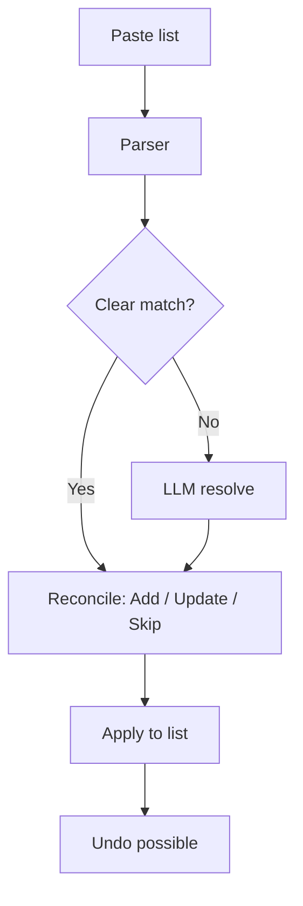
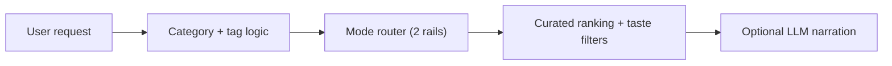
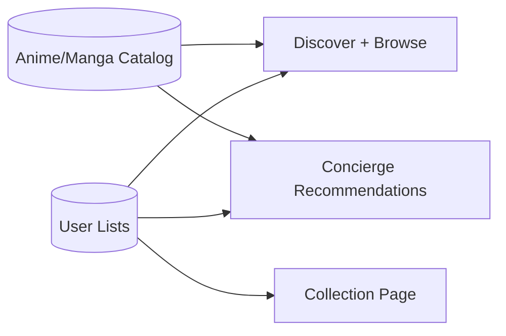
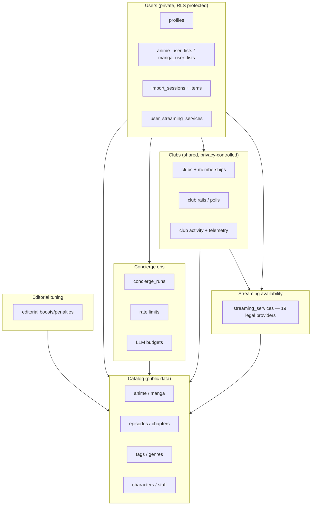
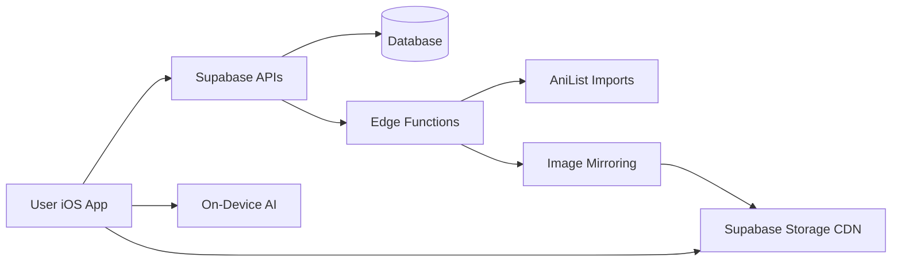
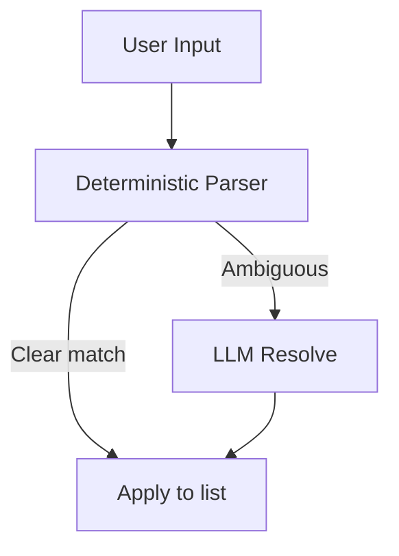

# Kuro — Current State (Plain English)

**Last updated:** 2026-03-01

This file explains the app in everyday language for non-technical readers. It is meant to be a complete, easy overview of how Kuro works today.

---

## 1) Rule: Always keep this file updated

Every time the app changes (design, features, backend, data, schedules, etc.), this file must be updated. Add a new line to the **Change Log** at the bottom with the date and a short summary.

For the technical “source of truth” and auto-generated inventories, see `CURRENT_APP_STATE.md`.

If you need the *literal code* in one place for another model to read, see:
- `CURRENT_APP_STATE_CODEBASE.md` (auto-generated; very large)

---

## 2) What Kuro is (in one paragraph)

Kuro is a curated anime + manga app. It lets users browse premium picks, keep lists, create private clubs with friends, and use a "Concierge" chat to import their watch list or get recommendations. The app is fast, clean, and focuses on high‑quality discovery.

**At a glance**
- Clean editorial design
- No adult content by default
- Private clubs for watching together with friends
- Concierge uses deterministic routing first, with optional AI for ambiguity and narration
- On-device AI for smart search, description condensing, and disambiguation support
- Local Mac synopsis worker continuously improves weak descriptions and writes enhanced copy back to the backend (without overwriting raw source text)
- Separate local Mac catalog-safety worker scans catalog records for pornographic signals and writes safety states/open-gap reports (independent from synopsis pipeline)
- Images are mirrored to a CDN for speed
- Works offline (shows a banner when you lose internet)

---

## 3) How the app is organized (screens)

The app has 5 swipeable pages that follow a natural discovery flow:

1. **Concierge** (swipe left from Discover): An inline concierge page for importing from your library/clipboard and asking for recommendations. First-time visitors see an expanded hint explaining what you can do (import lists, get mood-based picks with a concrete example). After your first interaction, the hint collapses to a slim one-liner.
2. **Discover** (main page, opens by default): Shows 6 curated sections on first load (your personalized picks, what's airing today, essentials, trending, and manga counterparts). A "Show More" button reveals 7 additional sections (classics, current season, top rated, just added, etc.). Once you expand, it stays expanded across launches.
3. **Browse** (swipe right from Discover): Explore the full catalog with filters (genre, status, length, decade, format, sort).
4. **Collection** (swipe right from Browse): Your personal list of anime/manga. New filter pills let you narrow by streaming service (e.g., only titles on Crunchyroll) or by language (EN/DE/JA). Each title in the grid shows the best available streaming provider name underneath.
5. **Clubs** (rightmost page): Private groups (2–20 members) for watching together. Create a club, invite friends with a code, share curated watchlists (rails), see weekly highlights, vote in polls, and react to items (fire/heart/eyes/100). Club owners control privacy settings. The club list shows member counts, recent activity previews, and unread dots. When sharing is set to "progress", you'll see pace tracking ("3 ep behind the group"). Milestone cards celebrate when all members finish a title. Updates appear in real-time. Club activity also shows up on anime/manga detail pages. You can add anime/manga directly to a club rail from the Rails tab or via the "Add to Club..." context menu on any card. **Social activity**: when you open an anime or manga detail page, you can now see which of your club friends are also tracking that title, read their comments, and react with thumbs up/down. This replaces the old club chat tab with more relevant, title-level conversations. **Shared streaming**: a new "SHARED" toggle on club rails shows which titles are available on streaming services that all members share. Coverage text tells you how many members have set up their services.

**Search** is not a page — it opens as a sheet from the magnifying glass icon in the header, available from any page. It supports natural language queries like "show me action anime from 2020" using on-device AI.

Profile is a small menu in the top-right corner. You can set your streaming subscriptions here (Crunchyroll, Netflix, Funimation, HIDIVE, etc.) so the app knows where you can watch or read. Clubs is also accessible from the Profile sheet as a secondary shortcut.

**Header today:**
- Left: KURO wordmark
- Center: current page name in an animated window, with 5 dot indicators below
- Right: search icon + profile menu
- When on Concierge, a small chat icon appears next to the title.

### How to push a new TestFlight build

Run `fastlane beta` from the project root. This auto-increments the build number, archives the app, and uploads to TestFlight. No password or 2FA needed — it uses an API key stored at `~/.appstoreconnect/private_keys/AuthKey_7L84A7P9X7.p8`. The Fastlane config files are in `fastlane/Appfile` and `fastlane/Fastfile`.

---

## 3.1) Design style (today)

- Minimal, editorial look
- Glass‑like UI surfaces
- Serif titles, light typography
- Focus on premium / classic content

---

## 3.2) On-Device AI (Apple Foundation Models)

Kuro now uses Apple's built-in AI that runs directly on your device (no internet needed for these features). This means faster responses and better privacy since your data never leaves your phone for these tasks.

The concierge stack handles four things:

1. **Deterministic routing + heuristics first** for fast and stable recommendations.
2. **Disambiguation support** when multiple titles collide (for example, “Hunter x Hunter 1999” vs “Hunter x Hunter 2011”).
3. **Synopsis condensing**: Long plot descriptions get automatically shortened into 2-sentence hooks that are spoiler-free and easy to scan.
4. **Smart search**: You can search your collection using everyday language instead of picking filters manually.

---

## 3.3) New features added in this session

### Smart Descriptions
Long plot summaries from AniList are often several paragraphs. The app now automatically condenses them into short, spoiler-free 2-sentence hooks using on-device AI. This makes browsing feel faster and cleaner.

### Smart Search
Instead of tapping through genre filters and dropdowns, you can now type things like "show me action anime from 2020" or "short comedy manga" and the app understands what you mean. This uses the on-device AI to interpret your query.

### What to Watch/Read Next
When you open an anime or manga detail page, there is now a personalized "Next Up" section. It looks at your progress and suggests what episode or chapter to continue with, so you spend less time figuring out where you left off.

---

## 3.4) Offline detection

The app now notices when you lose your internet connection and shows a small "OFFLINE" banner at the top of the screen. When your connection comes back, the banner disappears automatically. This way you always know whether the app can reach the server.

---

## 3.5) App lifecycle handling

The app now properly handles being sent to the background (when you switch to another app) and coming back to the foreground. Previously, data could become stale or connections could break if you left the app for a while. Now it refreshes gracefully when you return.

---

## 4) Concierge (the assistant)

The Concierge is designed to:
- **Import** lists quickly (e.g. “AoT completed, JJK ep 12”) and apply them to your list.
- **Recommend** new anime or manga based on your mood.

It works in two layers:
1. **Smart rules first** (fast, cheap, predictable).
2. **LLM fallback** only when needed (to resolve ambiguous titles or narrate recommendations).

There are built-in usage limits so it can’t be abused.

**On the Concierge page (today):**
- A short intro card explains what it does.
- Four quick actions:
  - From your library
  - From clipboard
  - Try an example import
  - Describe a vibe
- The Concierge no longer takes over the full screen. Everything stays inline in the chat conversation, which makes it feel faster and more natural:
  - Import results appear as inline confirm bubbles (with cover art)
  - Recommendation results appear as scrollable editorial-style horizontal rails
  - Confirmations are inline buttons (not separate screens)
  - Success shows as a brief toast with undo
  - Internal mode names are hidden; users see curated titles and subtitles.

**Adult content:** filtered out by default.

---

## 4.1) How an import works (simple steps)

1. You import from your library or paste a list.
2. The concierge parser tries to match titles.
3. Each matched item is classified as one of three actions:
   - **Add** — brand new to your collection.
   - **Update** — already in your collection but with newer progress (e.g. more episodes watched).
   - **Skip** — already in your collection with the same or better progress (duplicate).
4. If something is unclear, it shows an inline clarify flow (status/title/intent) in the same message.
5. After confirmation, your list updates in place. A toast confirms success and supports Undo.
6. High-confidence imports (score >= 0.85) can auto-apply immediately with an undo toast.

---

## 4.2) How recommendations are chosen

- The system prefers **classics** and **premium picks** (internally `premium_picks`, surfaced in UI as **The Cut**).
- It avoids adult content by default.
- If you say "like X", it finds similar titles first.
- The LLM only adds wording or resolves ambiguity.
- Your prompt is routed into **up to 2 curated rails**:
  - Rail A: the best-fit vibe set for your request
  - Rail B: an expanded classics set (when available)
- The server selects from **23 configured modes** (v8), including:
  - Mecha, Mystery/Detective, Music & Performance, Historical, School/Coming-of-Age, Shoujo/Josei, plus core modes.
- The concierge now shows curated copy (for example, "The Cut", "Soft Evenings", "Dark, Not Empty") and suppresses raw internal taxonomy names.
- Roughly **50 curated rails** across anime/manga are active after dedupe/quality pruning.
- Negative genre filtering supported: "action but no romance", "fantasy without harem". Excluded genres now also suppress conflicting modes in routing (not just item filtering).
- 30+ abbreviations in the parser (up from 10): OP, DB/DBZ/DBS, SAO, NGE/Eva, LOTGH, etc.
- **German-first support**: inflection handling, intent keywords, and curated EN/DE recommendation copy.
- The modes are configurable in the database (`public.concierge_config.config.modes`) so we can tune them without redeploying the app.

---

## 4.3) Cost + abuse protection (so the Concierge cannot be exploited)

Kuro is built so it won't "accidentally bankrupt you" if someone spams the chat:
- **Deterministic-first**: most requests are handled by rules + database queries (no LLM call).
- **Rate limits**: frequent callers get temporarily blocked.
- **Daily token budgets** (per day):
  - **Per user**: 50,000 tokens/day
  - **Global**: 1,000,000 tokens/day

If budgets are exceeded, the app should keep working but the LLM-heavy behaviors get reduced (for example: less narration / fewer disambiguation calls).

---

## 5) Where the data comes from

Kuro’s anime and manga catalog is mostly imported from **AniList**. This includes:
- anime / manga titles
- episodes / chapters
- staff / characters
- tags / genres

This data is stored in Supabase (the backend database).

There are two main ways the database is populated:
1. **Bulk AniList imports** (scripts or edge functions)
2. **Image mirroring** (moves posters to Supabase Storage)

---

## 6) How images work (CDN + caching)

- The app **mirrors** images into Supabase Storage.
- Those images are then served from a CDN-like public storage URL.
- The app also caches images locally for speed.

This means posters are fast, stable, and don’t rely on AniList’s servers at runtime.

---

## 7) Scheduled jobs (automated maintenance)

Right now, the only built-in scheduled job is:
- **Concierge housekeeping**: runs daily to delete old logs/metrics.

Other imports (like image mirroring or AniList ingestion) are currently run manually or by external scripts.

---

## 8) The backend (Supabase) in plain terms

Supabase stores:
- the full catalog
- user lists and profiles
- concierge sessions + logs
- metrics and rate limits

Supabase also runs the Concierge server logic and provides secure APIs.

**Usage limits (plain English):**
- Per‑user and global daily budgets are enforced for AI usage.
- This prevents expensive overuse.

---

## 8.2) What data is stored about a user

- A **profile** row (your account basics)
- Your **anime/manga list** entries (status, progress, rating)
- Your **streaming subscriptions** (which services you use — Crunchyroll, Netflix, etc.)
- Concierge **import sessions** (so you can undo)
- Concierge **logs** (for improving the parser and debugging)
- **Club memberships** and your activity within clubs

No one else can read your private list data because of row‑level security. Club data is shared only with club members, and the club owner controls exactly what is visible. Your streaming subscription data is deleted when you delete your account (GDPR compliant).

---

## 8.3) What to update when things change

Whenever you change the app or backend, update these two files:
- `CURRENT_APP_STATE.md` (technical)
- `CURRENT_APP_STATE_PLAIN.md` (plain English)

Then add a line to the Change Log at the bottom.

---

## 8.1) Simplified data model

---

## 8.4) Database (high-level view)

This is a simplified map (not every table/column, just the big groups):

If you need the full table/column-level definition, use:
- `CURRENT_APP_STATE.md` (schema + object maps)
- `CURRENT_APP_STATE_CODEBASE.md` (all migrations included)

---

## 9) Simple system diagram

---

## 10) Concierge flow (simple view)

---

## 11) Where to find things (non-technical)

- **App UI code:** `Kuro/Views/`
- **Main navigation:** `Kuro/ContentView.swift`
- **Data + API calls:** `Kuro/Services/SupabaseService.swift`
- **Backend SQL changes:** `supabase/migrations/`
- **Legacy DB fixes:** `supabase/migrations/20260206143000_fix_legacy_tags_and_comments.sql`
- **Foundation schema:** `supabase/migrations/20250109_remote_applied_placeholder.sql` (baseline core tables; already in prod migration history)                                                                                        
- **Legacy SQL originals:** `legacy_sql/` (archived; no longer used directly)
- **Backend functions (Concierge, imports):** `supabase/functions/`

---

## 12) Operator checklist (plain English)

- If images look slow: run image mirroring. Note that only ~2.7% of images are currently mirrored — this is a known backlog.
- If Concierge seems broken: check its usage limits and logs.
- If recommendations look bad: verify the recommendation tables and see if imports are stale.
- If imports stop: check the import cursor and re-run import scripts.
- If bulk imports fail with "unauthorized": make sure the correct secret key is being sent in the request header.
- If on-device AI features are not working: they require an Apple device with Foundation Models support (recent hardware). Older devices will fall back to non-AI behavior.
- **Dashboard action still needed**: 1 auth setup step must be done manually in the Supabase dashboard (see section 17).

---

## 13) Glossary (plain English)

- **RPC:** A database function that the app can call like an API.
- **Edge Function:** A small backend function that runs on Supabase.
- **RLS:** Row Level Security; ensures users can only see their own data.
- **CDN:** Fast image delivery system.
- **Club:** A private group of friends who share watchlists and vote on what to watch next.
- **Rail:** A horizontal scrollable row of anime/manga picks (used on Discover, in Clubs, and in Concierge recommendations).
- **Quality gate:** An automated check that runs before code is saved, catching mistakes early.
- **On-device AI:** AI that runs directly on your iPhone using Apple's built-in models, so it works without internet and your data stays private.
- **Prompt injection:** A type of attack where someone types specially crafted text to trick an AI into doing something unintended. Kuro sanitizes user input to prevent this.
- **Synopsis condensing:** Automatically shortening a long plot description into a brief, spoiler-free hook.

---

## 14) Quality gates (automated checks)

Before code changes are committed, automated checks run to catch common problems early:
- **Secret scanning**: Makes sure no passwords, API keys, or tokens are accidentally included in the code.
- **Migration validation**: Checks that database migration files are well-formed and won't break the database.
- **Code quality**: Catches common code issues (unused variables, formatting problems, etc.).

These run automatically so that problems are caught before they reach users.

---

## 15) Security hardening (production-readiness session)

A thorough security review was done to make the app safer before it ships:

- **Import endpoints locked down**: The bulk import functions (used to load anime/manga data into the database) now require a secret key. Previously anyone who knew the URL could trigger an import.
- **Image uploads restricted**: The storage bucket that holds cover images now only accepts image files (jpeg, png, webp, avif, gif) up to 5MB. This prevents someone from uploading scripts or huge files.
- **Storage permissions tightened**: Proper read/write rules are in place so only the right people can upload or delete images.
- **AI prompt protection**: When user text is sent to AI services (like the Concierge LLM), it is now sanitized first. This prevents "prompt injection" attacks where someone types specially crafted text to trick the AI.
- **Database hardening**: Foreign keys, indexes, and row-level security policies were reviewed and tightened up.
- **Debug logging removed**: Verbose debug output that could reveal internal details has been stripped from production builds.
- **All edge functions redeployed**: Every backend function was redeployed with the latest security and performance fixes.

---

## 16) Performance improvements (production-readiness session)

- **Image mirroring no longer stalls**: The pipeline that copies cover images to our CDN used to get stuck waiting for database locks. A fix reduced the "skip" rate from 58% down to roughly 0%.
- **Automatic retries on flaky connections**: Network calls from the app now automatically retry 2-3 times when they hit temporary connection problems (timeouts, brief outages).
- **Gentler mirror batches**: The image mirroring job now processes 200 images at a time with 15 minutes between batches, which is more stable and less likely to overwhelm the server.

---

## 17) Known remaining items

These items were identified during the production-readiness review but require manual action in the Supabase dashboard (they cannot be done through code):

- **Disable email confirmations** (1 step — required so new sign-ups are authenticated immediately):
  1. Auth → Email → turn OFF "Confirm email" (email verification is no longer required for sign-up)
- **Image mirroring backlog**: Only about 2.7% of catalog images have been mirrored to our CDN so far. This is a long-running data task that will take time to fully catch up.

---

## 17.1) P2 production improvements (completed 2026-02-16)

A batch of lower-priority production improvements was completed across the backend, iOS app, and accessibility:

### Backend hardening
- **Database cleanup**: All 8 core catalog tables (anime, manga, episodes, chapters, volumes, characters, studios, staff) now require a `created_at` timestamp -- previously some rows had NULL values which could cause sorting/filtering issues.
- **Index cleanup**: 12 unused database indexes were removed. These were leftovers from earlier search approaches that have since been replaced by the title_search materialized view.
- **Duplicate policy fix**: Two overlapping security policies on the club_members table were merged into one cleaner policy.
- **Mirror health check**: A new `check_mirror_health()` database function lets operators quickly check if the image mirroring pipeline is healthy (shows run stats, failure counts, and an alert flag).
- **Image mirroring improvements**: The mirroring pipeline now supports AVIF images (a modern, efficient image format). Mirrored images are now cached for 1 year with an "immutable" flag, meaning browsers and CDNs won't re-fetch them unnecessarily.

### iOS bug fixes
- **Vote errors now handled gracefully**: If voting in a club poll fails (network issue, etc.), the app now shows a clear error toast instead of silently failing.
- **Background tasks properly cancelled**: The Concierge page had several background tasks (warmup, prefetch, refresh) that could leak if you navigated away quickly. These are now tracked and cancelled when you leave the page.
- **Discover page error recovery**: If the Discover page fails to load on first attempt, it now shows a clear error message with a retry button instead of a blank screen.

### Accessibility improvements
- Screen readers (VoiceOver) now work better across multiple screens:
  - **Club detail**: Section headers are properly marked as headings.
  - **Club list**: The empty state and club cards have descriptive labels (club name + member count).
  - **Collection**: Section headers are properly marked as headings.
  - **Discover**: Section titles and error states have proper labels.
  - **Concierge**: Chat messages say "You said: ..." and "Concierge: ..." for clarity. Recommendation rail titles are marked as headings. Clarification cards have combined labels for easier reading.

### Deep linking (new feature)
- The app now supports deep links via the `kuro://` URL scheme. This means other apps or websites can link directly into Kuro:
  - `kuro://anime/12345` — opens a specific anime
  - `kuro://manga/67890` — opens a specific manga
  - `kuro://club/abc123` — opens a specific club
  - `kuro://discover` — goes to the Discover page
  - `kuro://collection` — goes to your Collection
  - `kuro://concierge?prompt=action` — opens the Concierge with a pre-filled prompt
  - `kuro://auth/callback?access_token=...&refresh_token=...` — handles email verification callback (signs user in immediately)
- The app's entitlements file was updated with an Associated Domains placeholder for future Universal Links support (`kuro.app`).

### Branded email templates + auth callback (new feature)
- 5 custom email templates replace the default Supabase emails: signup verification, password reset, magic link, email change, and invitation.
- Designed in the Kuro editorial style: monochrome, serif "K" wordmark, warm gray (#f5f5f0) background, black call-to-action buttons, minimal copy.
- **Sign-up flow** (how it works today):
  1. A user enters their email. The form validates the format in real time and checks uniqueness with a 500ms debounce (sign-up only). A subtle checkmark appears when the email is valid and available.
  2. The user enters a password. A "8 characters minimum" hint shows until the password meets the requirement, then a checkmark appears.
  3. The submit button stays disabled until both fields pass validation.
  4. On sign-up, the user is immediately authenticated — no email verification step, no "check your email" message. They go straight into the app.
- **Password reset and other email flows** still use branded email templates (reset link, magic link, email change, invitation). These redirect into the app via `kuro://auth/callback`. If the direct redirect doesn't work (e.g., on a desktop browser), a fallback page appears: a dark-themed page with an animated K logo and an "Open Kuro" button.
- **5 branded email templates** in the `emails/` folder: signup verification, password reset, magic link (passwordless login), email change confirmation, and invitation. They match Kuro's editorial style: warm gray background, serif K wordmark, black call-to-action buttons, minimal copy.
- **Custom SMTP required for production**: Supabase's built-in email service is severely limited — only ~2 emails per hour and only to team member addresses. For a real user base, you need a third-party email provider like Resend (3,000 emails/month free), AWS SES, Postmark, or Brevo. Resend is already configured as an MCP server in `.mcp.json`.
- **Pending manual step** (must be done in the Supabase Dashboard):
  1. **Auth → Email → Enable email confirmations**: Turn OFF "Confirm email" so that new sign-ups are authenticated immediately without email verification

---

## 18) Change Log (append-only)

- 2026-02-28: **FM-Powered Intent Classification**: The Concierge now uses Apple's on-device Foundation Models as its primary intent classifier on supported devices (iOS 26+). When you type something like "Watched jujutsu kaisen halfway through", the FM model understands the intent (import) from context instead of relying on keyword matching. This handles nuances that keywords can't — for example, "I watched something great, recommend me more" correctly routes to recommendations even though it contains the word "watched". The FM classifies into 6 intents (import, recommend by vibe, recommend by seed title, library query, club action, unknown) with a confidence score. If the model is unsure (below 65% confidence), unavailable, or times out, it falls back to the existing keyword matching — so there's zero regression risk. On older devices without FM, keyword routing works exactly as before. Analytics now track whether each routing decision came from FM or keywords so we can compare accuracy. The keyword matching logic (`looksLikeImport`) was also extracted from ConciergeView into `TextNormalization` so it can be unit-tested — 14 unit tests now cover keyword detection for status words, past tense, German, progress patterns, and more. A UI test verifies that typing "Watched Jujutsu Kaisen halfway through" in Concierge routes to the import flow (not recommendations). The KuroTests unit test target was also wired into the Xcode scheme so `xcodebuild test` actually runs it.
- 2026-02-28: **Concierge Import UX Improvements**: Redesigned the import cards and confirmation flow in the Concierge. Import cards are now larger (80x114pt posters with sharp editorial edges), show the media type (ANIME/MANGA badge), display what was parsed from your text (e.g., "WATCHING · Ep 12 of 24"), and you can tap the poster or title to preview the full detail page. The redundant "N% match" text was removed (the ring indicator is enough). Low-confidence matches (below 80%) now auto-expand the "Other possibilities" list. The CONFIRM button now shows a loading spinner while items are being applied, and after success, the bubble permanently shows a summary (e.g., "2 added, 1 updated") with UNDO and VIEW COLLECTION buttons right there in the chat — so you don't have to rely on catching the 4-second toast anymore.
- 2026-02-28: **Fix Concierge Import False Success Toast**: Fixed a bug where using the Concierge to import anime/manga (e.g., "I watched Jujutsu Kaisen halfway") would show a "added to collection" success toast even when the server-side save actually failed. Both the auto-apply path (high-confidence matches) and the manual confirm path now properly check the server's response before showing the toast. If the save fails, users now see an error toast with the actual reason instead of a false success. Investigation confirmed the database column types are correct (TEXT, not the legacy INTEGER from original SQL) — the fix is purely on the iOS side where the response wasn't being checked.
- 2026-02-27: **UX Density + Clarity Improvements**: Four changes to reduce information overload and help first-time users. (1) **Discover page**: reduced from 13 sections on first load to 6 primary sections (your picks, airing today, essentials, trending, manga counterparts), with a "Show More" button to reveal 7 more (classics, current season, top rated, etc.). Once expanded, stays expanded. Data loading unchanged. (2) **Concierge first-time hint**: new users now see a clear two-row explanation of what Concierge does (import lists + get mood-based recommendations with a concrete example). After first use, it collapses to a slim one-liner. (3) **Club reactions**: items with no reactions now show a compact smiley icon instead of 4 empty emoji buttons; tap to expand. Items with existing reactions show the full row. (4) **Error dedup in Concierge**: rate-limit errors now show inline only, network errors show as toast only — no more seeing the same error in two places.
- 2026-02-24: **Social Activity Layer + Add to Club Context Menu**: Replaced the club chat tab with a more useful social activity layer. Now when you open any anime or manga detail page, you can see how many of your club friends are tracking that title, read their short comments, and react with thumbs up or thumbs down. "Friends" means anyone who shares a club with you. Cards throughout the app (Discover, Browse, Collection) now show a small indicator when friends are tracking that title, and long-pressing any card gives you an "Add to Club..." option to quickly add it to one of your club rails. The old club chat tab has been removed from clubs (clubs now have 3 tabs: Rails, This Week, Polls). The feature is behind the `social_activity_v1` flag at 0% rollout for safe staged launch. Backend: 2 new database tables, 5 new RPCs, rate limits on comments (10/5min) and reactions (30/min). iOS: 1 new view file, 12 modified files, ~600 lines added, ~316 lines removed.
- 2026-02-24: **Catalog safety uncertain flood reduced**: We found why the safety runner looked “stuck” with too many uncertain items. Most uncertain rows were `model_uncertain + no_strong_signal` (so not actually porn evidence, just conservative model output). We updated the worker to default to **safe** when there is no meaningful porn signal (low rule score + no rule hits), added a new metric `safe_fallback_no_signal`, and updated the safety dashboard to show it. A forced validation run confirmed improvement: `processed=240`, `safe=235`, `uncertain=0`, `blocked=5`.
- 2026-02-24: **Audit follow-up fixes completed**: The catalog safety worker no longer silently hides open-gap fetch failures. If `get_catalog_safety_open_gaps` fails, the run now records a failure metric (`open_gaps_fetch_failed`), logs a warning, keeps the previous `uncertain-latest.md` report instead of accidentally showing a misleading empty state, and writes the failure metric into each run summary line for easier terminal debugging. We also refreshed the technical inventory snapshot in `CURRENT_APP_STATE.md`, updated stale function-version notes in `CLAUDE.md` to match live deployments, and added backlog progress visualization to the safety dashboard (`http://127.0.0.1:8788`) so you can see how far the safety queue has moved (baseline vs remaining + completion %).
- 2026-02-24: **Separate catalog-safety runner added (synopsis runner unchanged)**: Added a fully separate local worker for catalog safety (`scripts/catalog_safety_worker.swift`) so safety scanning runs independently from synopsis enrichment. It has its own launchd label (`com.kuro.catalog-safety`), its own lock file, its own report directory (`/Applications/Kuro/reports/catalog-safety/`), and its own dashboard on `http://127.0.0.1:8788`. It does not reuse synopsis runner files. New backend RPC support was added in migration `20260224101000_catalog_safety_runner_v1.sql` (`get_catalog_safety_candidates`, `upsert_catalog_safety_result`, `mark_catalog_safety_failed`, `get_catalog_safety_open_gaps`). You can now track unresolved safety items in `/Applications/Kuro/reports/catalog-safety/uncertain-latest.md` while continuing to use synopsis weak-source tracking at `/Applications/Kuro/reports/synopsis-enrichment/weak-sources-latest.md`.
- 2026-02-23: **Synopsis enrichment pipeline stabilized and instrumented**: The local synopsis worker now resumes safely (retry/backoff migration applied remotely: `20260223002000`), tracks backlog before/after each run, and records extra quality metrics (`tone_polish_used`, `fallback_used`, `autodeduped_sentences`). The run scripts were hardened to avoid overlaps with a lock file, and launchd install now preserves existing env settings and validates required Supabase secrets before writing the plist. Lock handling now auto-recovers stale lock folders (PID + TTL guard) so the worker can resume without manual cleanup after crashes. The local dashboard now shows cumulative totals + 24h rollups and includes a generated-samples panel so you can inspect actual generated synopsis text from recent runs.
- 2026-02-23: **Dashboard timestamp fix**: The local synopsis dashboard no longer shows `updated_at: null`. `/api/status` now auto-fills `updated_at` from the latest run log timestamp (or file metadata fallback), so you always see a real last-run time.
- 2026-02-20: **Import cursor rewind bug fixed**: `scripts/run_full_import.js` was unintentionally resetting import cursors (`last_page=0`) each time it started. We changed it to “seed only if missing” behavior, so existing cursor progress is now preserved across runs.
- 2026-02-20: **Full import script now self-recovers from timeouts**: `scripts/run_full_import.js` now detects import timeout failures (like 504/524), automatically runs a smaller schedule-safe fallback batch, and then continues instead of stopping the whole import. This reduces manual babysitting during long imports. Live smoke test confirmed: after an anime timeout, fallback succeeded and cursor advanced.
- 2026-02-20: **Manga collision matching improved and data started flowing**: We loosened the collision tie-break rules so the matcher no longer stalls as easily when multiple MangaDex records share the same external ID. We also added an English-title preference layer (while still penalizing edition variants like “webtoon version” when possible). We fixed a backend insert bug where chapter upserts were failing due conflict-target mismatch, and switched to a safe dedupe-then-insert path. After deploying the function, the known problematic manga (**Tales of Demons and Gods / Yao Shen Ji**, AniList 86707) now maps correctly and imports chapter data: 321 chapter rows inserted, highest imported chapter 468, status now shows ready.
- 2026-02-20: **Parity deployment completed**: We ran the full sequence in order: pushed pending migrations, deployed `manga-chapter-enrich`, then deployed `manga-source-review-action`. Remote now includes both pending migrations (`20260221150000`, `20260221162000`). Function versions are now `manga-chapter-enrich` v4 and `manga-source-review-action` v2. Follow-up checks still pass: DB lint is warnings-only, DB health metrics look stable, and iOS build is still `BUILD SUCCEEDED`.
- 2026-02-20: **Backend sanity check re-run from Supabase CLI + docs synced**: Re-validated the live backend with `supabase functions list`, `supabase migration list --linked`, `supabase db lint --linked`, and `supabase inspect db db-stats`. iOS build also re-ran and passed (`BUILD SUCCEEDED`). The backend is healthy (no lock/blocking issues, good cache hit rates), but deployment parity is still not complete: local migrations `20260221150000` and `20260221162000` are not applied remotely yet, and chapter-enrichment functions are still on older deployed versions (`manga-chapter-enrich` v3, `manga-source-review-action` v1). This pass updated `CURRENT_APP_STATE.md`, `CURRENT_APP_STATE_PLAIN.md`, and `CLAUDE.md` to reflect that exact state.
- 2026-02-20: **Manga matching upgraded to fuzzy v2 with safety guardrails**: The chapter enrichment function now keeps exact AniList/MAL ID matches first, then uses a weighted fuzzy score for title matching (similarity + token overlap + exact alias) only when confidence and ambiguity checks pass. Mappings are now remembered and periodically re-verified (`next_verify_at`) so we don’t redo matching from scratch every run. If a mapping starts failing verification repeatedly, it is automatically deactivated and safely rematched. New run metrics were added for fuzzy attempts, skips, verification mismatches, and wrong-map proxy counts. A new quality RPC (`get_manga_match_quality_metrics`) powers operational scorecards. Daily housekeeping now auto-expires stale pending review rows older than 30 days. `check_cron_health.js` now prints auto-resolve rate, wrong-map proxy rate, unresolved trend, and current matcher mode/degraded status.
- 2026-02-20: **Senior full-stack stability audit published**: Added four evidence-backed audit documents in `/Applications/Kuro/docs/` (manifest, findings, remediation plan, release gate). Current release decision is **NO-GO** because one P0 (plaintext import secret exposure in migration SQL) and one P1 (deployed backend artifacts not yet tracked in git) are still open. Also re-verified that the prior add-to-rail P3 issue is fixed through structured PostgREST error mapping.
- 2026-02-19: **Manga chapter enrichment v1 scaffolded**: Added a new backend pipeline to fill missing manga chapter rows without touching the existing AniList import path. New migration creates `manga_source_links` (strict provider mapping), `manga_source_link_review` (manual review queue), candidate/metrics RPCs, and a 15-minute cron job (`manga-chapter-enrich-15m`). New edge function `manga-chapter-enrich` is secret-gated, lock-protected, logs to `import_runs` as `chapter_enrich`, maps MangaDex links in strict order (AniList ID, MAL ID, strict title), skips fractional chapter numbers, and upserts integer chapters safely. iOS now uses a legal-provider allowlist for manga read links: chapter taps no longer use generic `siteUrl`, and users see explicit copy when no legal link is available. `check_cron_health.js` now includes enrichment metrics + smoke test. Follow-up migration `20260219234000_fix_manga_chapter_enrich_cron_secret.sql` ensures the cron job always includes `x-import-secret`. Added one-tap review queue endpoint (`manga-source-review-action`) to approve/reject unresolved mappings and trigger immediate enrichment for the approved manga.

### 2026-02-18: Database Health Audit Fixes
- Dropped 2 duplicate indexes saving ~19 MB
- Removed dead rag_cache_cleanup() function
- Filled in 3 migration files that were previously remote-only
- 93 total migrations now (91 local + 2 remote)
- 67 public functions (removed 1 dead one)
- Postgres confirmed at version 17.6
- Pending Dashboard items down from 6 to 3

- 2026-02-18: **Audit follow-up — error handling, dead code, backend hardening**: A 4-agent team fixed 21 remaining findings from the pre-ship audit. Auth errors now surface to users (login failures, club errors, rate limits). Deleted ~2,100 lines of dead code (4 unused files + 2 dead structs in ContentView). Fixed force-unwraps in manga detail and import cards. Added debug logging to 4 empty catch blocks in Apple FM service. Backend: storage uploads now restricted to user's own folder, club descriptions validated (500 char max), chat message RPCs captured in migrations, unused `validate_club_invite` function dropped, concierge input limited to 5000 chars. Feature flag docs corrected: chat/reactions/realtime all at 100%. Added 3 more manual Dashboard items to pending list (OTP expiry, leaked password protection, Postgres upgrade). 60 Swift files (down from 64), 93 total migrations.
- 2026-02-18: **Pre-ship quality audit fixes**: A 7-agent audit found and fixed several issues: auth error messages now show to users instead of failing silently, a rare crash in Apple Sign In nonce generation was fixed, the Browse page no longer re-renders all cards when loading more results, 1,417 external links with Korean/Chinese/Japanese characters now work correctly, a Privacy Manifest was added (required by Apple for App Store), and joining archived clubs is now blocked. 93 migrations total.
- 2026-02-18: **Direct app redirect + Resend SMTP**: Email verification now redirects directly into the Kuro app via `kuro://auth/callback` deep link — no intermediate webpage. URL scheme registered in `Info.plist` at project root. Resend MCP server configured for production email delivery.
- 2026-02-17: **Branded email templates + auth callback deep linking**: 5 branded email templates (confirm, reset, magic-link, change-email, invite) with monochrome Kuro editorial styling. Auth-callback edge function deployed as fallback. iOS handles auth callbacks at app level (before auth gate) with `handleAuthCallback()` using `setSession()`. `signUpWithEmail` and `resetPassword` now pass `redirectTo` pointing to `kuro://auth/callback`. Files: `emails/*`, `supabase/functions/auth-callback/index.ts`, `DeepLinkRouter.swift`, `SupabaseService.swift`, `KuroApp.swift`, `ContentView.swift`.
- 2026-02-17: **Detail page error feedback fix**: When marking an episode as watched or a chapter as read fails (e.g. network error), the app now shows a visible error toast instead of silently failing. This applies to both the inline preview and the full episode/chapter list sheets. Also fixed the chapter row accessibility hint from "Opens on AniList" to the generic "Opens external link" since the link can go to any source.
- 2026-02-16: **P2 production blockers completed**: Backend hardening (NOT NULL on catalog created_at, 12 unused indexes dropped, duplicate club_members policy merged, mirror health check function, mirror AVIF support + 1-year cache). iOS bug fixes (vote error toast in clubs, Task.detached cancellation in concierge, discover error state with retry). Accessibility pass across 6 views (VoiceOver headings, labels, combined descriptions). Deep linking infrastructure (kuro:// scheme with anime/manga/club/page routes, Associated Domains placeholder). Added section 17.1.
- 2026-02-16: **Add to rail from clubs + adaptive card sizing**: You can now add anime or manga directly to a club rail without leaving the club. Each rail has a "+" button that opens a search sheet — type a title, tap to add. Locked rails only show the button for admins/owners. Error messages are clear (e.g. "This title is already in this rail"). Member labels in club activity now use a stable short ID instead of "Member 1, Member 2". Card sizes across Discover, Genre Hub, and detail pages now adapt to your screen width instead of being hardcoded.
- 2026-02-16: **Clubs Enhancement — reactions, chat, pace sync, realtime, notifications**: Clubs got a major upgrade across 6 phases. The club list now shows member counts, what's happening ("Added: Frieren"), and a dot when there's new activity you haven't seen. Inside a club, you can react to items with emoji (fire, heart, eyes, 100) — counts are anonymous. A new Chat tab lets members send short messages (280 chars, auto-deleted after 30 days) — like group iMessage, not a forum. When everyone's sharing progress, you'll see pace tracking ("3 ep behind the group" or "In sync") and milestone celebrations when all members finish a title. Updates now appear live without pull-to-refresh (Supabase Realtime). A badge dot on the Clubs indicator in the header tells you when there's new activity. All new features are behind feature flags for staged rollout. Privacy maintained: reaction counts are anonymous, chat is member-only with 30-day auto-prune, pace uses median (not individual progress).
- 2026-02-15: **5-page swipe navigation restored**: The app now has 5 swipeable pages instead of 3: Concierge ← Discover → Browse → Collection → Clubs. Browse was promoted from a popup to its own page. Clubs was elevated from being hidden inside Profile to its own rightmost page. Search stays as a popup from the header icon. Page transitions are snappier and the app runs at 120fps on ProMotion displays. Distant pages are automatically unloaded to save memory. Fastlane/TestFlight deployment instructions added to documentation.
- 2026-02-15: **43 UX improvements shipped + first TestFlight build**: A 16-agent team shipped 43 improvements across the entire app (discover, collection, browse, search, detail pages, concierge, settings). Senior code review caught and fixed a German spelling error, a security nonce cleanup, and a color palette violation. Fastlane was set up for automated TestFlight builds (run `fastlane beta` to push a new build). Build 2 (version 1.0) is now live on TestFlight. The on-device AI features (Smart Descriptions, Smart Search, Next Up) are compiled in and will activate on supported devices — no special Apple entitlement is needed for Foundation Models, just the standard framework import. A placeholder app icon (white K on black) was added. Bundle ID is `com.Kuro.app`.
- 2026-02-14: **Concierge and Clubs UX polish documented and completed**: Added "From your library" import action, curated concierge labels and 1–2 line curator notes, status clarifications in import flow, club member status/progress rendering on activity screens, and docs alignment for changed Concierge behavior.
- 2026-02-09: **Production-readiness session**: Added on-device AI (Apple Foundation Models) for mode routing, disambiguation, synopsis condensing, and smart search. Three new user-facing features: Smart Descriptions (2-sentence hooks), Smart Search (natural language collection queries), and What to Watch/Read Next (personalized "Next Up" on detail pages). Offline detection with banner. App lifecycle handling (background/foreground). Security hardening: bulk import auth, storage restrictions (images only, 5MB), prompt injection protection, DB hardening, debug logging removed. Performance: image mirroring lock fix (58% skip → ~0%), automatic network retries, gentler mirror batches. All edge functions redeployed. Added sections 3.2–3.5, 15–17.
- 2026-02-09: **Plain-English doc refresh**: Updated sections 2–4.2 to cover Clubs (private groups with shared watchlists, polls, privacy controls), import reconciliation (Add/Update/Skip detection with undo), Concierge inline redesign (no more full-screen takeovers), German language support, 23 recommendation modes (6 new), and quality gate automation. Added new section 14 for quality gates.
- 2026-02-09: **Clubs feature launched**: Private groups (2-20 members) with curated rails, polls, and privacy levels. New page in the app (6th swipe page). Create/join clubs via invite codes. Import reconciliation detects existing collection entries and proposes Add/Update/Skip actions instead of blind imports. Quality gate scripts added for CI. Club telemetry with 90-day retention. Haptics and empty states polished across all new views.
- 2026-02-09: **Concierge images wired**: `search_titles()` RPC now returns `cover_image_medium` (new migration). Import preview cards and recommendation cards now show actual cover art via `KuroCachedAsyncImage` instead of gradient placeholders. Gradient remains as fallback for missing images.
- 2026-02-09: **P0 fix — progress data forwarding**: `confirmImport()` now sends parsed progress fields (episodes, chapters, volumes, season, caughtUp, etc.) to the apply endpoint. Previously all imports landed with progress=0.
- 2026-02-09: **Performance parallelization**: All 3 concierge edge functions (parse, apply, recommend) now process items and DB queries in parallel via `Promise.all` instead of sequential loops. Expected 2-5x latency improvement. iOS post-apply fetches also parallelized with `async let`.
- 2026-02-08: **Adaptation disambiguation**: Parser extracts year mentions from input ("HxH 2011" → year=2011), boosts matching candidates, strips years from search queries. Resolver shows year/format tags to Groq LLM. iOS blocks auto-apply when top candidates are different adaptations of the same series (e.g. HxH 1999 vs 2011), unless the user's year mention resolves it.
- 2026-02-08: **Negative genre mode suppression**: "action but no romance" now correctly routes to `premium_action` (The UI copy is “Comedy/Action taste” class) instead of Romcom. Excluded genres suppress conflicting modes in both `mapStrongGenreToModeId` and `scoreMode`. Router eval script hardened with exponential backoff for 429/5xx.
- 2026-02-08: **Major curated content overhaul**: cleaned up all existing rails (removed sequels, misclassified items, cross-rail duplicates; slimmed from 120-210 items to 30-80 per rail; fixed classics definition). Added 3 new vibe modes (Sports, Sci-Fi, Horror & Supernatural) + demographic rails (Seinen, Shoujo, Josei). Parser now has 30 abbreviations and supports negative filtering ("no romance"). Total: 17 modes, 38 rails, 63 migrations. Enhanced audit script with overlap/franchise/year/size checks.
- 2026-02-08: Removed genre labels (Action, Adventure) from all card types — only year + episode count shown. Tightened card text spacing.
- 2026-02-08: "Recommend something" is now pinned to `premium_picks`, surfaced as **The Cut**, so vague prompts return consistently great results.
- 2026-02-08: Fixed some “off vibe” picks in pinned rails. Short & Complete is now truly short (<= 13 episodes) and Fantasy (no isekai) no longer includes ongoing or huge long-runners. Migration: `supabase/migrations/20260208090000_refine_short_and_fantasy_rails.sql`.
- 2026-02-07: More "vibe" recommendations are now pinned/curated (legacy internal modes like `premium_action`, `premium_comedy_grownup`, `cozy_comfort`, `dark_serious`, `hidden_gems`) and converted to curated copy before display.
- 2026-02-06: Security hardening: RLS enabled on 5 unprotected tables + 5 views fixed. Deleted 2 legacy edge functions (duplicates). Concierge UI polished: signal badges now visible on recommendation cards, serif fonts for editorial feel, larger tap targets, rail header dividers.
- 2026-02-06: Curated rail expansion: +366 editorial picks across 4 rails (classics_anime +90, classics_manga +97, gateway_anime +75, gateway_manga +104). All Ecchi/Hentai titles excluded, quality thresholds enforced (score >= 76 classics, >= 78 gateway). Total curated items: ~676.
- 2026-02-06: Schema drift fixed: baseline schema SQL captured in `supabase/migrations/20250109_remote_applied_placeholder.sql` (core catalog tables + import tracking + materialized views + matview refresh cron). Original root SQL files archived to `legacy_sql/`.
- 2026-02-06: Removed unused iOS code: ConciergeOverlay, KuroChanMascot, getByMood, dead SearchViewNew block (~500 lines).
- 2026-02-06: Concierge modes expanded from 8 to **14** and deployed: added Short & Complete, Movie Night, Romance (serious), Romcom, Fantasy (no isekai), Isekai. Enriched synonyms (incl. German) + new intent detectors.
- 2026-02-05: Concierge recommendations now return **two curated rails (modes)** and an **expanded Classics rail** (configurable via database).
- 2026-02-05: Added Concierge cost guardrails + a high-level database diagram; fixed formatting glitches.
- 2026-02-05: Added non-technical runbook and glossary sections.
- 2026-02-06: Added a production schema drift fix migration for `tags.kitsu_id` and `comments.user_id` types: `supabase/migrations/20260206143000_fix_legacy_tags_and_comments.sql`.
- 2026-02-05: Expanded this plain-English snapshot with deeper flows and diagrams.
- 2026-02-05: Added/expanded this plain-English snapshot for non-technical readers.
- 2026-02-05: Concierge moved to left swipe page. Profile is a top-right menu. Cards now show YEAR · EPS. Concierge intro + quick-start pills added.

### February 19, 2026 — Backend Security & Quality Remediation

Completed a comprehensive 5-phase backend quality remediation based on a 7-agent audit:

**Security fixes:**
- Removed 5 dangerous database functions (2 contained hardcoded admin credentials that could be called by anyone)
- Locked down 4 admin-only database functions so they can't be called by regular users or anonymous visitors
- Added authentication to the image mirroring service (was previously open to anyone)
- Fixed an analytics table that was silently rejecting all data

**Bug fixes:**
- Fixed anime/manga data model mismatches — two ID columns were mapped to wrong database names, one had the wrong data type, and two properties referenced columns that don't exist
- Added the user's anime and manga lists to real-time updates (subscriptions were silently failing)
- Made the "is adult content" flag required instead of optional on anime and manga

**Hardening:**
- Added rate limiting to club reactions (30/minute) and club creation (5/hour, max 20 clubs per user)
- Restricted club emoji reactions to only the 4 approved emojis
- Tightened 5 database access policies from "anyone" to "logged-in users only"
- Fixed a storage policy that didn't verify file ownership on updates
- Added 2 missing database indexes for better query performance
- Removed 2 ambiguous function duplicates that could cause routing issues

**Operations:**
- Added automatic cleanup of cron job history (keeps 14 days)
- Removed a duplicate weekly cleanup job
- Fixed a scheduling conflict where 3 jobs ran at the same time
- Updated all image mirroring schedules with proper authentication

**Numbers:** 12 new database migrations, functions reduced from 67 to 58, edge functions increased from 13 to 14

### February 19, 2026 — P0 Pre-Ship Audit Remediation

Fixed the highest-priority issues identified during the pre-ship audit:

**Database integrity:**
- Fixed 13 potential crash points where the database allowed empty values in columns that the app expected to always have data. Added strict "must have a value" constraints on 17 database columns total.

**Concierge import fixes:**
- Fixed a bug where user ratings (like "Naruto 8/10") were correctly understood by the AI parser but silently lost when building the import payload. Ratings now carry through the entire import flow from parse to apply.
- Fixed a build error in the import card mock data that was caused by adding the new rating fields.

**Club live updates:**
- Fixed club real-time subscriptions: new polls and chat messages from other members now trigger instant refresh. These two tables were missing from the real-time subscription list.

**Error handling improvements:**
- Progress updates and rating changes now show error messages to the user instead of failing quietly.
- Club chat loading failures now show an error message with a retry option instead of a blank screen.
- Club reaction toggle failures now show a toast notification instead of silently failing.

**Deep linking:**
- Opening `kuro://concierge?prompt=recommend something` now actually pre-fills the prompt in the Concierge input field. Previously the prompt parameter was parsed but never applied.

### 2026-02-24 — Detail page scrolling fixes
- **Bottom dead zone gone**: The anime and manga detail pages had a ~59pt dead zone at the very bottom where touches didn't register. The hero banner was being visually shifted up but its invisible layout frame still took the original space. Fixed by shrinking the layout to match.
- **Horizontal rails scroll again**: The "More Like This" section on detail pages couldn't be swiped horizontally because three competing touch recognizers were fighting. Removed the one that only matters on the main pager pages (not inside sheet presentations).

### 2026-02-25 — Sign-up flow streamlined with inline validation
- **Inline field validation**: The sign-up/login screen now validates email format in real time as you type. During sign-up, it also checks if the email is already taken (with a 500ms debounce so it doesn't fire on every keystroke). Password shows a "8 characters minimum" hint until valid. Both fields show subtle checkmarks when they pass validation. The submit button stays disabled until everything checks out.
- **No more email verification on sign-up**: New users are authenticated immediately after signing up — no "check your email" step. This removes friction from onboarding.
- **New database function**: `check_email_exists` powers the real-time email uniqueness check from the sign-up form.
- **Pending Dashboard steps reduced**: The 3 manual Supabase Dashboard steps (redirect URLs, email templates, SMTP) have been replaced by just 1: disable email confirmations in the Dashboard so sign-ups go through instantly.

### 2026-02-26 — Gesture regressions fixed (TestFlight build 9)
- **3 gesture regressions fixed**: Vertical scrolling was stuck, horizontal rails were hard to swipe, and most cards could not be tapped. All three issues traced to a single root cause.
- **Root cause**: The `KuroDeliberateTap` modifier used a custom drag gesture with overly strict thresholds (6pt movement limit, 80ms dwell time, 220ms cooldown after rail scrolls) that blocked normal interactions instead of just guarding against accidental taps during page swipes.
- **Fix**: Replaced the custom drag gesture with SwiftUI's built-in `.onTapGesture`, which natively handles tap-vs-scroll disambiguation without interfering with scrolling or swiping. The only guard kept is `suppressCardTaps`, which prevents card taps while the user is actively swiping between pages.
- **TestFlight build 9** shipped with this fix.

### 2026-02-28 — Fix: Concierge import detection
- Fixed a bug where phrases like "Watched jujutsu kaisen halfway through" were incorrectly treated as recommendation requests instead of imports. The app now recognizes standalone past-tense verbs ("watched", "saw", "seen") and partial-progress markers ("halfway", "midway") as import signals, matching what the server parser already supports. Also added German past-tense detection ("geschaut", "gesehen", "gelesen").

### 2026-03-01 — FM intent classification post-review cleanup
- **Documentation fix**: The technical snapshot had a stale 260-line code dump of the old `send()` function that didn't reflect the new FM-powered intent routing. Replaced with a concise summary pointing to the real source code.
- **Flag rollout documented**: The `fm_assist_v1` feature flag (which enables on-device AI intent classification) is now documented as 0% staged rollout with a planned ramp: 0% → 10% canary → 50% → 100%. It stays dormant until on-device testing validates accuracy.
- **8 more tests added**: Edge cases for empty/whitespace input, case-insensitive matching (e.g., "WATCHED"), German vibe-guard override when staffel/folge is present, and regex boundary conditions (e.g., "s1e1", "1x50"). Test suite now has 22 tests total, all passing.
- **2 clarifying comments added**: One explains why the "is this input garbage?" check runs before the AI classifier (to save inference cost), another explains why `ConciergeInputField` has its own list-detection function separate from the main import detector.
- No behavior changes, no new files.

### 2026-03-01 — Offline mode hardening
- **Detail pages now fall back to cached data** instead of showing an error when the network is unavailable. If the app has previously loaded an anime or manga, it will show the cached version when offline.
- **Browse shows an offline error screen** with a retry button instead of looking like "no results found".
- **Collection shows a network-aware error** ("You're Offline" vs "Couldn't Load Collection") with a retry button. When offline but cached data exists, it shows a subtle "Showing Cached Data" label.
- **Discover shows a "Showing Cached Data" label** when offline but content is still visible.
- **Detail sheets have a retry button** so users can re-attempt loading without dismissing and reopening.
- **Write actions are disabled when offline**: Concierge send button, Add to List save, and club create rail/poll buttons are all disabled with appropriate hints.
- **Pages auto-refresh when you come back online**: Discover reloads its bundle, Collection reloads your lists, Clubs checks for new notifications.
- No new files, no backend changes. 10 existing files updated.

### 2026-03-01 — Streaming Availability v1 (Where to Watch/Read)
- **Set your streaming subscriptions in Profile**: You can now tell Kuro which streaming services you use (Crunchyroll, Netflix, Funimation, HIDIVE, and 15 more legal providers — 19 total). This is saved to your account and used to personalize what you see across the app.
- **Collection gets streaming + language filters**: New filter pills on the Collection page let you narrow your list by streaming service (e.g., "only show titles on Crunchyroll") or by language (EN, DE, JA). Card grids now show the best available streaming provider name below each title.
- **Clubs get a "SHARED" toggle**: On club rails, a new SHARED toggle highlights titles that are available on services all club members share. Coverage text explains how many members have set up their services (e.g., "3 of 5 members have set up streaming").
- **New database tables**: `streaming_services` (19 pre-populated legal streaming providers) and `user_streaming_services` (tracks which services each user subscribes to). Both have proper row-level security.
- **GDPR compliant**: User streaming data is deleted when the user deletes their account.
- **Behind feature flag**: All streaming features are behind `streaming_availability_v1` at 0% rollout. Test with the launch argument `--ff-on=streaming_availability_v1`.
- 1 new migration file, 7 modified Swift files, 0 new Swift files.
