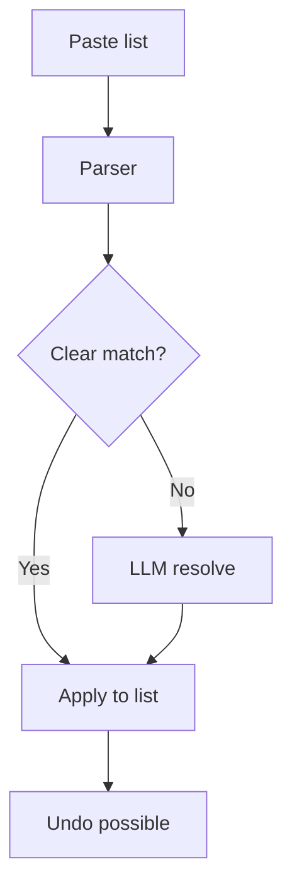
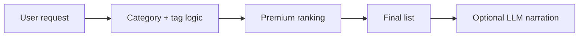
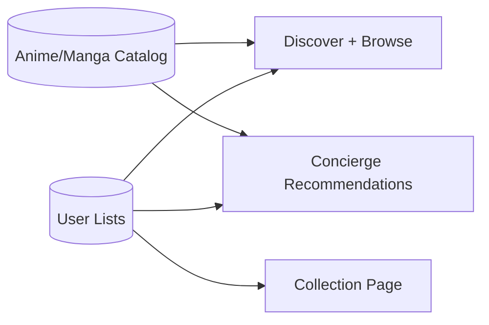
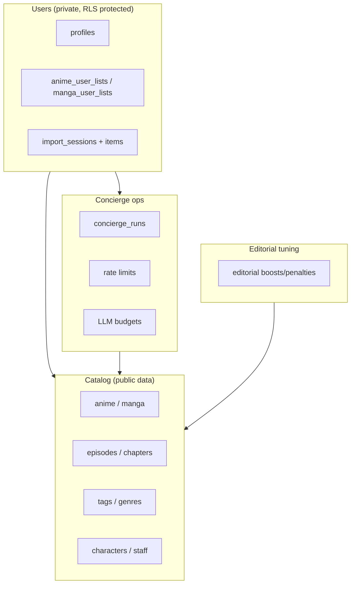
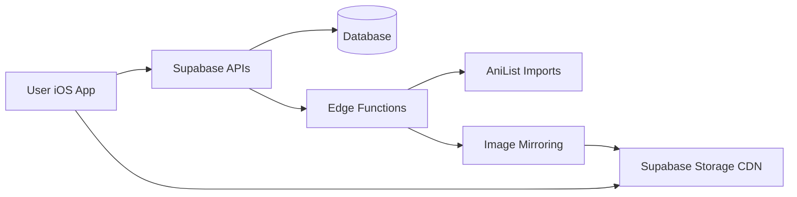
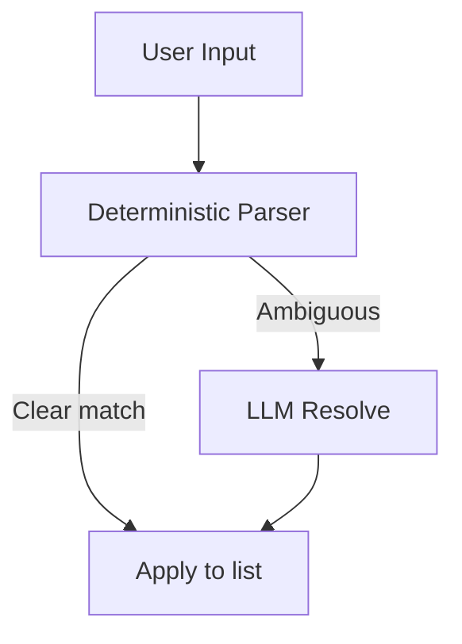

# Kuro — Current State (Plain English)

**Last updated:** 2026-02-05

This file explains the app in everyday language for non-technical readers. It is meant to be a complete, easy overview of how Kuro works today.

---

## 1) Rule: Always keep this file updated

Every time the app changes (design, features, backend, data, schedules, etc.), this file must be updated. Add a new line to the **Change Log** at the bottom with the date and a short summary.

For the technical “source of truth” and auto-generated inventories, see `CURRENT_APP_STATE.md`.

If you need the *literal code* in one place for another model to read, see:
- `CURRENT_APP_STATE_CODEBASE.md` (auto-generated; very large)

---

## 2) What Kuro is (in one paragraph)

Kuro is a curated anime + manga app. It lets users browse premium picks, keep lists, and use a “Concierge” chat to import their watch list or get recommendations. The app is fast, clean, and focuses on high‑quality discovery.

**At a glance**
- Clean editorial design
- No adult content by default
- Concierge uses smart rules first, LLM only when needed
- Images are mirrored to a CDN for speed

---

## 3) How the app is organized (screens)

- **Concierge (left swipe)**: A chat-like page for importing lists and asking for recommendations.
- **Discover (main page)**: Curated sections like Essentials, Classics, Trending, etc.
- **Collection**: Your personal list of anime/manga.
- **Browse**: Explore the catalog with filters.
- **Search**: Find specific titles.

Profile is a small menu in the top-right corner.

**Header today:**
- Left: KURO wordmark
- Center: current page name
- Right: profile menu
- When on Concierge, a small chat icon appears next to the title.

---

## 3.1) Design style (today)

- Minimal, editorial look
- Glass‑like UI surfaces
- Serif titles, light typography
- Focus on premium / classic content

---

## 4) Concierge (the assistant)

The Concierge is designed to:
- **Import** lists quickly (e.g. “AoT completed, JJK ep 12”) and apply them to your list.
- **Recommend** new anime or manga based on your mood.

It works in two layers:
1. **Smart rules first** (fast, cheap, predictable).
2. **LLM fallback** only when needed (to resolve ambiguous titles or narrate recommendations).

There are built-in usage limits so it can’t be abused.

**On the Concierge page (today):**
- A short intro card explains what it does.
- Three quick start buttons:
  - Paste from clipboard
  - Try an example import
  - Give me a vibe

**Adult content:** filtered out by default.

---

## 4.1) How an import works (simple steps)

1. You paste a list.
2. The system tries to match titles.
3. If something is unclear, it asks or uses the LLM to resolve.
4. It applies the results to your list and saves a session so you can undo.

---

## 4.2) How recommendations are chosen

- The system prefers **classics** and **premium picks**.
- It avoids adult content by default.
- If you say “like X”, it finds similar titles first.
- The LLM only adds wording or resolves ambiguity.

---

## 4.3) Cost + abuse protection (so the Concierge cannot be exploited)

Kuro is built so it won't "accidentally bankrupt you" if someone spams the chat:
- **Deterministic-first**: most requests are handled by rules + database queries (no LLM call).
- **Rate limits**: frequent callers get temporarily blocked.
- **Daily token budgets** (per day):
  - **Per user**: 50,000 tokens/day
  - **Global**: 1,000,000 tokens/day

If budgets are exceeded, the app should keep working but the LLM-heavy behaviors get reduced (for example: less narration / fewer disambiguation calls).

---

## 5) Where the data comes from

Kuro’s anime and manga catalog is mostly imported from **AniList**. This includes:
- anime / manga titles
- episodes / chapters
- staff / characters
- tags / genres

This data is stored in Supabase (the backend database).

There are two main ways the database is populated:
1. **Bulk AniList imports** (scripts or edge functions)
2. **Image mirroring** (moves posters to Supabase Storage)

---

## 6) How images work (CDN + caching)

- The app **mirrors** images into Supabase Storage.
- Those images are then served from a CDN-like public storage URL.
- The app also caches images locally for speed.

This means posters are fast, stable, and don’t rely on AniList’s servers at runtime.

---

## 7) Scheduled jobs (automated maintenance)

Right now, the only built-in scheduled job is:
- **Concierge housekeeping**: runs daily to delete old logs/metrics.

Other imports (like image mirroring or AniList ingestion) are currently run manually or by external scripts.

---

## 8) The backend (Supabase) in plain terms

Supabase stores:
- the full catalog
- user lists and profiles
- concierge sessions + logs
- metrics and rate limits

Supabase also runs the Concierge server logic and provides secure APIs.

**Usage limits (plain English):**
- Per‑user and global daily budgets are enforced for AI usage.
- This prevents expensive overuse.

---

## 8.2) What data is stored about a user

- A **profile** row (your account basics)
- Your **anime/manga list** entries (status, progress, rating)
- Concierge **import sessions** (so you can undo)
- Concierge **logs** (for improving the parser and debugging)

No one else can read your private list data because of row‑level security.

---

## 8.3) What to update when things change

Whenever you change the app or backend, update these two files:
- `CURRENT_APP_STATE.md` (technical)
- `CURRENT_APP_STATE_PLAIN.md` (plain English)

Then add a line to the Change Log at the bottom.

---

## 8.1) Simplified data model

---

## 8.4) Database (high-level view)

This is a simplified map (not every table/column, just the big groups):

If you need the full table/column-level definition, use:
- `CURRENT_APP_STATE.md` (schema + object maps)
- `CURRENT_APP_STATE_CODEBASE.md` (all migrations included)

---

## 9) Simple system diagram

---

## 10) Concierge flow (simple view)

---

## 11) Where to find things (non-technical)

- **App UI code:** `Kuro/Views/`
- **Main navigation:** `Kuro/ContentView.swift`
- **Data + API calls:** `Kuro/Services/SupabaseService.swift`
- **Backend SQL changes:** `supabase/migrations/`
- **Backend functions (Concierge, imports):** `supabase/functions/`

---

## 12) Operator checklist (plain English)

- If images look slow: run image mirroring.
- If Concierge seems broken: check its usage limits and logs.
- If recommendations look bad: verify the recommendation tables and see if imports are stale.
- If imports stop: check the import cursor and re-run import scripts.

---

## 13) Glossary (plain English)

- **RPC:** A database function that the app can call like an API.
- **Edge Function:** A small backend function that runs on Supabase.
- **RLS:** Row Level Security; ensures users can only see their own data.
- **CDN:** Fast image delivery system.

---

## 14) Change Log (append-only)

- 2026-02-05: Added Concierge cost guardrails + a high-level database diagram; fixed formatting glitches.
- 2026-02-05: Added non-technical runbook and glossary sections.
- 2026-02-05: Expanded this plain-English snapshot with deeper flows and diagrams.
- 2026-02-05: Added/expanded this plain-English snapshot for non-technical readers.
- 2026-02-05: Concierge moved to left swipe page. Profile is a top-right menu. Cards now show YEAR · EPS. Concierge intro + quick-start pills added.
